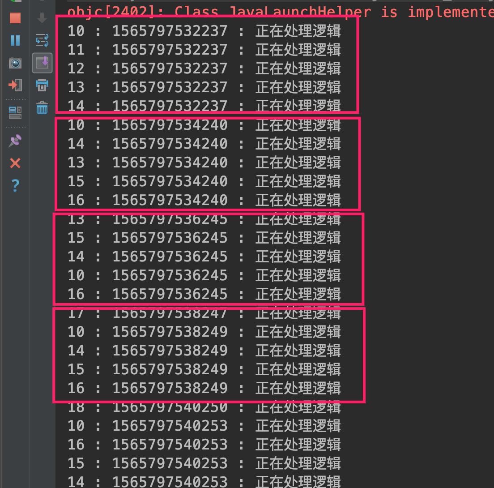
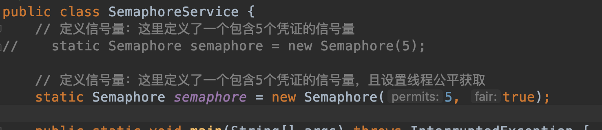
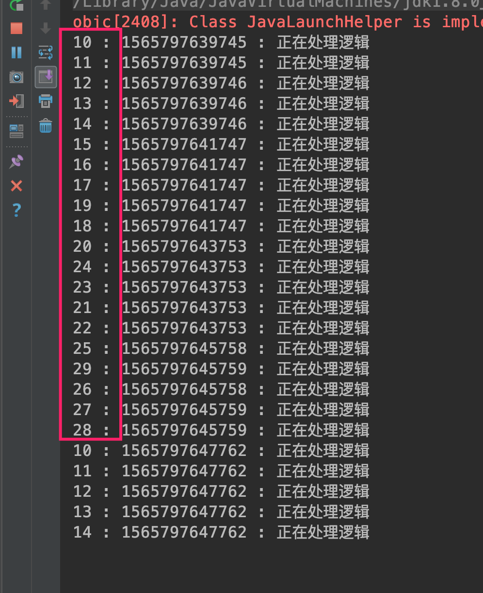
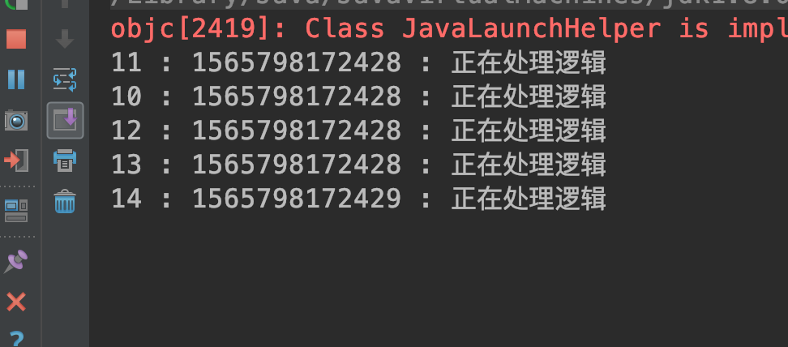

##### 6.5 信号量 Semaphore
###### 6.5.1 基本内容
synchronized 和 ReentrantLock 进行线程互斥同步处理，一次只能有一个线程进入临界区，而信号量 Semaphore 可以允许多个线程同时进入临界区。

信号量其实和锁类似，都是通过同一个限制对象来控制线程对临界区访问的权限，起到控流的作用；

###### 6.5.2 方法定义
* 信号量构造函数：

A. 申请指定凭证个数的信号量：`public Semaphore(int permits)`

每个线程执行的时候需要获取一个凭证，信号量定义多少个凭证则允许同时有多少线程访问临界区；

B. 申请指定凭证且可指定是否公平：`public Semaphore(int permits, boolean fair)`

* 信号量凭证操作方法

`public void acquire() throws InterruptedException` ：尝试获取凭证，无法获得则一直等待；可响应中断放弃等待；

`public void acquireUninterruptibly()`：一直等待不响应中断;

`public boolean tryAcquire()`：尝试获取凭证，成功返回true，失败返回false，如果获取不成功立即返回，不进行等待；

`public boolean tryAcquire(long timeout, TimeUnit unit) throws InterruptedException`：一定时间内尝试获取，超时放弃；

`public void release()` ： 释放凭证

线程在执行结束后同释放锁一样需要释放占用的凭证，否则会造成其他线程无凭证可用造成饥饿；

###### 6.5.3 代码示例

```
package com.skylaker.lock;

import java.util.concurrent.ExecutorService;
import java.util.concurrent.Executors;
import java.util.concurrent.Semaphore;

/**
 * 信号量 Semaphore
 * @author skylaker2019@163.com
 * @version V1.0 2019/8/13 8:09 PM
 */
public class SemaphoreService {
    // 定义信号量：这里定义了一个包含5个凭证的信号量
    static Semaphore semaphore = new Semaphore(5);

    public static void main(String[] args) throws InterruptedException {
        ExecutorService executor = Executors.newFixedThreadPool(20);
        for(int i = 0; i < 100; i++){
            executor.submit(new MyTask());
        }
    }

    static class MyTask implements Runnable {
        public void run() {
            try {
                // 线程先申请信号量凭证
                semaphore.acquire();

                System.out.println(Thread.currentThread().getId() + " : "
                        + System.currentTimeMillis() +  " : 正在处理逻辑");
                Thread.sleep(2000);
            } catch (InterruptedException e) {
                e.printStackTrace();
            } finally {
                // 线程需要释放信号量凭证
                semaphore.release();
            }

        }
    }
}
```



每5个线程一组执行；

设置公平信号量：





基本上线程依次获取凭证执行；

利用tryAcquire():

```
static class MyTask implements Runnable {
        public void run() {
            boolean hasAcquire = false;
            try {
                // 线程先申请信号量凭证
//                semaphore.acquire();

                // 尝试获取凭证
                if(semaphore.tryAcquire()){
                    hasAcquire = true;
                    System.out.println(Thread.currentThread().getId() + " : "
                            + System.currentTimeMillis() +  " : 正在处理逻辑");
                    Thread.sleep(2000);
                }
            } catch (InterruptedException e) {
                e.printStackTrace();
            } finally {
                // 线程需要释放信号量凭证
                if(hasAcquire){
                    semaphore.release();
                }
            }

        }
    }
```



只有5个线程任务执行成功，因为其它线程尝试获取失败后都直接结束了；需要主要这里通过 hasAcquire 变量来标识线程获取到了凭证，最后如果获取到了凭证才释放，如果没有这个变量控制直接在finally中释放，那么不管线程有没有获取到凭证都释放凭证，那么会导致凭证没有起到类似锁的作用，因为刚被获取就被其他线程释放，这样所有的任务都会执行，不过不是期望的正确执行方式了。