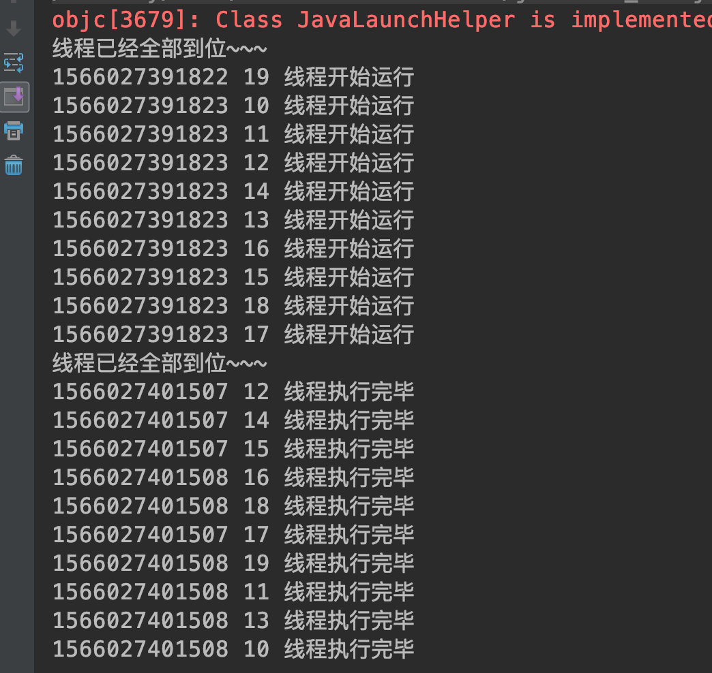
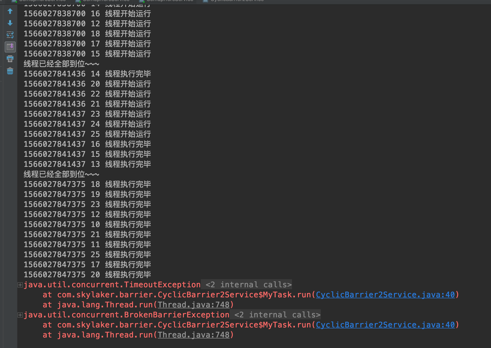

##### 6.8 循环栅栏 CyclicBarrier
###### 6.8.1 基本概念
可以使线程等待，直到线程数量达到指定数量，所有等待的线程才开始运行。类似倒计时器CountDownLatch计数等待，但是循环栅栏支持循环计数，即一个计数周期结束后可以直接进入下个计数周期。

场景类似于几个好朋友一起约定去哪玩，等所有人到齐后才出发。
###### 6.8.2 基本方法
构造方法：
parties 指定计数值，即需要等待到齐的线程个数；
barrierAction 线程到齐后执行的动作；

`public CyclicBarrier(int parties, Runnable barrierAction)`

栅栏等待：
等待指定线程到齐，可响应中断，产生中断异常；
如果等待不齐，则产生表示栅栏破坏的异常BrokenBarrierException，例如等待中某个线程中断异常导致所有线程不齐；

`public int await() throws InterruptedException, BrokenBarrierException`

等待指定时间，超时异常放弃等待：
`public int await(long timeout, TimeUnit unit)
throws InterruptedException,
BrokenBarrierException,
TimeoutException`

###### 6.8.3 代码示例

```
package com.skylaker.barrier;

import java.util.Random;
import java.util.concurrent.BrokenBarrierException;
import java.util.concurrent.CyclicBarrier;
import java.util.concurrent.TimeUnit;
import java.util.concurrent.TimeoutException;

/**
 * 循环栅栏 CyclicBarrier
 * @author skylaker2019@163.com
 * @version V1.0 2019/8/17 12:36 PM
 */
public class CyclicBarrierService {
    // 控制线程，让目标数量线程等待一起执行
    static CyclicBarrier cyclicBarrier = new CyclicBarrier(10, new Runnable() {
        public void run() {
            System.out.println("线程已经全部到位~~~");
        }
    });


    public static void main(String[] args) {
        MyTask myTask = new MyTask();

        for(int i = 0; i < 10; i++){
            new Thread(myTask).start();
        }
    }

    static class MyTask implements Runnable {
        public void run() {
            try {
                // 每个线程一开始都等待，等待指定数量的线程就位
                cyclicBarrier.await();
                System.out.println(System.currentTimeMillis() + " " + Thread.currentThread().getId() + " 线程开始运行");
                Thread.sleep(Math.abs(new Random().nextInt()%10000));

                // 线程再次等待，等待所有线程执行完毕
                cyclicBarrier.await();
                System.out.println(System.currentTimeMillis() + " " + Thread.currentThread().getId() + " 线程执行完毕");
            } catch (InterruptedException e) {
                e.printStackTrace();
            } catch (BrokenBarrierException e) {
                e.printStackTrace();
            }
        }
    }
}
```



一开始10个线程等到大家的到齐，到齐后所有线程开始执行；然后又等待所有线程执行完毕，在实际运行时，等待结束时明显暂停，因为线程在等待；等待完成后线程间并发执行，所以显示的时间相对一致，但是线程并非都并行化，所以大家执行打印输出时刻有些差异；

这里我们设置的线程数量正好等于设置的等待数量，如果少于、大于指定数量呢？其实小于的话肯定等不齐，那么线程就会一直等待，我们可以采取等待超时、或者中断方式退出等待结束程序；大于的话如果设置的线程数量乘以2正好是设置的数量那还是可以正常结束的，因为一个线程开始时等待，结束时等待，如果凑到指定数量的线程都是可以执行的，并不一定说都必须都是开始执行，这个只是业务场景设置，对于循环栅栏来说有指定数量线程来说就可以；但是如果不满足这个数量要求，那么还是造成线程一直等待，那么同样可以采取等待超时、或者中断方式退出等待结束程序；

```
// 控制线程，让目标数量线程等待一起执行
    static CyclicBarrier cyclicBarrier = new CyclicBarrier(10, new Runnable() {
        public void run() {
            System.out.println("线程已经全部到位~~~");
        }
    });


    public static void main(String[] args) {
        MyTask myTask = new MyTask();

        for(int i = 0; i < 16; i++){
            new Thread(myTask).start();
        }
    }

    static class MyTask implements Runnable {
        public void run() {
            try {
                // 每个线程一开始都等待，等待指定数量的线程就位
                cyclicBarrier.await(5, TimeUnit.SECONDS);
                System.out.println(System.currentTimeMillis() + " " + Thread.currentThread().getId() + " 线程开始运行");
                Thread.sleep(Math.abs(new Random().nextInt()%10000));

                // 线程再次等待，等待所有线程执行完毕
                cyclicBarrier.await(5, TimeUnit.SECONDS);
                System.out.println(System.currentTimeMillis() + " " + Thread.currentThread().getId() + " 线程执行完毕");
            } catch (InterruptedException e) {
                e.printStackTrace();
            } catch (BrokenBarrierException e) {
                e.printStackTrace();
            } catch (TimeoutException e) {
                e.printStackTrace();
            }
        }
    }
```



这里设置了栅栏10，线程16个，那么必然有不能满足凑足数量的线程，所以采用超时等待方式，结束等待、异常退出；

