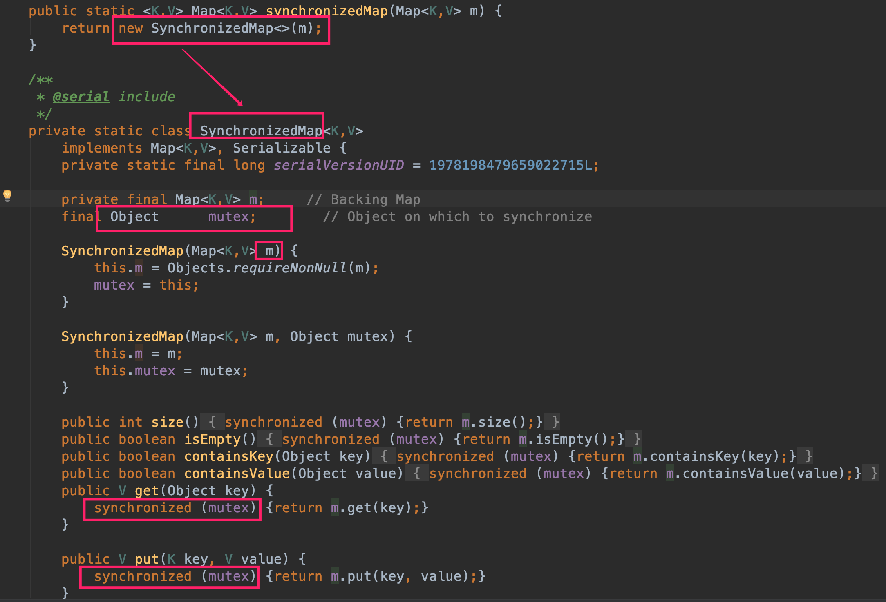
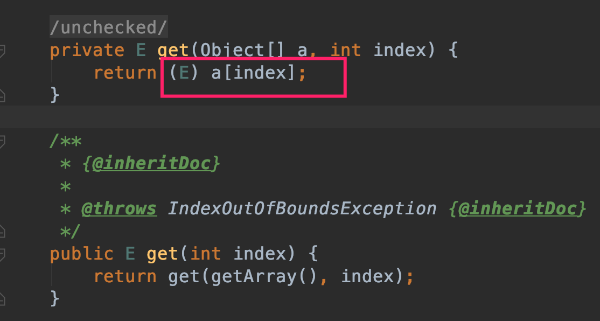
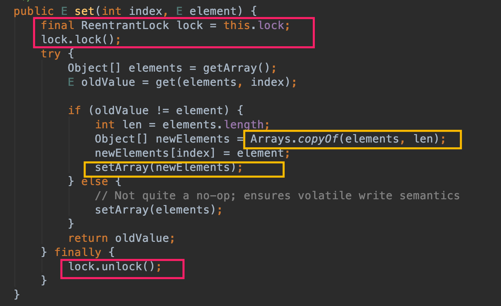
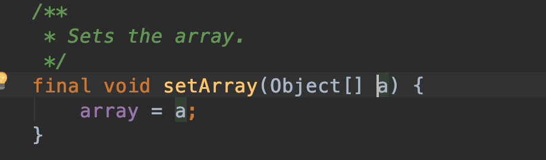
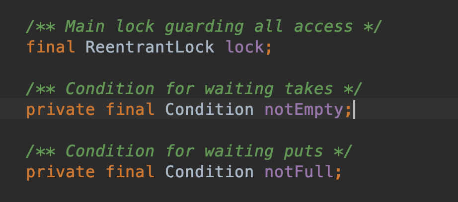
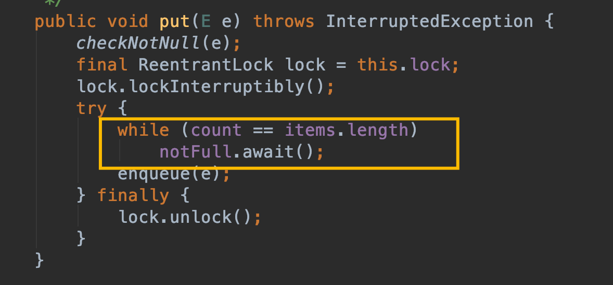
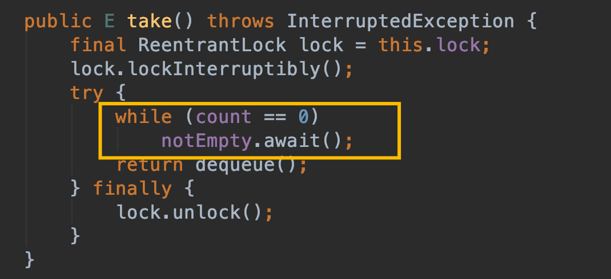

#### 7 JDK的并发容器
* java.util.concurrent包
* Collections.synchronized** 可将任意集合包装成线程安全的集合
##### 7.1 线程安全的HashMap
* `Collections.synchronizedMap(Map<K,V> m)`
使用委托，在传入的map之外包装了一层，具体map功能由传入的map实现，自己实现线程安全：

可以看到实际内部定义了一个 SynchronizedMap ，对于具体的map操作还是调用传进来的map的方法，只不过 SynchronizedMap 负责利用 synchronozed 进行线程互斥保证安全。

可以保证线程安全；但是因为所有操作都需要进行锁互斥，效率低；

* `ConcurrentHashMap` 
采用分段加锁的机制进行线程同步互斥操作，既保证线程安全，又效率高效（在大部分场景下），具体后期单独研究~~

##### 7.2 线程安全的List
* `Collections.synchronizedList(List<T> list)`
同synchronizedMap一样也是通过对List进行外层加锁处理实现线程安全。

* `CopyOnWriteArrayList`
不变模式的高效集合类；
读操作之间不互斥；读与写也不互斥，写的时候不是直接在原有数组上进行修改，而是复制一份原有数据，然后在副本上进行修改，修改完成之后替换原来数据，这样同时读写并不冲突，写完之后读也能因为数组对象是volatile而获知最新值；写与写之间需要互斥；

读直接读原有数据数据；

写时候加锁进行互斥操作；先复制在副本操作再替换原来的数组；

##### 7.3 线程安全的Queue
* `ConcurrentLinkedQueue`
基于链表的队列；使用CAS实现实现线程安全；

* `BlockingQueue`
可用于线程数据共享的队列；是一个接口，具体实现主要有：
基于数组实现 `ArrayBlockingQueue`
基于链表实现 `LinkedBlockingQueue`

ArrayBlockingQueue：
服务线程向队列中塞入数据，队列满则等待；消费线程从队列中取数据，如果队列空则等待；

put()、take()方法核心存、取方法；

当队列满的时候则服务线程在notFull上等待，当队列有空时再继续运作往队列存放数据；

当队列为空的时候，消费线程在notEmpty等待，等待队列有数据即不为空的时候再取内容进行消费。