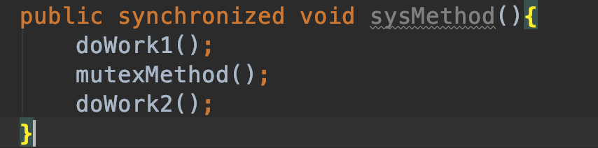
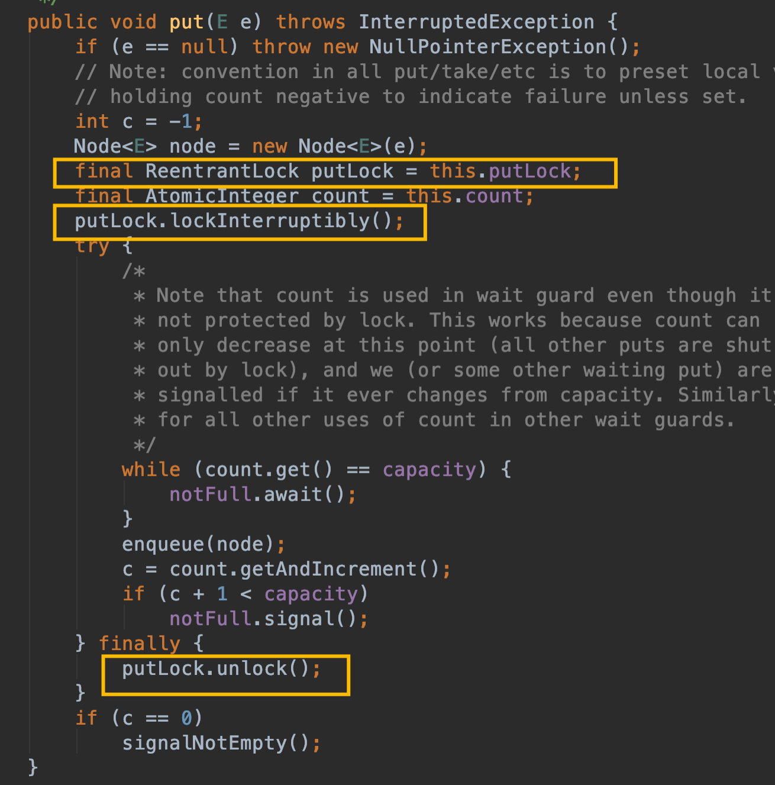
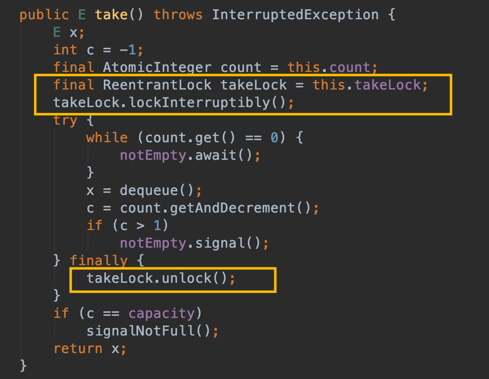
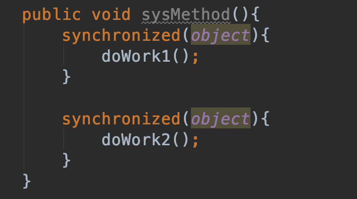
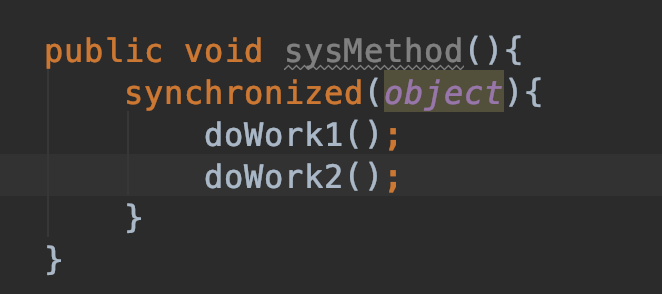
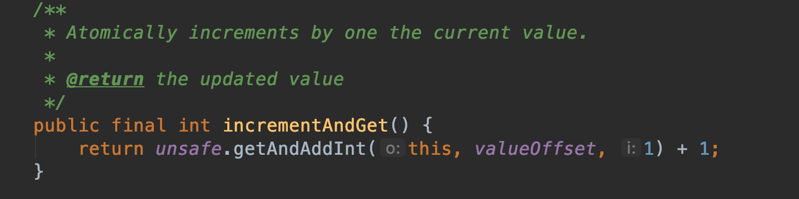
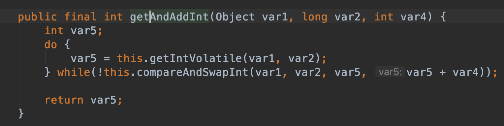
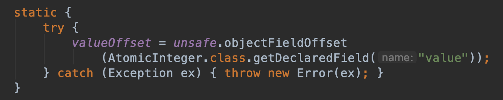

#### 8 锁的优化及注意事项

##### 8.1 提升锁性能的方式

###### 8.1.1 减少锁持有时间
即将不必要进行加锁的操作不加锁；减少锁内部的耗时操作；
例如：


doWork1方法和doWork2方法不涉及共享数据操作不会产生线程安全问题，那么也就无需加锁，那么加锁操作可以只针对需要同步的 mutexMethod方法加；

另外有些时候在锁内部尽量减少耗时操作，例如IO操作，根据业务场景分析是否可以将这些耗时操作放到锁外边进行，避免大量并发加锁操作严重耗时；

###### 8.1.2 减小锁粒度
同样上面的例子也能说明同样的问题，将不需要的加锁操作不加锁，是一种减少锁粒度的方式；

另外一种就是例如 ConcurrentHashMap 采用分段加锁的思想，将原本的一个大锁拆分成一个个小锁，进行操作的时候通过哈希计算确定元素分段，对对应的分段加锁，那么不同分段之间就可以实现并发了；

###### 8.1.3 读写分离锁取代独占锁
读多写少场合可以采用读写锁提升性能；

###### 8.1.4 锁分离
也是类似锁分离的思想，将单个大锁分为不同的锁分别操作，互不影响，例如LinkedBlockingQueue，存放和取值采用两个锁；





###### 8.1.5 锁粗化
有些时候锁细粒度有助于提升性能，有些时候锁粗化可以提升性能，例如：


这里面两个相同的锁对象且连续，两个加锁操作完全可以合成一个：


尤其在循环内部的话，可以把锁提取到循环外面，避免每次操作都进行互斥加锁。

##### 8.2 Java虚拟机对锁的优化

###### 8.2.1 锁偏向
如果一个线程获得锁，锁进入偏向模式；当同样的线程再次请求该锁时，需要进行同步操作；如果是其它线程请求该锁，偏向模式结束。

该模式对于使用了同步但几乎无竞争，例如只是一个线程操作场景能显著提升了性能，避免了无谓的加锁同步过程。

###### 8.2.2 轻量级锁
轻量级锁目的是在没有多线程竞争的前提下，减少传统重量级锁使用操作系统互斥量产生的性能消耗。

###### 8.2.3 自旋锁
锁膨胀后，避免线程真实地在操作系统层面挂起，虚拟机采用自旋锁。假设几个CPU时钟周期后就能获取锁，所以虚拟机让当前线程做几个空循环，若一定循环次数后可以得到锁，那么就顺利进入临界区；如果还不能获取则将线程在操作系统层面挂起。

###### 8.2.4 锁消除
Java虚拟机在JIT编译时，进行上下文扫描，去除不可能存在共享资源竞争的锁。例如我们在非并发场合使用线程安全的容器Vector，而Vector内部是利用synchronized进行安全控制的，必然损耗性能，但是当前环境根本不会出现线程安全，所以可以直接锁操作去除。

逃逸分析：观察某个变量是否会逃出某个作用域。其实就是看变量是否会被多线程共享操作，如果是在局部方法内部每个线程都操作自己的变量，不会被其他线程访问到自然不会存在线程安全问题。

##### 8.3 ThreadLocal
###### 8.3.1 基本概述
线程安全问题主要是不同线程对共享资源的操作造成的，但是如果大家都操作自己的资源，自然也就不存在安全问题了，这也就是ThreadLocal的作用。

###### 8.3.2 代码示例
```
package com.example.skylaker;

import java.text.ParseException;
import java.text.SimpleDateFormat;
import java.util.Date;
import java.util.Random;
import java.util.concurrent.ExecutorService;
import java.util.concurrent.Executors;

/**
 * 线程本地变量 ThreadLocal
 * @author skylaker2019@163.com
 * @version V1.0 2019/8/22 10:27 PM
 */
public class ThreadLocalService {
    private static ThreadLocal<SimpleDateFormat> threadLocal =
            new ThreadLocal<>();

    public static void main(String[] args) {
        ExecutorService pool = Executors.newFixedThreadPool(20);
        for(;;){
            pool.execute(new MyTask());
        }
    }


    static class MyTask implements Runnable {
        @Override
        public void run() {
            if(null == threadLocal.get()){
                threadLocal.set(new SimpleDateFormat("yyyy-MM-dd HH:mm:ss"));
            }

            String date = threadLocal.get().format(new Date(Math.abs(new Random().nextLong())));
            System.out.println(date);
        }
    }

}
```

##### 8.4 无锁
###### 8.4.1 乐观锁与悲观锁
悲观锁：锁是一种悲观的策略，总是认为每次临界区资源操作都会产生冲突，因此涉及多线程操作共享变量时用锁进行并发同步控制。但是因为阻塞等待导致性能受到影响。

乐观锁：总是认为并发操作共享变量不会产生冲突，直接操作，当产生冲突的时候再用CAS方式解决冲突。

###### 8.4.2 CAS
CAS: Compare And Swap 比较交换

非阻塞，对死锁免疫；避免线程调度开销，性能相对锁优越；

CAS算法：三个参数 CAS(V,E,N)
V：要更新的变量
E：表示预期值
N：表示新值

当且仅当V值等于E值时候，才将V值设置为N值，如果V值和E值不相等，说明已经有其他线程更新了V值，那么将放弃更新。允许失败重试，即重新读取V值，在准备更新。

举个例子，变量V=1，线程1过来要将其更新为3，先读取，然后准备更新，在读取到线程1真正更新的期间线程2来将变量设置为了5，这个时候线程1正式更新的时候发现变量V已经被修改过，不是自己当初认识的它即值为1，就放弃更新了，当然也可以重新读取变量V的最新值，再次准备更新。

###### 8.4.3 Atomic类
JDK并发包中atomic包，实现了一些直接使用CAS操作的线程安全类型。

AtomicInteger：线程安全的int型数据；
AtomicLong: 线程安全的long型数据；
AtomicBoolean: 线程安全的boolean型数据；
AtomicReference: 线程安全对象引用；

AtomicInteger的incrementAndGet方法：
JDK1.7实现：
```
public final int incrementAndGet() {
    for (;;) {
        int current = get();
        int next = current + 1;
        if (compareAndSet(current, next))
            return next;
    }
}
public final boolean compareAndSet(int expect, int update) {
    return unsafe.compareAndSwapInt(this, valueOffset, expect, update);
}
```

先通过Get方法直接获取当前值，然后加1操作得到将要更新的新值，通过compareAndSet方法，即CAS操作，更新时候判断指定变量的值与之前读取的current值是否一致，一致则将变量值更新为新的next值，并返回；否则进入for循环，重新读取值准备更新...

JDK1.8实现：





其实还是用到CAS操作，如果目标变量值等于期望var5值，则设置为新值 当前值 + var4，即加1；

上面都用到了unsafe类，是sun.misc.Unsafe，封装了类似指针操作，非线程安全；


内部使用CAS操作；
第一个参数：给定对象；
第二个参数：var2为对象内的偏移量（字段到对象头部偏移量，通过该偏移量可以快速定位字段）：



第三个参数：var4 期望值，即一开始读取的当前变量值；
第四个参数：var5 要设置的值；

###### 8.4.4 带有时间戳的对象引用AtomicStampedReference

CAS操作一定程度上通过无锁的方式保证了数据操作线程安全，但是存在一个问题，主要的方式是比较目标变量值与预期值是否一致，其实这存在一个漏洞，在当前线程获取到初始值后，其他线程操作了该变量，然后又还原为原来的值，那么当前线程在更新的时候发现满足要求的当期值与预期值一致便更新变量，这种如果对于状态性有要求那么必然有问题。

解决办法：记录对象在修改过程中的状态值；

AtomicStampedReference 在 AtomicReference 对象基础上不仅维护了对象值，还维护了一个时间戳，数据被修改，不仅更新值还要更新时间戳；设置新值时候，需要对象值和时间戳都满足期望；


