#### 1. 基础概念

1.1. **开篇废话**

进行Java开发也不知不觉很长时间了，虽然也有涉及框架内容的开发，但其实就是开源框架的搬运工，很多技术内容深层次根本涉及不到也没有潜心研究，实则痛心，因此暗下决心多多学习，Java线程相关的内容便是一座巍峨的大山，山虽高、虽险，但坚定盘之，亦可笑登山巅！  
    
本学习内容主要以《实战JAVA高并发程序设计》一书为参考资料，先知其然，再知其所以然~~

1.2.  **高并发与多线程**

说到线程，可能比较令人难以理解，毕竟是作为抽象的存在，我们面对的是一个高度封装的计算机硬件设施以及很神奇的软件系统，线程具体在里面的存在形式、运行方式等等，都是无法直观感知的，具体的内容需要学习相关的计算机原理、操作系统原理等知识的。我们这里谈高并发、谈线程可以先不必刨根问底其底层原理，可以先外部感知，知道如何使用。

我们先说说高并发，啥叫高并发呢？整天听人说高并发，一言不合分布式啥的，听着老高大上了。其实我们编程不要仅仅拘泥于程序开发本身，很多东西都是融会贯通，有着现实场景类似的。比如我们去饭店吃饭，就一个人去，饭店空荡荡的，这种情况下服务员肯定不会着急，从容应对，来给你点菜、上菜啥的，服务周到，美滋滋~~~ 但是如果去饭店吃饭的人多了，那如果还是这一个服务员的话，肯定要忙成狗了，你这边刚点完菜，那边桌的客人就喊着去点菜，点完又忙着来回上菜，就是一时干这一时干那~~ 如果老板不想雇佣其他服务员，我估计一个顾客来这的体验肯定不会好，要等好久才能轮到服务自己；而服务员肯定也不爽，太累了，拍屁股走人~~ 那么为了应对大量客户的情况，正常的老板肯定会雇佣多个服务员，来满足这种忙碌的场景。其实这个一堆人来吃饭就是高并发的现实场景，那这个在计算机世界、在互联网环境下呢？就是同时存在大量计算、调度场景；存在大量网络请求处理的场景，例如双11亿万同胞集体狂欢，一起买买买导致大量的请求奔向各大电商网站的情景。

那么怎么应对高并发场景、解决高并发的导致的一系列问题呢？首先我们明确一个概念，多线程是高并发么？这个问题其实是伪命题，我们需要区分高并发与多线程的概念，高并发是一种场景，而多线程是一种技术手段、是应对解决高并发的一种方式。我们不能说多个服务员就是忙碌的场景，概念完全不对，是因为面对顾客多忙碌的场景我们采用多个服务员来应对。应对高并发有着各种各样的方式，例如我们常听说的微服务架构、分布式架构、集群模式、分库分表、缓存系统等等，而具体到实际处理对象上来说，我们可以开启多个线程来处理实际的问题，例如开启多个线程分别负责多个客户端请求连接（当然这个方式合不合理值得商榷）~~ 这个需要具体学习不同的高并发场景解决技术了~~

我们再来说说线程，具体什么是线程？我们打开电脑，如果是windows平台我们可以打开资源管理器、mac平台打开活动监视器查看当前哪些应用在运行，例如
    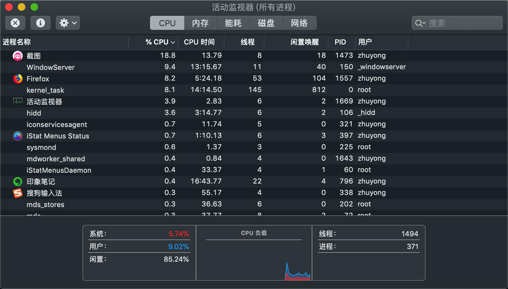
这里我们可以看到很多应用，各个应用占用的CPU、内存等资源也在不停的变化，我们看到第一列显示进程名称，其实我们的一个应用在操作系统中就是被当做进程管理的，而每一个应用详细信息列中会显示线程数量：
    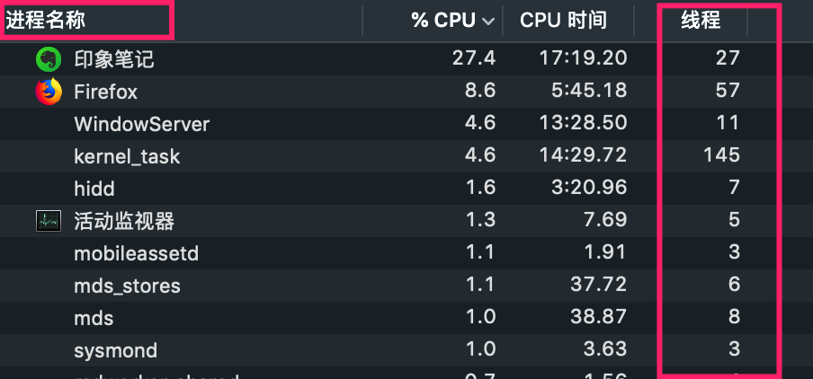
看到这里我们大致就能知道线程其实是进程内部的资源对象。即进程是应用级别的调度对象，就是一个个的应用程序占用CPU、内存等系统资源的逻辑对象；线程就是进程内部、会公用进程资源的调度对象。回到上面的例子，进程就相当于一个个不同的饭店，每个饭店中不同的服务员就相当于线程。而常常开启多个线程就是为了提升系统运行效率，毕竟饭店只有一个服务员的话顾客一多肯定是忙不过来的，但是非要就一个的话，来回服务倒是可以，一边服务员忙成狗，一边客人不愿意等待还没点菜就跑了，回到计算机中就是一堆任务迟迟得不到解决、一堆用户买买买请求得不到处理，自然就会导致系统过载，或系统崩溃、或大量请求失效~~ 

面对高并发我们可以采用多线程方式处理，那是不是开启更多的线程就更能应对、更好的解决问题呢？并不是，就好比如饭店顾客多，总不能有多少顾客就雇佣多少服务员吧，真这样的话饭店老板就哭了，得付多少薪水啊、还咋挣钱？同样系统开启更多的线程，那么所产生的系统资源消耗和上下文切换等带来的负担也逐渐增大，所以需要综合考量开启合适数量的线程。

1.3. **同步和异步**
* 同步（Synchronous）：需要依次执行，调用端需要等待调用完成才能继续执行，例如吃饭上菜，不给你同时上菜，吃完一个菜再上下一个菜；
* 异步(Asynchronous)：不需要等待，在等待某个事情执行时可以做别的事情，例如去吃饭一直在等待菜上来，在等待过程中可以玩玩手机、聊聊天，等菜上来了就正式吃饭。

1.4. **并发和并行**
* 并行(Parallslism)：同时运行，例如在吃饭的同时边看电视；
* 并发(Concurrency)：侧重于多个任务交替执行，例如吃一会饭，又去玩玩手机，但是不能同时进行。
* 很多时候二者会当成同一个概念，其实是有差别的。对计算机来说，如果只有一个CPU，那么其实是做不到真正的并行的，只能并发，因为CPU某个时刻智能执行一条指令，采用多线程操作方式其实CPU是来回切换执行的，只不过速度很快，让人的感觉是同时完成的。不过现代计算机大多多核，也就能做到真正的并行了，即可以同时执行多个任务。

1.5. **临界区**
* 共享的资源或者公共资源，对于多个线程共享临界区来说，某个时刻只允许一个线程访问（其实多个访问我们也可以称作临界区），其他线程要想访问必须等待。
* 对于多线程访问临界区，大部分情况下需要进行同步控制，避免多个线程同时操作临界区资源以导致资源破坏。

1.6. **阻塞和非阻塞**
* 阻塞(Blocking)：是一种事物之间相互影响的描述，一个事物的状态导致另一个一直在等待。例如堵车，前面的车不动了，而且这条路单行道，那么后面的车就动弹不得，只能处于等待状态，这就是阻塞。对于线程来说，一个线程操作临界区资源，同时线程间进行同步控制，那么其他线程就需要等待当前线程执行完毕，等待过程就是一种阻塞状态。
* 非阻塞(Non-Blocking)：即不需要等待，这路很宽，不管你这辆车停不停，其他车照样畅通无阻。对于线程来说，就是一个线程不用等待其他线程执行完毕，可以畅通执行。

1.7. **死锁、饥饿和活锁**
* 死锁（Deadlock）：指多线程之间因为相互持有多方的所需要的锁，但是又都释放不了，导致相互等待无法继续运行的状态。
* 饥饿（Starvation）：指线程因为因为种种原因一直得不到所需要的资源，一直无法执行。多线程执行需要抢占系统资源，例如CPU，如果有些线程因为优先级低导致常常抢占不到CPU调度，就会一直在阻塞状态导致饥饿。
* 活锁（LiveLock）：死锁是互相占用对方需要的资源就不释放，而活锁是双方都在释放资源给对方使用，导致双方都获取不到资源，无法继续运行，好比如你走路遇到某个人，你给他让路，他也给你让路，但是你往左，他往右，没办法，你又往右，他又往左...这样你和对方都无法继续往前走了，都在礼让。

1.8. **并发级别**
* 阻塞：线程之间利用synchronized或者重入锁进行同步，其中一个获取到锁可以访问临界区资源，那么其他的线程就需要处在等待阻塞状态，等获取锁的线程释放资源后自己抢占到锁后才能继续运行。
* 无饥饿（Starvation-Free）：线程调度是相对公平的，所有的线程都能得到执行，例如采用公平锁，不会因为线程优先级低而得不到执行。
* 无锁（Lock-Free）：不直接采用锁机制同步，利用CAS等方式保证线程之间同步访问临界区资源。
* 无等待（Wait-Free）：无锁要求所有线程必须在有限步骤内完成。例如采用读写锁进行线程同步，读控制不加处理，写操作需要加锁操作。

1.9. JMM
* 高并发场景下采用多线程处理相关逻辑，一大核心难点在于线程间的同步，即对临界区资源的访问控制，不加控制有可能导致数据操作出错，例如两个线程都对临界区资源变量 a = 1 进行加1操作，两个线程同时读取到当前值，线程1操作 a=1+1, 回写a值，线程2也 a=1+1，也回写a值，那么最终a的值就变成了2，而非期望的3，这就是线程未同步导致的一大问题。
* JMM，Java Memory Model ，Java内存模型机制，保证线程间操作有效、正确的协同，有以下三个特性：
1）原子性（Atomicity）：指一个操作是不可中断的；
2）可见性（Visibility）：一个线程修改了共享变量值，其他的线程能否立即知道这个修改。
3）有序性（Ordering）：计算机在执行程序指令时会进行相关的优化，会有指令重排序，多线程并发场景下有些指令重排会导致问题。有序性即要求相关指令间不允许重排序，依赖Happen-Before原则。

#### 2. 线程方法
2.1. **新建线程**
* 方式一：继承Thread实现
```
public class ThreadNew {

    public static void main(String[] args){
        // 方式一: 通过继承Thread
        Thread01 thread01 = new Thread01();
        thread01.start();

        /// 打印当前主线程ID
        System.out.println("主线程ID：" + Thread.currentThread().getId());
    }
    
    /**
     * 方式一: 通过继承Thread
     */
    static class Thread01 extends Thread {
        @Override
        public void run() {
            System.out.println("Hello, I'm a Thread by extends !");
            System.out.println("子线程ID：" + Thread.currentThread().getId());
        }
    }
```
 执行结果：
 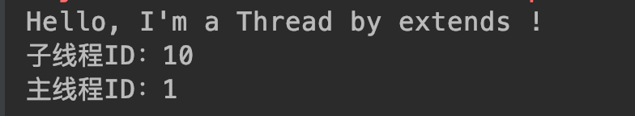

在这里，我们通过继承Java线程对象Thread创建了一个线程（我们确实创建了线程本身吗？），然后通过start方法来启动运行，同时我们还在main方法输出所谓的主线程ID，最后执行结果输出了三行内容，我们看到第一行 Hello... 这个内容，这个正是我们在线程run方法中定义的，第二、三行分别输出了子线程、主线程ID。

我们的main方法作为入口方法，负责执行的对象被称为主线程，而通过定义一个Thread，执行start方法，就是创建了一个子线程。从上述结果我们可以验证确实启动了一个新的子线程执行了执行代码指令。主线程和子线程的关系可以表示如下：
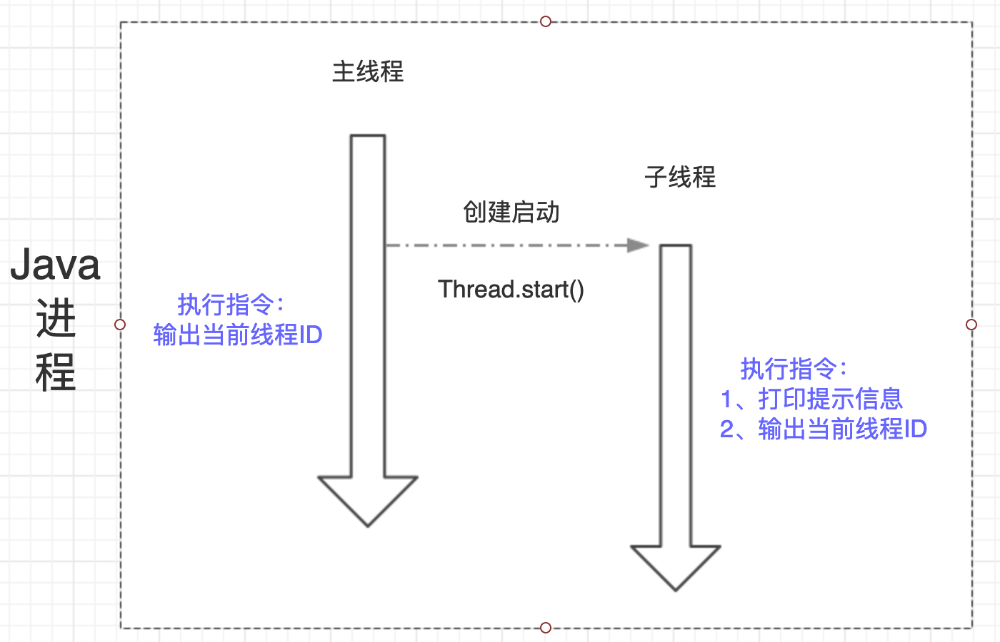

主线程、子系统是两个不同的个体对象，他们单独执行自己的程序指令，可以在主线程中启动子线程。

* 方式二：通过实现Runnable接口
```
public class ThreadNew {

    public static void main(String[] args){
        // 方式二：通过实现Runnable接口
//        Thread02 thread02 = new Thread02();
//        thread02.start(); 没有该方法，更不可能执行，因为这是Thread02实例，不是线程Thread实例
        Thread thread02 = new Thread(new Thread02());
        thread02.start();

        /// 打印当前主线程ID
        System.out.println("主线程ID：" + Thread.currentThread().getId());
    }
    
        /**
     * 方式二：通过实现Runnable接口
     */
    static class Thread02 implements Runnable {
        public void run() {
            System.out.println("Hi, I'm a Thread by implements !");
            System.out.println("子线程ID：" + Thread.currentThread().getId());
        }
    }
}
```
执行结果：


可以看到和方式一类似的结果，不过这里我们发现主线程的信息先打印出来了，如果多次执行其实可以发现有时子线程先打印信息，有时主线程先打印，这个正是因为主线程、子系统是两个相互独立的个体，主线程启动了子线程，相当于系统中有两个线程同时在运行，那么具体谁先执行完成是无法确定的，所以也就是谁先打印信息也就无法确定了。

* 我们创建了线程吗？
上面两种方式是创建线程的基本方式，但是其实说到底也是一种方式，因为Thread对象默认实现了Runnable接口：

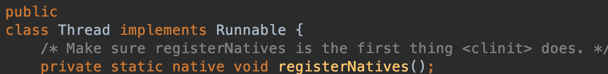

即创建线程都需要实现Runable接口，不过如果我们直接通过继承Thread来实现的话，因为Java单继承特性我们无法再继承其他对象，所以最好通过实现接口的方式。

我们现在来思考一个问题，我们这些操作确实是创建了线程吗？即我们是否创建了线程本身？其实我们定义的线程其实真实的理解应该是我们定义了线程需要执行的任务内容，即run方法内的程序指令，只不过需要执行这段指令的方式是让JVM去创建一个线程去执行，而非当前主线程；new Thread 然后 start 就是通知JVM去创建线程执行指令，只不过不同线程执行的指令可以是同一个代码片段定义的。
    
```
    @Test
    public void testThread(){
        Thread02 thread02 = new Thread02();

        Thread t1 = new Thread(thread02);
        Thread t2 = new Thread(thread02);
        Thread t3 = new Thread(thread02);
        t1.start();
        t2.start();
        t3.start();
    }
```
执行结果：

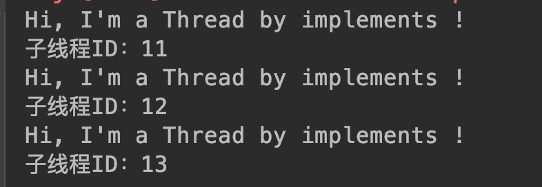

我们定义了个Thread02实例，理论上如果我们实现Runnable接口的对象实例就是线程本身，那么这里三个线程执行就应该是同一个线程，应该输出同样的线程ID，但是结果显示并非如此，而是输出了三个线程ID，也就是通过 new Thread 方法才真正定义了线程，但其实也不完全是，更准确的说法是Thread执行start方法后主线程通知JVM去创建三个不同的线程，然后执行我们在Thread02的run方法中定义的代码内容。只不过很多时候因为我们用这样的方式启动的就是线程，所以就直接称Thread为线程了。

其实执行start方法后，JVM创建了线程，线程并非直接获取到CPU调度，而是出于就绪状态，会和其他线程抢占资源，当被CPU调度后，就会出于运行状态，执行对应的run方法中的内容。

线程本身是操作系统中的一个资源处理对象，我们的代码是程序指令，线程可以接收CPU调度，执行我们指定的程序指令。我们去吃饭可以让服务员倒杯水，服务员接收我们的请求来做倒水的事情，但是不能说我们请服务器倒水这个请求是服务员，我们更没有自带或者创建了服务员~~

* 直接Run方法怎样？
我们启动线程的时候是通过Thread的start方法，但是run方法里面才是我们要线程执行的内容啊，为啥不直接执行Run方法呢？
```
    @Test
    public void testRunStart(){
        Thread t1 = new Thread01();
        t1.run();

        Thread t2 = new Thread(new Thread02());
        t2.run();

        System.out.println("主线程ID：" + Thread.currentThread().getId());
    }
```
运行结果：


我们利用两种方式创建的线程，直接运行run方法，同时输出主线程ID，如果run方法启动的是线程执行，那么理论上他们对应的线程ID应该和主线程不同，但是很意外，输出的结果显示两个子线程和主线程的ID是一致的，说明通过run方法根本没有新建子线程，就是主线程在运行。

其实启动线程必须通过Thread的start方法，如果直接运行run方法也是可以的，只不过是运行普通的java方法，还是主线程在执行。Thread的start方法执行过后，通知JVM创建子线程，子线程运行其中run方法定义的指令。

* 多次调用start方法
如果多次调用start方法会怎么样呢？
```
    @Test
    public void testStart(){
        Thread t1 = new Thread(new Thread02());
        t1.start();
        t1.start();
    }
```
执行结果：

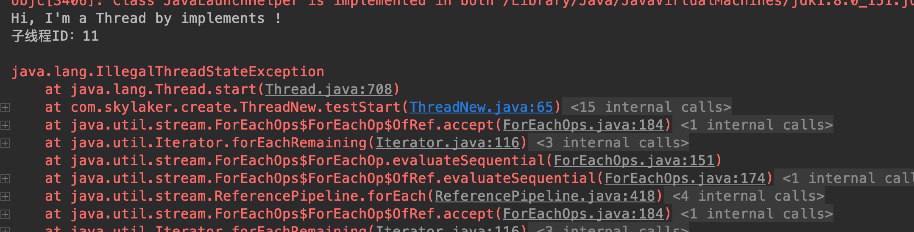

前面两行创建了线程，执行了代码指令，但是再次执行start方法就报错了，因为已经启动了线程，正在执行指令，无法再次发送任务了，直白点人家线程已经启动了你还要去启动不是多余么~~ 而抛出的异常也阐明了这一点，IllegalThreadStateException，非法线程状态，线程已经处于就绪状态不能又直接就绪。

2.2. **终止线程**
* 我们已经有了新建线程的方法，那么如何停止一个线程呢，停止不就stop嘛，我们试试，你别说还真有stop方法，还开心，赶紧试试：
```
public class ThreadStop {
    @Test
    public void testStopThread(){
        Thread thread = new Thread(new Runnable() {
            public void run() {
                try {
                    System.out.println("Hello, Thread !");
                    Thread.sleep(2000);
                } catch (InterruptedException e) {
                    e.printStackTrace();
                }
            }
        });

        // 启动线程
        thread.start();
        // 终止线程
        thread.stop();
    }
}
```
输出结果：

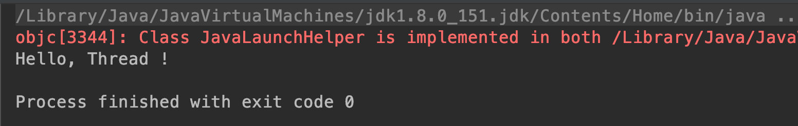

可以看到输出了期望的值~~ 但是我们发现一个问题，stop方法被标识为横线了，这表明这是一个过时的方法，一个废弃的方法必然有其被废弃的原因，一般都会导致一些问题或者有了更好的方法。我们看下官方注释：

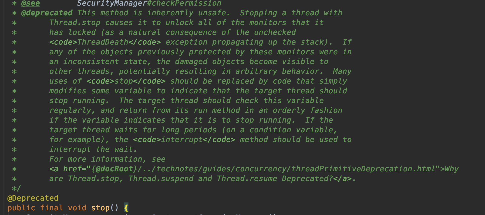

里面说明了弃用该方法的原因，大致意思就是如果使用stop方法去终止一个线程，那么该线程所持有的监视器（一般来说锁对象）都会直接释放掉，而这些监视器是保证线程之间同步的措施，如果突然释放掉，那么其他线程就会获的访问临界区资源的资格，进而操作临界区资源，可能导致临界区资源破坏。

仔细想想，我们线程之间同时去操作临界区资源，为了保证临界区资源安全性需要对访问该临界区的线程进行同步，常常通过锁的方式，线程获取到了锁，进行临界区资源操作，操作完成释放掉锁，其他线程抢占CPU获取调用得到了锁，进入临界区进行操作，大家先后依次有序进行，保证了共享资源的安全性。现在某个线程获取到了锁，正在操作临界区资源，突然接收到stop方法，被迫中止，释放掉锁了，这个时候其他正在阻塞等待的线程就有机会了，获取到了锁进行临界区资源操作，但是问题来了，前一个突然被中止的线程操作数据刚到一半，现在又被其他线程操作，那么数据就被破坏了，比如原本要 a=1 进行加5操作，依次加1操作，才加到3就突然退出了，后续的线程应该在前一个加了5的基础上操作，现在在加了3的基础上操作，明显最终的数据结果就会出问题，这正是stop方法非安全性被舍弃的原因。我们可以通过程序模拟下相关的场景：
```
package com.skylaker.stop;

/**
 * 线程直接stop产生问题场景模拟
 *
 * @author skylaker2019@163.com
 * @version V1.0 2019/7/20 9:53 PM
 */
public class ThreadStop2 {
    private static User user  = new User();

    public static void main(String[] args){
        // 开启读线程不停的读
        new ReadThread().start();

        // 开启写线程不停的写
        while(true){
            WriteThread writeThread = new WriteThread();
            writeThread.start();

            try {
                Thread.sleep(150);
            } catch (InterruptedException e) {
                e.printStackTrace();
            }
            writeThread.stop();
        }
    }

    /**
     * 读线程：读取User对象的age和name，当不一致的时候输出
     */
    static class ReadThread extends Thread {
        @Override
        public void run() {
            while (true){
                synchronized (user){
                    if(user.getAge() != Integer.parseInt(user.getName())){
                        System.out.println("当前User的age和name不一致，age："
                                + user.getAge()
                                + ", name: "
                                + user.getName());
                    }
                }

                // 临时让出资源避免读线程一直持有锁对象，
                // 写线程无法操作，观察不出现象
                Thread.yield();
            }
        }
    }

    /**
     * 写线程：不停的设置User的 age、name值，且值一致（忽略类型）
     */
    static class WriteThread extends Thread {
        @Override
        public void run() {
            while (true){
                synchronized (user){
                    int value = (int) (System.currentTimeMillis() / 1000);
                    user.setAge(value);

                    try {
                        Thread.sleep(100);
                    } catch (InterruptedException e) {
                        e.printStackTrace();
                    }

                    user.setName(String.valueOf(value));
                }

                Thread.yield();
            }
        }
    }

    static class User {
        private int age;

        private String name;

        User() {
            // 初始化设值，避免读线程刚启动疯狂读取没有值报错
            age = 1;
            name = "1";
        }

        public int getAge() {
            return age;
        }

        public void setAge(int age) {
            this.age = age;
        }

        public String getName() {
            return name;
        }

        public void setName(String name) {
            this.name = name;
        }

        @Override
        public String toString() {
            return "User{" +
                    "age=" + age +
                    ", name='" + name + '\'' +
                    '}';
        }
    }
}
```
执行结果：

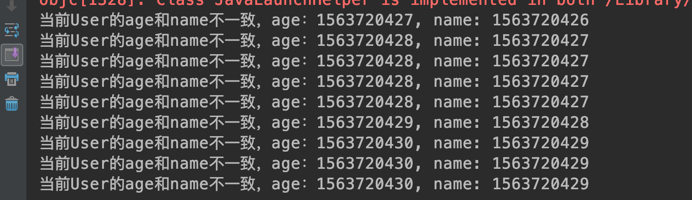

可以看到测试代码输出了意外场景的数据，仔细观察发现，发生意外时候name的值（对应的int值）总是比age的值小1，这是为什么呢？因为我们的写线程中是先设置age的值得，但是在到设置name的值中间有个短暂的间隔，但正是因为这个间隔就产生了问题，因为在此期间，写线程突然被stop终止了，那么就会导致写线程只设置了age的值却没来得及设置name的值，这样我们以时间戳值设置变量的话，就会发现name值比age小1。

上述验证代码正验证了stop代码的危害，也是官方描述的内容，会突然导致线程终止，释放锁资源，导致同步失效，最终导致数据损坏。

所以，我们程序中禁止stop方法！

那么我们程序就是想要线程停止运行呢，该咋办？可以有两种方式，一个是自行实现程序自动退出的逻辑，例如定义一个标识位，当满足条件时即退出程序运行；另外可以通过线程间中断实现。

2.3. **线程中断**
* 中断概述

回忆上一节stop方法内容，如果仔细思考，发现它不安全的根本原因就在于突然停止线程，好比如你在吃饭突然被人把碗筷扔了，你突然不能继续吃饭了，你不得发飙；但是如果换个方式，有人来告诉你说食堂因为有事要打扫卫生啥的，让你赶紧吃完，这个肯定要温柔点了。在线程中也有类似的方式，就是线程中断，通过中断通知线程停止运行，不过和你被通知不要吃饭但是你可以选择继续吃一会就不吃了还是立即就不吃了一样，线程在接收到中断请求后，也可以继续运行完当前程序指令内容后再停止，或者已经几乎执行完了可以直接停止。

总计起来就是，中断可以请求线程结束运行，但是线程收到中断请求何时真正停止可以自行处理决定。

中断是线程间的协作方式。因为中断时需要别的线程发起请求的，类似人之间通信交流。

* 线程方法

A. **public void Thread.interrupt()**

中断线程：通知目标线程中断，设置中断标志位。这个中断标志位是干嘛的呢？其实就直接当做一个flag看待了，我们通知目标线程中断，但是目标线程具体停不停止、如何处理中断完全由目标线程决定，那么目标线程如何判断呢？就相当于if(true == flag)了，即通过判断中断标志位。

B. **public boolean Thread.isInterrupted()**

判断线程是否被中断：目标线程被通知中断后，可以通过该方法判断是否被中断

C. **public static boolean Thread.interrupted()**

判断是否被中断，并清除当前中断标志

* 线程测试

A. 只通知线程中断，但是线程不显式处理
```
public static void main(String[] args) throws InterruptedException {
        testInterrupt();
    }

    /**
     * 如果子线程不对中断通知进行处理，那么将不会退出处理逻辑
     * @throws InterruptedException
     */
    public static void testInterrupt() throws InterruptedException {
        Thread thread = new Thread(){
            @Override
            public void run() {
                while (true) {
                    System.out.println("子线程正在运行：" + System.currentTimeMillis());
                    Thread.yield();
                }
            }
        };

        thread.start();
        Thread.sleep(2000);
        // 通知子线程中断
        thread.interrupt();
    }
```

执行结果：

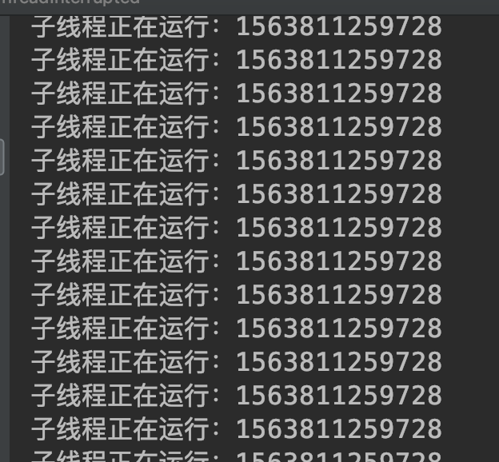

通知线程中断，但是线程并没有对中断进行处理，因此不会结束程序。

B. 对中断进行判断处理
```
/**
     * 子线程对中断通知进行响应
     * @throws InterruptedException
     */
    public static void testReolveInterrupt() throws InterruptedException {
        Thread thread = new Thread(){
            @Override
            public void run() {
                while (true) {
                    if(Thread.currentThread().isInterrupted()){
                        System.out.println("子线程收到中断通知，准备退出！");
                        break;
                    }

                    System.out.println("子线程正在运行：" + System.currentTimeMillis());
                    Thread.yield();
                }
            }
        };

        thread.start();
        Thread.sleep(200);
        // 通知子线程中断
        thread.interrupt();
    }
```

执行结果:

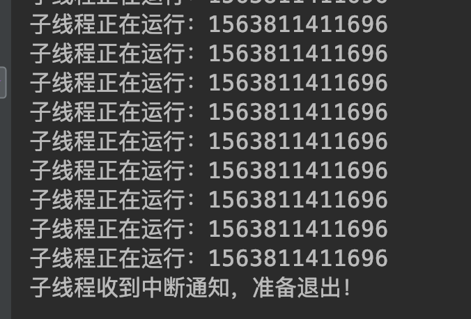

子线程对中断标志位进行判断，如果产生了中断则结束。

C.休眠中断处理
```
/**
     * 休眠过程中中断
     * @throws InterruptedException
     */
    public static void testSleepInterrupt() throws InterruptedException {
        Thread thread = new Thread(){
            @Override
            public void run(){
                while (true) {
                    if (Thread.currentThread().isInterrupted()){
                        System.out.println("子线程收到中断通知，准备退出！");
                        break;
                    }

                    System.out.println("子线程正在运行：" + System.currentTimeMillis());

                    try {
                        Thread.sleep(100);
                    } catch (InterruptedException e) {
                        System.out.println("子线程休眠中断异常");
                        // 异常中断标志位被清除，需要重新设置，让子线程处理退出，避免直接退出导致后续代码无法执行
                        Thread.currentThread().interrupt();
                    }

                    System.out.println("休眠后逻辑内容：" + System.currentTimeMillis());
                    Thread.yield();
                }
            }
        };

        thread.start();
        Thread.sleep(300);
        // 通知子线程中断
        thread.interrupt();
    }
```

执行结果：


子线程处理逻辑中存在sleep方法，线程在休眠期间如果被中断则会产生中断异常，且会清除中断标志位。但是产生中断异常后我们不应该直接退出线程，因为后续可能还会有其他处理逻辑，可以通过重新设置中断标志位，进行判断后处理。

2.4 **线程等待、唤醒**

* 场景概述

线程之间在某些情况下会需要相互协作，A线程处理某个逻辑时可能需要等待B线程处理完成后才能继续进行。举个生活的场景，例如你去海底捞吃火锅，但是人已经满了，这个时候你就需要等待，服务员通知你人满了，你便到等待区域吃点小吃慢慢等着；等有空桌时，服务员又通知你可以如坐点餐吃火锅了。这个过程中你相当于一个线程，而其他吃饭的顾客是其他线程。线程之间的通信采用 wait 和 notify 方法完成。

* 协作方法
A. public final void wait() throws InterruptedException

该方法为object方法，即所有对象都具有该方法。当线程中的对象调用wait方法后当前所在线程便暂停当前程序处理逻辑，然后释放当前线程所持有的锁，进入调用wait方法对象的等待队列，这个等待队列其实是一个虚拟的概念，当期对象上面等待的线程都在这个队列中，这个过程可以用如下图示表达：

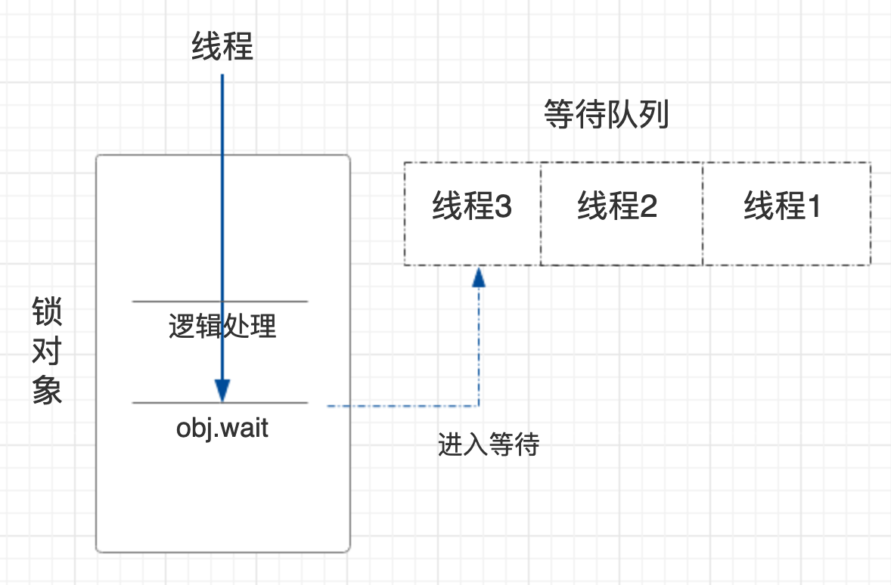

B. public final native void notify()

该方法也是object定义的方法，同样意味所有的对象都拥有这个方法。当对象调用notify方法时候，当前所在线程会在执行完程序逻辑后释放掉当前的持有的锁，然后去当前对象的等待队列中随机唤醒一个线程，获取到锁的线程会继续在原来暂停的地方继续运行。

不过还有个 notifyAll 方法，唤醒所有等待的线程。

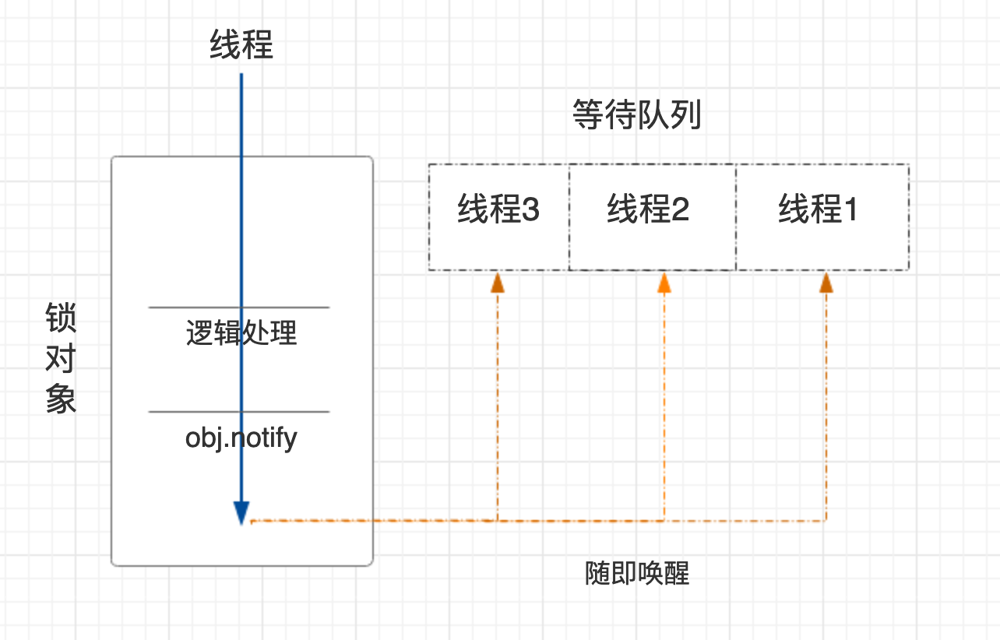

* 代码实例
```
package com.skylaker.wait;

/**
 * 多线程协作：wait notify
 * @author skylaker2019@163.com
 * @version V1.0 2019/7/23 10:31 PM
 */
public class ThreadWaitNotify {
    final static Object object = new Object();

    public static void main(String[] args){
        WaitThread waitThread = new WaitThread();
        NotifyThread notifyThread = new NotifyThread();
        waitThread.start();
        notifyThread.start();
    }

    // 阻塞等待 wait
    static class WaitThread extends Thread {
        @Override
        public void run() {
            synchronized (object) {
                System.out.println(System.currentTimeMillis() + " 等待线程处理逻辑 1 ");

                try {
                    // 当前锁对象锁住的线程进入阻塞等待，并释放锁
                    object.wait();
                } catch (InterruptedException e) {
                    e.printStackTrace();
                }

                System.out.println(System.currentTimeMillis() + " 等待线程继续处理逻辑 2");
            }
        }
    }

    // 通知唤醒 notify
    static class NotifyThread extends Thread {
        @Override
        public void run() {
            synchronized (object) {
                System.out.println(System.currentTimeMillis() + " 通知线程处理逻辑 1");

                // 当前锁对象锁住的线程通知当前锁对象等待队列中的某个线程唤醒
                object.notify();

                System.out.println(System.currentTimeMillis() + " 通知线程处理逻辑 2");
                try {
                    Thread.sleep(2000);
                } catch (InterruptedException e) {
                    e.printStackTrace();
                }
            }
        }
    }
}
```
执行结果：

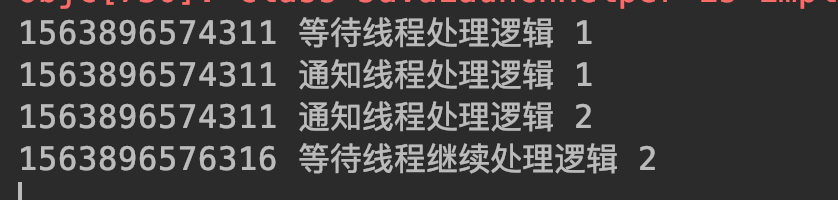

在这里我们模拟了两个线程，在等待线程中，通过锁对象通知线程进行等待，然后在通知线程中锁对象进行唤醒等待队列中的阻塞线程。我们可以看待输出结果第四行显示的是等待线程之前执行wait方法后的逻辑内容，说明进行wait的线程被唤醒后会继续在原来等待的地方继续运行。而第四行比第三行延时2秒，这个因为我们在通知线程中notify之后，又故意等待了两秒，这个恰恰说明通知线程在notify之后并没有立即释放掉当前持有的锁资源，而是执行完自己的剩余逻辑才释放掉锁资源，这个也是一种保证逻辑正确、数据正确的方式，不然就和stop类似了。

* 必须是同一个对象吗？
```
public class ThreadWaitNotify {
    final static Object object = new Object();
    final static Object object2 = new Object();

    public static void main(String[] args){
        WaitThread waitThread = new WaitThread();
        NotifyThread notifyThread = new NotifyThread();
        waitThread.start();
        notifyThread.start();
    }

    // 阻塞等待 wait
    static class WaitThread extends Thread {
        @Override
        public void run() {
            synchronized (object) {
                System.out.println(System.currentTimeMillis() + " 等待线程处理逻辑 1 ");

                try {
                    // 当前锁对象锁住的线程进入阻塞等待，并释放锁
                    object.wait();
                } catch (InterruptedException e) {
                    e.printStackTrace();
                }

                System.out.println(System.currentTimeMillis() + " 等待线程继续处理逻辑 2");
            }
        }
    }

    // 通知唤醒 notify
    static class NotifyThread extends Thread {
        @Override
        public void run() {
            synchronized (object2) {
                System.out.println(System.currentTimeMillis() + " 通知线程处理逻辑 1");

                // 当前锁对象锁住的线程通知当前锁对象等待队列中的某个线程唤醒
                object2.notify();

                System.out.println(System.currentTimeMillis() + " 通知线程处理逻辑 2");
                try {
                    Thread.sleep(2000);
                } catch (InterruptedException e) {
                    e.printStackTrace();
                }
            }
        }
    }
}
```

执行结果：


这里可以看到等待线程在等待后就一直没有下文了，即一直处于等待阻塞状态，因为在它的锁对象object上面没有其他线程来唤醒他，所以就一直处于阻塞状态了。而通知线程它是通知锁对象object2上面等待队列中的等待线程，那么肯定通知不到object上等待的线程了。好比上面你去吃火锅，还在等待呢，结果旁边麻辣烫店的服务员把你薅过去了，你是不是一脸懵逼，答应么（我们正常来说哈）？

* 必须是锁对象吗？

那么必须要用锁对象进行 wait 和 nitify 吗？

```
public class ThreadWaitNotify {
    final static Object object = new Object();
    final static Object object2 = new Object();

    public static void main(String[] args){
        WaitThread waitThread = new WaitThread();
        NotifyThread notifyThread = new NotifyThread();
        waitThread.start();
        notifyThread.start();
    }

    // 阻塞等待 wait
    static class WaitThread extends Thread {
        @Override
        public void run() {
            synchronized (object) {
                System.out.println(System.currentTimeMillis() + " 等待线程处理逻辑 1 ");

                try {
                    // 当前锁对象锁住的线程进入阻塞等待，并释放锁
                    object2.wait();
                } catch (InterruptedException e) {
                    e.printStackTrace();
                }

                System.out.println(System.currentTimeMillis() + " 等待线程继续处理逻辑 2");
            }
        }
    }

    // 通知唤醒 notify
    static class NotifyThread extends Thread {
        @Override
        public void run() {
            synchronized (object) {
                System.out.println(System.currentTimeMillis() + " 通知线程处理逻辑 1");

                // 当前锁对象锁住的线程通知当前锁对象等待队列中的某个线程唤醒
                object2.notify();

                System.out.println(System.currentTimeMillis() + " 通知线程处理逻辑 2");
                try {
                    Thread.sleep(2000);
                } catch (InterruptedException e) {
                    e.printStackTrace();
                }
            }
        }
    }
}
```

执行结果：

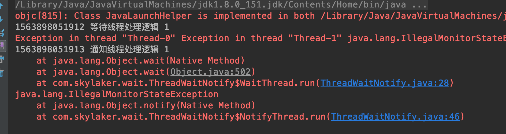

可以看到两个线程在执行 wait 和 notify 时都报错了，这个说明要想执行 wait 和 notify 必须是同一个锁对象！其实仔细想想，如果不是用锁对象，那么也就无法控制线程之间同步，导致临界区资源问题。好比如上面你去吃火锅，没有服务员控制下顾客，大家随意抢桌子，估计就乱了~~~


#### 3. 同步控制

#### 4. 线程池

#### 5. 并发容器

