- [1. 基础概念](#head1)
	- [1.1. 开篇废话](#head2)
	- [1.2.  高并发与多线程](#head3)
	- [1.3. 同步和异步](#head4)
	- [1.4. 并发和并行](#head5)
	- [1.5. 临界区](#head6)
	- [1.6. 阻塞和非阻塞](#head7)
	- [1.7. 死锁、饥饿和活锁](#head8)
	- [1.8. 并发级别](#head9)
	- [1.9. JMM](#head10)
- [2. 线程方法](#head11)
	- [2.1. 新建线程](#head12)
		- [2.1.1 方式一：继承Thread实现](#head13)
		- [2.1.2 方式二：通过实现Runnable接口](#head14)
		- [2.1.3 我们创建了线程吗](#head15)
		- [2.1.4 直接Run方法怎样](#head16)
		- [2.1.5 多次调用start方法](#head17)
	- [2.2. 终止线程](#head18)
		- [2.2.1 如何停止线程](#head19)
		- [2.2.2  方法分析](#head20)
	- [2.3. 线程中断](#head21)
		- [2.3.1 中断概述](#head22)
		- [2.3.2 线程方法](#head23)
		- [2.3.3 方法实例](#head24)
			- [2.3.3.1 只通知线程中断，但是线程不显式处理](#head25)
			- [2.3.3.2 对中断进行判断处理](#head26)
			- [2.3.3.3 休眠中断处理](#head27)
	- [2.4  线程等待、唤醒](#head28)
		- [2.4.1 场景概述](#head29)
		- [2.4.2 协作方法](#head30)
		- [2.4.3 代码实例](#head31)
		- [2.4.4 必须是同一个对象吗](#head32)
		- [2.4.5 必须是锁对象吗](#head33)
		- [2.4.6 wait和sleep的区别](#head34)
	- [2.5 线程挂起和继续执行](#head35)
		- [2.5.1 方法概述](#head36)
		- [2.5.2 方法问题](#head37)
	- [2.6 等待线程结束和和谦让](#head38)
		- [2.6.1 等待线程运行结束：join方法](#head39)
		- [2.6.2 线程谦让：yield](#head40)
	- [2.7 线程组 ThreadGroup](#head41)
	- [2.8 守护线程](#head42)
	- [2.9 线程优先级](#head43)
		- [2.9.1 优先级概述](#head44)
		- [2.9.2 不设置优先级的情况表现](#head45)
		- [2.9.3 设置线程优先级](#head46)
- [3. 任务分工](#head47)
	- [3.1 分工概述](#head48)
	- [3.2 Executor与线程池](#head49)
		- [3.2.1 线程池概述](#head50)
		- [3.2.2 Java线程池结构](#head51)
		- [3.2.3 线程池种类](#head52)
			- [3.2.3.1 固定大小的线程池](#head53)
			- [3.2.3.2 创建单个数量线程的线程池](#head54)
			- [3.2.3.3 动态大小的线程池](#head55)
			- [3.2.3.4 周期性、定时性执行任务的线程池](#head56)
		- [3.2.4 线程池内部实现](#head57)
			- [3.2.4.1 相关参数](#head58)
			- [3.2.4.2 核心参数](#head59)
				- [3.2.4.2.1 workQueue: 等待队列](#head60)
					- [3.2.4.2.1.1 SynchronousQueue 直接提交任务的队列](#head61)
					- [3.2.4.2.1.2 ArrayBlockingQueue 有界任务队列](#head62)
					- [3.2.4.2.1.3 LinkedBlockingQueue 无界任务队列](#head63)
					- [3.2.4.2.1.4 PriorityBlockingQueue 优先任务队列](#head64)
				- [3.2.4.2.2 拒绝策略](#head65)
					- [3.2.4.2.2.1 拒绝策略接口定义](#head66)
					- [3.2.4.2.2.2 AbortPolicy 策略](#head67)
					- [3.2.4.2.2.3 CallerRunsPolicy 调用者执行拒绝的任务](#head68)
					- [3.2.4.2.2.4 DiscardOldestPolicy 删除最老的任务，然后执行当前新提交的任务](#head69)
					- [3.2.4.2.2.5 DiscardPolicy 静默拒绝](#head70)
					- [3.2.4.2.2.6 自定义拒绝策略](#head71)
				- [3.2.4.2.3 线程创建工厂](#head72)
					- [3.2.4.2.3.1 线程工厂默认实现](#head73)
					- [3.2.4.2.3.2 自定义线程工厂](#head74)
					- [3.2.4.2.3.3 线程执行任务跟踪](#head75)
	- [3.3 Fork/Join](#head76)
		- [3.3.1 概述](#head77)
		- [3.3.2 原理方法](#head78)
		- [3.3.3 使用示例](#head79)
	- [3.4 Future](#head80)
- [4. 线程协作](#head81)
- [5. JMM内存模型](#head82)
- [6. 互斥处理](#head83)
	- [6.1 概述](#head84)
	- [6.2 synchronized](#head85)

------

# 1. <span id="head1">基础概念</span>

## 1.1. <span id="head2">开篇废话</span>

进行Java开发也不知不觉很长时间了，虽然也有涉及框架内容的开发，但其实就是开源框架的搬运工，很多技术内容深层次根本涉及不到也没有潜心研究，实则痛心，因此暗下决心多多学习，Java线程相关的内容便是一座巍峨的大山，山虽高、虽险，但坚定盘之，亦可笑登山巅！  

本学习内容主要以《实战JAVA高并发程序设计》一书为参考资料，先知其然，再知其所以然~~

## 1.2.  <span id="head3">高并发与多线程</span>

说到线程，可能比较令人难以理解，毕竟是作为抽象的存在，我们面对的是一个高度封装的计算机硬件设施以及很神奇的软件系统，线程具体在里面的存在形式、运行方式等等，都是无法直观感知的，具体的内容需要学习相关的计算机原理、操作系统原理等知识的。我们这里谈高并发、谈线程可以先不必刨根问底其底层原理，可以先外部感知，知道如何使用。

我们先说说高并发，啥叫高并发呢？整天听人说高并发，一言不合分布式啥的，听着老高大上了。其实我们编程不要仅仅拘泥于程序开发本身，很多东西都是融会贯通，有着现实场景类似的。比如我们去饭店吃饭，就一个人去，饭店空荡荡的，这种情况下服务员肯定不会着急，从容应对，来给你点菜、上菜啥的，服务周到，美滋滋~ 但是如果去饭店吃饭的人多了，那如果还是这一个服务员的话，肯定要忙成狗了，你这边刚点完菜，那边桌的客人就喊着去点菜，点完又忙着来回上菜，就是一时干这一时干那 如果老板不想雇佣其他服务员，我估计一个顾客来这的体验肯定不会好，要等好久才能轮到服务自己；而服务员肯定也不爽，太累了，拍屁股走人~~ 那么为了应对大量客户的情况，正常的老板肯定会雇佣多个服务员，来满足这种忙碌的场景。其实这个一堆人来吃饭就是高并发的现实场景，那这个在计算机世界、在互联网环境下呢？就是同时存在大量计算、调度场景；存在大量网络请求处理的场景，例如双11亿万同胞集体狂欢，一起买买买导致大量的请求奔向各大电商网站的情景。

那么怎么应对高并发场景、解决高并发的导致的一系列问题呢？首先我们明确一个概念，多线程是高并发么？这个问题其实是伪命题，我们需要区分高并发与多线程的概念，高并发是一种场景，而多线程是一种技术手段、是应对解决高并发的一种方式。我们不能说多个服务员就是忙碌的场景，概念完全不对，是因为面对顾客多忙碌的场景我们采用多个服务员来应对。应对高并发有着各种各样的方式，例如我们常听说的微服务架构、分布式架构、集群模式、分库分表、缓存系统等等，而具体到实际处理对象上来说，我们可以开启多个线程来处理实际的问题，例如开启多个线程分别负责多个客户端请求连接（当然这个方式合不合理值得商榷）~~ 这个需要具体学习不同的高并发场景解决技术了~~

我们再来说说线程，具体什么是线程？我们打开电脑，如果是windows平台我们可以打开资源管理器、mac平台打开活动监视器查看当前哪些应用在运行，例如
    
这里我们可以看到很多应用，各个应用占用的CPU、内存等资源也在不停的变化，我们看到第一列显示进程名称，其实我们的一个应用在操作系统中就是被当做进程管理的，而每一个应用详细信息列中会显示线程数量：
    
看到这里我们大致就能知道线程其实是进程内部的资源对象。即进程是应用级别的调度对象，就是一个个的应用程序占用CPU、内存等系统资源的逻辑对象；线程就是进程内部、会公用进程资源的调度对象。回到上面的例子，进程就相当于一个个不同的饭店，每个饭店中不同的服务员就相当于线程。而常常开启多个线程就是为了提升系统运行效率，毕竟饭店只有一个服务员的话顾客一多肯定是忙不过来的，但是非要就一个的话，来回服务倒是可以，一边服务员忙成狗，一边客人不愿意等待还没点菜就跑了，回到计算机中就是一堆任务迟迟得不到解决、一堆用户买买买请求得不到处理，自然就会导致系统过载，或系统崩溃、或大量请求失效~~ 

面对高并发我们可以采用多线程方式处理，那是不是开启更多的线程就更能应对、更好的解决问题呢？并不是，就好比如饭店顾客多，总不能有多少顾客就雇佣多少服务员吧，真这样的话饭店老板就哭了，得付多少薪水啊、还咋挣钱？同样系统开启更多的线程，那么所产生的系统资源消耗和上下文切换等带来的负担也逐渐增大，所以需要综合考量开启合适数量的线程。

## 1.3. <span id="head4">同步和异步</span>

* 同步（Synchronous）：需要依次执行，调用端需要等待调用完成才能继续执行，例如吃饭上菜，不给你同时上菜，吃完一个菜再上下一个菜；
* 异步(Asynchronous)：不需要等待，在等待某个事情执行时可以做别的事情，例如去吃饭一直在等待菜上来，在等待过程中可以玩玩手机、聊聊天，等菜上来了就正式吃饭。

## 1.4. <span id="head5">并发和并行</span>

* 并行(Parallslism)：同时运行，例如在吃饭的同时边看电视；
* 并发(Concurrency)：侧重于多个任务交替执行，例如吃一会饭，又去玩玩手机，但是不能同时进行。
* 很多时候二者会当成同一个概念，其实是有差别的。对计算机来说，如果只有一个CPU，那么其实是做不到真正的并行的，只能并发，因为CPU某个时刻智能执行一条指令，采用多线程操作方式其实CPU是来回切换执行的，只不过速度很快，让人的感觉是同时完成的。不过现代计算机大多多核，也就能做到真正的并行了，即可以同时执行多个任务。

## 1.5. <span id="head6">临界区</span>

* 共享的资源或者公共资源，对于多个线程共享临界区来说，某个时刻只允许一个线程访问（其实多个访问我们也可以称作临界区），其他线程要想访问必须等待。
* 对于多线程访问临界区，大部分情况下需要进行同步控制，避免多个线程同时操作临界区资源以导致资源破坏。

## 1.6. <span id="head7">阻塞和非阻塞</span>

* 阻塞(Blocking)：是一种事物之间相互影响的描述，一个事物的状态导致另一个一直在等待。例如堵车，前面的车不动了，而且这条路单行道，那么后面的车就动弹不得，只能处于等待状态，这就是阻塞。对于线程来说，一个线程操作临界区资源，同时线程间进行同步控制，那么其他线程就需要等待当前线程执行完毕，等待过程就是一种阻塞状态。
* 非阻塞(Non-Blocking)：即不需要等待，这路很宽，不管你这辆车停不停，其他车照样畅通无阻。对于线程来说，就是一个线程不用等待其他线程执行完毕，可以畅通执行。

## 1.7. <span id="head8">死锁、饥饿和活锁</span>

* 死锁（Deadlock）：指多线程之间因为相互持有多方的所需要的锁，但是又都释放不了，导致相互等待无法继续运行的状态。
* 饥饿（Starvation）：指线程因为因为种种原因一直得不到所需要的资源，一直无法执行。多线程执行需要抢占系统资源，例如CPU，如果有些线程因为优先级低导致常常抢占不到CPU调度，就会一直在阻塞状态导致饥饿。
* 活锁（LiveLock）：死锁是互相占用对方需要的资源就不释放，而活锁是双方都在释放资源给对方使用，导致双方都获取不到资源，无法继续运行，好比如你走路遇到某个人，你给他让路，他也给你让路，但是你往左，他往右，没办法，你又往右，他又往左...这样你和对方都无法继续往前走了，都在礼让。

## 1.8. <span id="head9">并发级别</span>

* 阻塞：线程之间利用synchronized或者重入锁进行同步，其中一个获取到锁可以访问临界区资源，那么其他的线程就需要处在等待阻塞状态，等获取锁的线程释放资源后自己抢占到锁后才能继续运行。
* 无饥饿（Starvation-Free）：线程调度是相对公平的，所有的线程都能得到执行，例如采用公平锁，不会因为线程优先级低而得不到执行。
* 无锁（Lock-Free）：不直接采用锁机制同步，利用CAS等方式保证线程之间同步访问临界区资源。
* 无等待（Wait-Free）：无锁要求所有线程必须在有限步骤内完成。例如采用读写锁进行线程同步，读控制不加处理，写操作需要加锁操作。

## 1.9. <span id="head10">JMM</span>

* 高并发场景下采用多线程处理相关逻辑，一大核心难点在于线程间的同步，即对临界区资源的访问控制，不加控制有可能导致数据操作出错，例如两个线程都对临界区资源变量 a = 1 进行加1操作，两个线程同时读取到当前值，线程1操作 a=1+1, 回写a值，线程2也 a=1+1，也回写a值，那么最终a的值就变成了2，而非期望的3，这就是线程未同步导致的一大问题。
* JMM，Java Memory Model ，Java内存模型机制，保证线程间操作有效、正确的协同，有以下三个特性：
1）原子性（Atomicity）：指一个操作是不可中断的；
2）可见性（Visibility）：一个线程修改了共享变量值，其他的线程能否立即知道这个修改。
3）有序性（Ordering）：计算机在执行程序指令时会进行相关的优化，会有指令重排序，多线程并发场景下有些指令重排会导致问题。有序性即要求相关指令间不允许重排序，依赖Happen-Before原则。

# 2. <span id="head11">线程方法</span>

## 2.1. <span id="head12">新建线程</span>

### 2.1.1 <span id="head13">方式一：继承Thread实现</span>

```java
public class ThreadNew {

    public static void main(String[] args){
        // 方式一: 通过继承Thread
        Thread01 thread01 = new Thread01();
        thread01.start();

        /// 打印当前主线程ID
        System.out.println("主线程ID：" + Thread.currentThread().getId());
    }
    
    /**
     * 方式一: 通过继承Thread
     */
    static class Thread01 extends Thread {
        @Override
        public void run() {
            System.out.println("Hello, I'm a Thread by extends !");
            System.out.println("子线程ID：" + Thread.currentThread().getId());
        }
    }
```
 执行结果：

 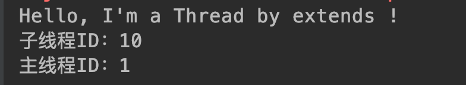

在这里，我们通过继承Java线程对象Thread创建了一个线程（我们确实创建了线程本身吗？），然后通过start方法来启动运行，同时我们还在main方法输出所谓的主线程ID，最后执行结果输出了三行内容，我们看到第一行 Hello... 这个内容，这个正是我们在线程run方法中定义的，第二、三行分别输出了子线程、主线程ID。

我们的main方法作为入口方法，负责执行的对象被称为主线程，而通过定义一个Thread，执行start方法，就是创建了一个子线程。从上述结果我们可以验证确实启动了一个新的子线程执行了执行代码指令。主线程和子线程的关系可以表示如下：

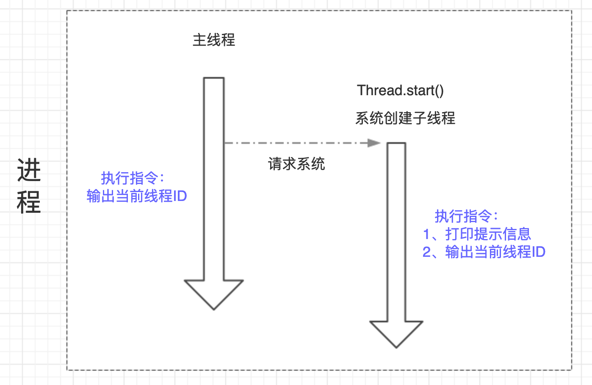

主线程、子系统是两个不同的个体对象，他们单独执行自己的程序指令，可以在主线程中启动子线程。

### 2.1.2 <span id="head14">方式二：通过实现Runnable接口</span>

```java
public class ThreadNew {

    public static void main(String[] args){
        // 方式二：通过实现Runnable接口
//        Thread02 thread02 = new Thread02();
//        thread02.start(); 没有该方法，更不可能执行，因为这是Thread02实例，不是线程Thread实例
        Thread thread02 = new Thread(new Thread02());
        thread02.start();

        /// 打印当前主线程ID
        System.out.println("主线程ID：" + Thread.currentThread().getId());
    }
    
        /**
     * 方式二：通过实现Runnable接口
     */
    static class Thread02 implements Runnable {
        public void run() {
            System.out.println("Hi, I'm a Thread by implements !");
            System.out.println("子线程ID：" + Thread.currentThread().getId());
        }
    }
}
```
执行结果：


可以看到和方式一类似的结果，不过这里我们发现主线程的信息先打印出来了，如果多次执行其实可以发现有时子线程先打印信息，有时主线程先打印，这个正是因为主线程、子系统是两个相互独立的个体，主线程启动了子线程，相当于系统中有两个线程同时在运行，那么具体谁先执行完成是无法确定的，所以也就是谁先打印信息也就无法确定了。

### 2.1.3 <span id="head15">我们创建了线程吗</span>

上面两种方式是创建线程的基本方式，但是其实说到底也是一种方式，因为Thread对象默认实现了Runnable接口：


即创建线程都需要实现Runable接口，不过如果我们直接通过继承Thread来实现的话，因为Java单继承特性我们无法再继承其他对象，所以最好通过实现接口的方式。

我们现在来思考一个问题，我们这些操作确实是创建了线程吗？即我们是否创建了线程本身？其实我们定义的线程其实真实的理解应该是我们定义了线程需要执行的任务内容，即run方法内的程序指令，只不过需要执行这段指令的方式是让JVM去创建一个线程去执行，而非当前主线程；new Thread 然后 start 就是通知JVM去创建线程执行指令，只不过不同线程执行的指令可以是同一个代码片段定义的。
    
```java
    @Test
    public void testThread(){
        Thread02 thread02 = new Thread02();

        Thread t1 = new Thread(thread02);
        Thread t2 = new Thread(thread02);
        Thread t3 = new Thread(thread02);
        t1.start();
        t2.start();
        t3.start();
    }
```
执行结果：


我们定义了个Thread02实例，理论上如果我们实现Runnable接口的对象实例就是线程本身，那么这里三个线程执行就应该是同一个线程，应该输出同样的线程ID，但是结果显示并非如此，而是输出了三个线程ID，也就是通过 new Thread 方法才真正定义了线程，但其实也不完全是，更准确的说法是Thread执行start方法后主线程通知JVM去创建三个不同的线程，然后执行我们在Thread02的run方法中定义的代码内容。只不过很多时候因为我们用这样的方式启动的就是线程，所以就直接称Thread为线程了。

其实执行start方法后，JVM创建了线程，线程并非直接获取到CPU调度，而是出于就绪状态，会和其他线程抢占资源，当被CPU调度后，就会出于运行状态，执行对应的run方法中的内容。

线程本身是操作系统中的一个资源处理对象，我们的代码是程序指令，线程可以接收CPU调度，执行我们指定的程序指令。我们去吃饭可以让服务员倒杯水，服务员接收我们的请求来做倒水的事情，但是不能说我们请服务器倒水这个请求是服务员，我们更没有自带或者创建了服务员~~

### 2.1.4 <span id="head16">直接Run方法怎样</span>

我们启动线程的时候是通过Thread的start方法，但是run方法里面才是我们要线程执行的内容啊，为啥不直接执行Run方法呢？

```java
    @Test
    public void testRunStart(){
        Thread t1 = new Thread01();
        t1.run();

        Thread t2 = new Thread(new Thread02());
        t2.run();

        System.out.println("主线程ID：" + Thread.currentThread().getId());
    }
```
运行结果：


我们利用两种方式创建的线程，直接运行run方法，同时输出主线程ID，如果run方法启动的是线程执行，那么理论上他们对应的线程ID应该和主线程不同，但是很意外，输出的结果显示两个子线程和主线程的ID是一致的，说明通过run方法根本没有新建子线程，就是主线程在运行。

其实启动线程必须通过Thread的start方法，如果直接运行run方法也是可以的，只不过是运行普通的java方法，还是主线程在执行。Thread的start方法执行过后，通知JVM创建子线程，子线程运行其中run方法定义的指令。

### 2.1.5 <span id="head17">多次调用start方法</span>

如果多次调用start方法会怎么样呢？

```java
    @Test
    public void testStart(){
        Thread t1 = new Thread(new Thread02());
        t1.start();
        t1.start();
    }
```
执行结果：


前面两行创建了线程，执行了代码指令，但是再次执行start方法就报错了，因为已经启动了线程，正在执行指令，无法再次发送任务了，直白点人家线程已经启动了你还要去启动不是多余么~~ 而抛出的异常也阐明了这一点，IllegalThreadStateException，非法线程状态，线程已经处于就绪状态不能又直接就绪。

## 2.2. <span id="head18">终止线程</span>

### 2.2.1 <span id="head19">如何停止线程</span>

我们已经有了新建线程的方法，那么如何停止一个线程呢，停止不就stop嘛，我们试试，你别说还真有stop方法，还开心，赶紧试试：

```java
public class ThreadStop {
    @Test
    public void testStopThread(){
        Thread thread = new Thread(new Runnable() {
            public void run() {
                try {
                    System.out.println("Hello, Thread !");
                    Thread.sleep(2000);
                } catch (InterruptedException e) {
                    e.printStackTrace();
                }
            }
        });

        // 启动线程
        thread.start();
        // 终止线程
        thread.stop();
    }
}
```
输出结果：


可以看到输出了期望的值~~ 

### 2.2.2  <span id="head20">方法分析</span>

但是我们发现一个问题，stop方法被标识为横线了，这表明这是一个过时的方法，一个废弃的方法必然有其被废弃的原因，一般都会导致一些问题或者有了更好的方法。我们看下官方注释：

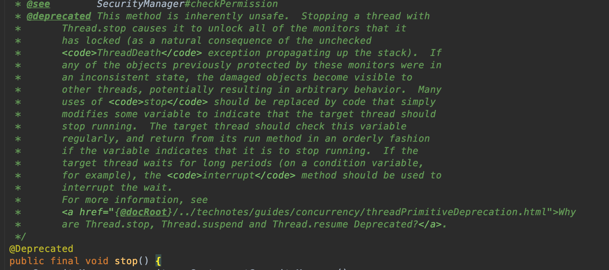

里面说明了弃用该方法的原因，大致意思就是如果使用stop方法去终止一个线程，那么该线程所持有的监视器（一般来说锁对象）都会直接释放掉，而这些监视器是保证线程之间同步的措施，如果突然释放掉，那么其他线程就会获的访问临界区资源的资格，进而操作临界区资源，可能导致临界区资源破坏。

仔细想想，我们线程之间同时去操作临界区资源，为了保证临界区资源安全性需要对访问该临界区的线程进行同步，常常通过锁的方式，线程获取到了锁，进行临界区资源操作，操作完成释放掉锁，其他线程抢占CPU获取调用得到了锁，进入临界区进行操作，大家先后依次有序进行，保证了共享资源的安全性。现在某个线程获取到了锁，正在操作临界区资源，突然接收到stop方法，被迫中止，释放掉锁了，这个时候其他正在阻塞等待的线程就有机会了，获取到了锁进行临界区资源操作，但是问题来了，前一个突然被中止的线程操作数据刚到一半，现在又被其他线程操作，那么数据就被破坏了，比如原本要 a=1 进行加5操作，依次加1操作，才加到3就突然退出了，后续的线程应该在前一个加了5的基础上操作，现在在加了3的基础上操作，明显最终的数据结果就会出问题，这正是stop方法非安全性被舍弃的原因。我们可以通过程序模拟下相关的场景：
```java
package com.skylaker.stop;

/**
 * 线程直接stop产生问题场景模拟
 *
 * @author skylaker2019@163.com
 * @version V1.0 2019/7/20 9:53 PM
 */
public class ThreadStop2 {
    private static User user  = new User();

    public static void main(String[] args){
        // 开启读线程不停的读
        new ReadThread().start();

        // 开启写线程不停的写
        while(true){
            WriteThread writeThread = new WriteThread();
            writeThread.start();

            try {
                Thread.sleep(150);
            } catch (InterruptedException e) {
                e.printStackTrace();
            }
            writeThread.stop();
        }
    }

    /**
     * 读线程：读取User对象的age和name，当不一致的时候输出
     */
    static class ReadThread extends Thread {
        @Override
        public void run() {
            while (true){
                synchronized (user){
                    if(user.getAge() != Integer.parseInt(user.getName())){
                        System.out.println("当前User的age和name不一致，age："
                                + user.getAge()
                                + ", name: "
                                + user.getName());
                    }
                }

                // 临时让出资源避免读线程一直持有锁对象，
                // 写线程无法操作，观察不出现象
                Thread.yield();
            }
        }
    }

    /**
     * 写线程：不停的设置User的 age、name值，且值一致（忽略类型）
     */
    static class WriteThread extends Thread {
        @Override
        public void run() {
            while (true){
                synchronized (user){
                    int value = (int) (System.currentTimeMillis() / 1000);
                    user.setAge(value);

                    try {
                        Thread.sleep(100);
                    } catch (InterruptedException e) {
                        e.printStackTrace();
                    }

                    user.setName(String.valueOf(value));
                }

                Thread.yield();
            }
        }
    }

    static class User {
        private int age;

        private String name;

        User() {
            // 初始化设值，避免读线程刚启动疯狂读取没有值报错
            age = 1;
            name = "1";
        }

        public int getAge() {
            return age;
        }

        public void setAge(int age) {
            this.age = age;
        }

        public String getName() {
            return name;
        }

        public void setName(String name) {
            this.name = name;
        }

        @Override
        public String toString() {
            return "User{" +
                    "age=" + age +
                    ", name='" + name + '\'' +
                    '}';
        }
    }
}
```
执行结果：


可以看到测试代码输出了意外场景的数据，仔细观察发现，发生意外时候name的值（对应的int值）总是比age的值小1，这是为什么呢？因为我们的写线程中是先设置age的值得，但是在到设置name的值中间有个短暂的间隔，但正是因为这个间隔就产生了问题，因为在此期间，写线程突然被stop终止了，那么就会导致写线程只设置了age的值却没来得及设置name的值，这样我们以时间戳值设置变量的话，就会发现name值比age小1。

上述验证代码正验证了stop代码的危害，也是官方描述的内容，会突然导致线程终止，释放锁资源，导致同步失效，最终导致数据损坏。

所以，我们程序中禁止stop方法！

那么我们程序就是想要线程停止运行呢，该咋办？可以有两种方式，一个是自行实现程序自动退出的逻辑，例如定义一个标识位，当满足条件时即退出程序运行；另外可以通过线程间中断实现。

## 2.3. <span id="head21">线程中断</span>

### 2.3.1 <span id="head22">中断概述</span>

回忆上一节stop方法内容，如果仔细思考，发现它不安全的根本原因就在于突然停止线程，好比如你在吃饭突然被人把碗筷扔了，你突然不能继续吃饭了，你不得发飙；但是如果换个方式，有人来告诉你说食堂因为有事要打扫卫生啥的，让你赶紧吃完，这个肯定要温柔点了。在线程中也有类似的方式，就是线程中断，通过中断通知线程停止运行，不过和你被通知不要吃饭但是你可以选择继续吃一会就不吃了还是立即就不吃了一样，线程在接收到中断请求后，也可以继续运行完当前程序指令内容后再停止，或者已经几乎执行完了可以直接停止。

总计起来就是，中断可以请求线程结束运行，但是线程收到中断请求何时真正停止可以自行处理决定。

中断是线程间的协作方式。因为中断时需要别的线程发起请求的，类似人之间通信交流。

### 2.3.2 <span id="head23">线程方法</span>

A. **public void Thread.interrupt()**

中断线程：通知目标线程中断，设置中断标志位。这个中断标志位是干嘛的呢？其实就直接当做一个flag看待了，我们通知目标线程中断，但是目标线程具体停不停止、如何处理中断完全由目标线程决定，那么目标线程如何判断呢？就相当于if(true == flag)了，即通过判断中断标志位。

B. **public boolean Thread.isInterrupted()**

判断线程是否被中断：目标线程被通知中断后，可以通过该方法判断是否被中断

C. **public static boolean Thread.interrupted()**

判断是否被中断，并清除当前中断标志

### 2.3.3 <span id="head24">方法实例</span>

#### 2.3.3.1 <span id="head25">只通知线程中断，但是线程不显式处理</span>

```java
public static void main(String[] args) throws InterruptedException {
        testInterrupt();
    }

    /**
     * 如果子线程不对中断通知进行处理，那么将不会退出处理逻辑
     * @throws InterruptedException
     */
    public static void testInterrupt() throws InterruptedException {
        Thread thread = new Thread(){
            @Override
            public void run() {
                while (true) {
                    System.out.println("子线程正在运行：" + System.currentTimeMillis());
                    Thread.yield();
                }
            }
        };

        thread.start();
        Thread.sleep(2000);
        // 通知子线程中断
        thread.interrupt();
    }
```

执行结果：


通知线程中断，但是线程并没有对中断进行处理，因此不会结束程序。

#### 2.3.3.2 <span id="head26">对中断进行判断处理</span>

```java
/**
     * 子线程对中断通知进行响应
     * @throws InterruptedException
     */
    public static void testReolveInterrupt() throws InterruptedException {
        Thread thread = new Thread(){
            @Override
            public void run() {
                while (true) {
                    if(Thread.currentThread().isInterrupted()){
                        System.out.println("子线程收到中断通知，准备退出！");
                        break;
                    }

                    System.out.println("子线程正在运行：" + System.currentTimeMillis());
                    Thread.yield();
                }
            }
        };

        thread.start();
        Thread.sleep(200);
        // 通知子线程中断
        thread.interrupt();
    }
```

执行结果:


子线程对中断标志位进行判断，如果产生了中断则结束。

#### 2.3.3.3 <span id="head27">休眠中断处理</span>

```java
/**
     * 休眠过程中中断
     * @throws InterruptedException
     */
    public static void testSleepInterrupt() throws InterruptedException {
        Thread thread = new Thread(){
            @Override
            public void run(){
                while (true) {
                    if (Thread.currentThread().isInterrupted()){
                        System.out.println("子线程收到中断通知，准备退出！");
                        break;
                    }

                    System.out.println("子线程正在运行：" + System.currentTimeMillis());

                    try {
                        Thread.sleep(100);
                    } catch (InterruptedException e) {
                        System.out.println("子线程休眠中断异常");
                        // 异常中断标志位被清除，需要重新设置，让子线程处理退出，避免直接退出导致后续代码无法执行
                        Thread.currentThread().interrupt();
                    }

                    System.out.println("休眠后逻辑内容：" + System.currentTimeMillis());
                    Thread.yield();
                }
            }
        };

        thread.start();
        Thread.sleep(300);
        // 通知子线程中断
        thread.interrupt();
    }
```

执行结果：


子线程处理逻辑中存在sleep方法，线程在休眠期间如果被中断则会产生中断异常，且会清除中断标志位。但是产生中断异常后我们不应该直接退出线程，因为后续可能还会有其他处理逻辑，可以通过重新设置中断标志位，进行判断后处理。

## 2.4  <span id="head28">线程等待、唤醒</span>

### 2.4.1 <span id="head29">场景概述</span>

线程之间在某些情况下会需要相互协作，A线程处理某个逻辑时可能需要等待B线程处理完成后才能继续进行。举个生活的场景，例如你去海底捞吃火锅，但是人已经满了，这个时候你就需要等待，服务员通知你人满了，你便到等待区域吃点小吃慢慢等着；等有空桌时，服务员又通知你可以如坐点餐吃火锅了。这个过程中你相当于一个线程，而其他吃饭的顾客是其他线程。线程之间的通信采用 wait 和 notify 方法完成。

### 2.4.2 <span id="head30">协作方法</span>

A. public final void wait() throws InterruptedException

该方法为object方法，即所有对象都具有该方法。当线程中的对象调用wait方法后当前所在线程便暂停当前程序处理逻辑，然后释放当前线程所持有的锁，进入调用wait方法对象的等待队列，这个等待队列其实是一个虚拟的概念，当期对象上面等待的线程都在这个队列中，这个过程可以用如下图示表达：


B. public final native void notify()

该方法也是object定义的方法，同样意味所有的对象都拥有这个方法。当对象调用notify方法时候，当前所在线程会在执行完程序逻辑后释放掉当前的持有的锁，然后去当前对象的等待队列中随机唤醒一个线程，获取到锁的线程会继续在原来暂停的地方继续运行。

不过还有个 notifyAll 方法，唤醒所有等待的线程。


### 2.4.3 <span id="head31">代码实例</span>

```java
package com.skylaker.wait;

/**
 * 多线程协作：wait notify
 * @author skylaker2019@163.com
 * @version V1.0 2019/7/23 10:31 PM
 */
public class ThreadWaitNotify {
    final static Object object = new Object();

    public static void main(String[] args){
        WaitThread waitThread = new WaitThread();
        NotifyThread notifyThread = new NotifyThread();
        waitThread.start();
        notifyThread.start();
    }

    // 阻塞等待 wait
    static class WaitThread extends Thread {
        @Override
        public void run() {
            synchronized (object) {
                System.out.println(System.currentTimeMillis() + " 等待线程处理逻辑 1 ");

                try {
                    // 当前锁对象锁住的线程进入阻塞等待，并释放锁
                    object.wait();
                } catch (InterruptedException e) {
                    e.printStackTrace();
                }

                System.out.println(System.currentTimeMillis() + " 等待线程继续处理逻辑 2");
            }
        }
    }

    // 通知唤醒 notify
    static class NotifyThread extends Thread {
        @Override
        public void run() {
            synchronized (object) {
                System.out.println(System.currentTimeMillis() + " 通知线程处理逻辑 1");

                // 当前锁对象锁住的线程通知当前锁对象等待队列中的某个线程唤醒
                object.notify();

                System.out.println(System.currentTimeMillis() + " 通知线程处理逻辑 2");
                try {
                    Thread.sleep(2000);
                } catch (InterruptedException e) {
                    e.printStackTrace();
                }
            }
        }
    }
}
```
执行结果：


在这里我们模拟了两个线程，在等待线程中，通过锁对象通知线程进行等待，然后在通知线程中锁对象进行唤醒等待队列中的阻塞线程。我们可以看待输出结果第四行显示的是等待线程之前执行wait方法后的逻辑内容，说明进行wait的线程被唤醒后会继续在原来等待的地方继续运行。而第四行比第三行延时2秒，这个因为我们在通知线程中notify之后，又故意等待了两秒，这个恰恰说明通知线程在notify之后并没有立即释放掉当前持有的锁资源，而是执行完自己的剩余逻辑才释放掉锁资源，这个也是一种保证逻辑正确、数据正确的方式，不然就和stop类似了。

### 2.4.4 <span id="head32">必须是同一个对象吗</span>

```java
public class ThreadWaitNotify {
    final static Object object = new Object();
    final static Object object2 = new Object();

    public static void main(String[] args){
        WaitThread waitThread = new WaitThread();
        NotifyThread notifyThread = new NotifyThread();
        waitThread.start();
        notifyThread.start();
    }

    // 阻塞等待 wait
    static class WaitThread extends Thread {
        @Override
        public void run() {
            synchronized (object) {
                System.out.println(System.currentTimeMillis() + " 等待线程处理逻辑 1 ");

                try {
                    // 当前锁对象锁住的线程进入阻塞等待，并释放锁
                    object.wait();
                } catch (InterruptedException e) {
                    e.printStackTrace();
                }

                System.out.println(System.currentTimeMillis() + " 等待线程继续处理逻辑 2");
            }
        }
    }

    // 通知唤醒 notify
    static class NotifyThread extends Thread {
        @Override
        public void run() {
            synchronized (object2) {
                System.out.println(System.currentTimeMillis() + " 通知线程处理逻辑 1");

                // 当前锁对象锁住的线程通知当前锁对象等待队列中的某个线程唤醒
                object2.notify();

                System.out.println(System.currentTimeMillis() + " 通知线程处理逻辑 2");
                try {
                    Thread.sleep(2000);
                } catch (InterruptedException e) {
                    e.printStackTrace();
                }
            }
        }
    }
}
```

执行结果：

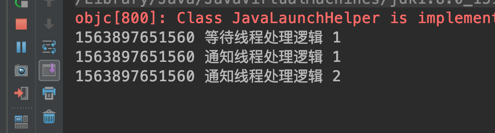

这里可以看到等待线程在等待后就一直没有下文了，即一直处于等待阻塞状态，因为在它的锁对象object上面没有其他线程来唤醒他，所以就一直处于阻塞状态了。而通知线程它是通知锁对象object2上面等待队列中的等待线程，那么肯定通知不到object上等待的线程了。好比上面你去吃火锅，还在等待呢，结果旁边麻辣烫店的服务员把你薅过去了，你是不是一脸懵逼，答应么（我们正常来说哈）？

### 2.4.5 <span id="head33">必须是锁对象吗</span>

那么必须要用锁对象进行 wait 和 nitify 吗？

```java
public class ThreadWaitNotify {
    final static Object object = new Object();
    final static Object object2 = new Object();

    public static void main(String[] args){
        WaitThread waitThread = new WaitThread();
        NotifyThread notifyThread = new NotifyThread();
        waitThread.start();
        notifyThread.start();
    }

    // 阻塞等待 wait
    static class WaitThread extends Thread {
        @Override
        public void run() {
            synchronized (object) {
                System.out.println(System.currentTimeMillis() + " 等待线程处理逻辑 1 ");

                try {
                    // 当前锁对象锁住的线程进入阻塞等待，并释放锁
                    object2.wait();
                } catch (InterruptedException e) {
                    e.printStackTrace();
                }

                System.out.println(System.currentTimeMillis() + " 等待线程继续处理逻辑 2");
            }
        }
    }

    // 通知唤醒 notify
    static class NotifyThread extends Thread {
        @Override
        public void run() {
            synchronized (object) {
                System.out.println(System.currentTimeMillis() + " 通知线程处理逻辑 1");

                // 当前锁对象锁住的线程通知当前锁对象等待队列中的某个线程唤醒
                object2.notify();

                System.out.println(System.currentTimeMillis() + " 通知线程处理逻辑 2");
                try {
                    Thread.sleep(2000);
                } catch (InterruptedException e) {
                    e.printStackTrace();
                }
            }
        }
    }
}
```

执行结果：


可以看到两个线程在执行 wait 和 notify 时都报错了，这个说明要想执行 wait 和 notify 必须是同一个锁对象！其实仔细想想，如果不是用锁对象，那么也就无法控制线程之间同步，导致临界区资源问题。好比如上面你去吃火锅，没有服务员控制下顾客，大家随意抢桌子，估计就乱了~~~

### 2.4.6 <span id="head34">wait和sleep的区别</span>

sleep可以让当前线程休眠一段时间，wait可以让当前锁线程阻塞等待一段时间，但是两者还是有区别的，一是wait可以被唤醒，但是sleep只能等休眠时间结束，如果休眠过程中发生中断，那么会导致中断异常；二是sleep休眠期间并不是释放当前锁资源，导致其它在当前锁对象上阻塞的线程一直在阻塞，而wait方法会导致当前锁上的线程暂停，释放掉持有的锁对象，进入等待队列，其他在阻塞的线程则抢占锁资源，抢占到锁的线程进入处理相关指令。

## 2.5 <span id="head35">线程挂起和继续执行</span>

### 2.5.1 <span id="head36">方法概述</span>

A. public final void suspend()

线程挂起方法，让当前线程挂起，但是不释放锁资源，那么就会导致其他在当前锁上等待的线程一直阻塞。

B. public final void resume() 

通知线程继续执行，suspend挂起的线程必须等到resume才能继续运行。

### 2.5.2 <span id="head37">方法问题</span>

我们在实际调用这两个方法的时候，发现其实已经被标注为舍弃方法，为啥呢？其实我们借鉴前面一些例子，就会发现挂起方法的一个大问题，就是在挂起期间不会释放当前锁对象，而suspend的线程必须被resume唤醒，试想如果出现差错，那么就会一直处于挂起状态，就一直持有锁对象，则导致其他等待的所有线程都得不到执行，严重影响系统功能。我们可以通过例子来测试下：

```java
package com.skylaker.suspend;

/**
 * 线程挂起suspend和继续执行resume
 *
 * @author skylaker2019@163.com
 * @version V1.0 2019/7/24 11:27 PM
 */
public class ThreadSuspendResume {
    private static Object object = new Object();

    public static void main(String[] args) throws InterruptedException {
        MyThread myThread1 = new MyThread("线程1");
        MyThread myThread2 = new MyThread("线程2");

        myThread1.start();
        myThread2.start();

        // 线程1继续执行
        System.out.println("通知线程1继续执行");
        myThread1.resume();
        // 线程2继续执行
        System.out.println("通知线程2继续执行");
        myThread2.resume();

        myThread1.join();
        myThread2.join();
    }

    static class MyThread extends Thread {
        private String threadName;

        MyThread(String threadName){
            this.threadName = threadName;
        }

        @Override
        public void run() {
            synchronized (object){
                System.out.println("线程：" + threadName + " 开始运行");
                // 线程挂起
                Thread.currentThread().suspend();
                System.out.println("线程：" + threadName + " 结束运行");

            }
        }
    }
}
```

运行正常结果：


非正常运行结果：


上面显示了两种不同的执行结果，一种正常的，两个线程都能正常结束运行，而另外一种则是非正常情况，线程2一直在挂起中，不能结束，这是因为线程2的通知唤醒resume唤醒时机在挂起suspend之前，这样线程2在挂起之后就一直等不到唤醒，那么也就一直等待了，造成结束不了。

其实这里挂起和唤醒继续运行和上一篇的wait、notify类似，但是wait、nofity会释放当前锁对象，一定程度上保证了整体程序的正常执行性，所以我们可以用wait、notify方法实现suspend、resume功能。

## 2.6 <span id="head38">等待线程结束和和谦让</span>

### 2.6.1 <span id="head39">等待线程运行结束：join方法</span>

和实际生活中一样，线程之间也存在着各种各样的协作，人在协作某些事情的时候，例如测试人员要等开发人员开发完成相关功能之后才能进行测试，而线程也有类似方法：join

public final void join() throws InterruptedException

调用join方法后，调用端线程会等到被调用线程执行结束，例如测试代码：

``` java
package com.skylaker.join;

/**
 * 等待线程结束运行 join
 *
 * @author skylaker2019@163.com
 * @version V1.0 2019/7/25 12:42 AM
 */
public class ThreadJoin {
    private static volatile int sum = 0;

    public static void main(String[] args){
        MyThread myThread = new MyThread();
        myThread.start();

        System.out.println("计算和为：" + sum);
    }

    static class MyThread extends Thread {
        @Override
        public void run() {
            for (int i = 0; i < 100; i++){
                sum += i;
            }
        }
    }
}
```

执行结果：


当然如果子线程运行足够快，有时会得到正确的最终结果 4950，不过很多情况下是小于4950的，就是因为主线程并未等到子线程执行完就直接打印结果了，但是如果主线程主动等到子线程执行完成就能始终得到最终的值。

```java
package com.skylaker.join;

/**
 * 等待线程结束运行 join
 *
 * @author skylaker2019@163.com
 * @version V1.0 2019/7/25 12:42 AM
 */
public class ThreadJoin {
    private static volatile int sum = 0;

    public static void main(String[] args){
        MyThread myThread = new MyThread();
        myThread.start();

        try {
            myThread.join();
        } catch (InterruptedException e) {
            e.printStackTrace();
        }
        System.out.println("计算和为：" + sum);

    }

    static class MyThread extends Thread {
        @Override
        public void run() {
            for (int i = 0; i < 100; i++){
                sum += i;
            }
        }
    }
}
```

执行结果：

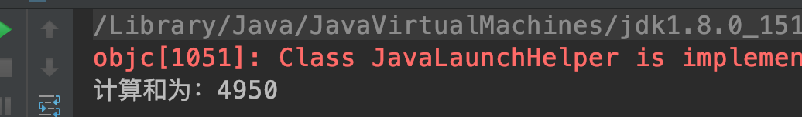

### 2.6.2 <span id="head40">线程谦让：yield</span>

调用的线程会让出占用的CPU资源，让其他线程先执行，但是当前线程让出之后并不是阻塞等待，而是又直接加入资源竞争，所以让出资源后可能还是当前线程继续运行。需要注意线程谦让并不会释放当前锁资源。

```java
package com.skylaker.yield;

/**
 * 线程谦让 yield
 *
 * @author skylaker2019@163.com
 * @version V1.0 2019/7/25 12:56 AM
 */
public class ThreadYield {
    public static void main(String[] args) throws InterruptedException {
        MyThread1 myThread1 = new MyThread1();
        MyThread2 myThread2 = new MyThread2();
        myThread1.setPriority(Thread.MIN_PRIORITY);
        myThread2.setPriority(Thread.MAX_PRIORITY);

        myThread1.start();
        myThread2.start();
    }

    static class MyThread1 extends Thread {
        @Override
        public void run() {
            System.out.println("线程1：开始运行");
            Thread.currentThread().yield();
            System.out.println("线程1：结束运行");
        }
    }

    static class MyThread2 extends Thread {
        @Override
        public void run() {
            System.out.println("线程2：运行");
        }
    }
}
```

运行结果：


可以看到线程1让出后线程2优先运行。

## 2.7 <span id="head41">线程组 ThreadGroup</span>

* 线程组很好理解，将线程分组，不同的线程放入不同的线程组，例如苹果放入苹果篮，梨子放入梨子篮。

* 设置方法

直接在 new Thread（）的时候传入当前线程要入驻的线程组

```java
package com.skylaker.group;

/**
 * 线程组
 *
 * @author skylaker2019@163.com
 * @version V1.0 2019/7/26 9:57 PM
 */
public class ThreadGroupCls {

    public static void main(String[] args) throws InterruptedException {
        // 定义线程组
        ThreadGroup threadGroup = new ThreadGroup("用户线程组");
        // 创建线程，传入线程组、定义线程信息
        Thread t1 = new Thread(threadGroup, new MyThread(), "获取用户信息线程");
        Thread t2 = new Thread(threadGroup, new MyThread(), "设置用户名称线程");

        t1.start();
        t2.start();

        Thread.sleep(1000);
        System.out.println("线程组活动线程数量："+ threadGroup.activeCount());

        System.out.println("\n线程组信息：\n");
        threadGroup.list();
        System.out.println("\n");
    }

    static class MyThread extends Thread {
        @Override
        public void run() {
            String groupAndName = "线程组名：" + Thread.currentThread().getThreadGroup().getName()
                    + "； 线程名称：" + Thread.currentThread().getName();

            while (true) {
                System.out.println(groupAndName);

                try {
                    Thread.sleep(3000);
                } catch (InterruptedException e) {
                    e.printStackTrace();
                }
            }
        }
    }
}
```

执行结果：


这里我们设置了两个线程，放入同一个线程组中，并可以通过线程组对象的 `public int activeCount()` 方法获取当前线程组中活动线程数量，当然这个值每次不一定相同。线程组 `public void list()` 打印当前线程组信息。

## 2.8 <span id="head42">守护线程</span>

* 有时候程序在运行时候需要有些后台默默运行的线程处理一些事情，例如JVM中的垃圾收集器负责垃圾回收。我们可以通过`public final void setDaemon(boolean on)`设置某个线程为守护线程：

```java
package com.skylaker.daemon;

/**
 * 守护线程
 *
 * @author skylaker2019@163.com
 * @version V1.0 2019/7/26 10:14 PM
 */
public class ThreadDaemon {
    public static void main(String[] args) throws InterruptedException {
        MyThread myThread = new MyThread();
        // 设置线程为守护线程
        myThread.setDaemon(true);

        // 主线程开始
        System.out.println("主线程正在运行");
        myThread.start();

        Thread.sleep(5000);
        // 主线程结束
        System.out.println("主线程结束运行");
    }

    static class MyThread extends Thread {
        @Override
        public void run() {
            while (true) {
                System.out.println("我是守护线程，正在运行~~~");
                try {
                    Thread.sleep(2000);
                } catch (InterruptedException e) {
                    e.printStackTrace();
                }
            }
        }
    }
}
```

运行结果：


需要注意 setDaemon 方法需要在线程启动前设置，不然无法将线程设置为守护线程。另外从代码执行结果来看，主线程执行结束后守护线程也结束了，这是为啥？所谓皮之不存毛将焉附，守护线程是为了其他主线程存在的，如果主要的线程对象代码执行完了，那么意味着程序结束，那么自然守护线程也就没有存在的必要了，所以也就随着其他非守护线程的都执行完毕而消失。

## 2.9 <span id="head43">线程优先级</span>

### 2.9.1 <span id="head44">优先级概述</span>

同现实世界一样，不同的线程有着不同的等级，高层阶级的人拥有着更多的社会资源，做事更容易成功，线程同样可以设置不同的优先级，在资源抢占方面有着不同的表现，例如抢占CPU、获取锁，高优先级的线程趋向于更容易获取到资源，而低优先级的获取资源能力弱，极端严重程度下都可能发生一值得不到运行即饥饿情况。

### 2.9.2 <span id="head45">不设置优先级的情况表现</span>

```java
package com.skylaker.priority;

/**
 * 线程优先级
 *
 * @author skylaker2019@163.com
 * @version V1.0 2019/7/26 10:33 PM
 */
public class ThreadPriority {

    public static void main(String[] args) throws InterruptedException {
        HighThread highThread = new HighThread();
        LowerThread lowerThread = new LowerThread();
        highThread.start();
        lowerThread.start();
    }

    static class HighThread extends Thread {
        private int count = 0;

        @Override
        public void run() {
            while (true) {
                count++;

                if(count > 100000){
                    System.out.println(System.currentTimeMillis() + ": 高优先级线程执行完毕！");
                    break;
                }
            }
        }
    }

    static class LowerThread extends Thread {
        private int count = 0;

        @Override
        public void run() {
            while (true) {
                count++;

                if(count > 100000){
                    System.out.println(System.currentTimeMillis() + ": 低优先级线程执行完毕！");
                    break;
                }
            }
        }
    }
}
```

执行结果：


两个线程几乎都是完成计算任务。

### 2.9.3 <span id="head46">设置线程优先级</span>

```java
package com.skylaker.priority;

import org.omg.PortableServer.THREAD_POLICY_ID;

/**
 * 线程优先级
 *
 * @author skylaker2019@163.com
 * @version V1.0 2019/7/26 10:33 PM
 */
public class ThreadPriority {

    public static void main(String[] args) throws InterruptedException {
        HighThread highThread = new HighThread();
        LowerThread lowerThread = new LowerThread();

        highThread.setPriority(Thread.MAX_PRIORITY);
        lowerThread.setPriority(Thread.MIN_PRIORITY);
        
        highThread.start();
        lowerThread.start();
    }

    static class HighThread extends Thread {
        private int count = 0;

        @Override
        public void run() {
            while (true) {
                count++;

                if(count > 100000){
                    System.out.println(System.currentTimeMillis() + ": 高优先级线程执行完毕！");
                    break;
                }
            }
        }
    }

    static class LowerThread extends Thread {
        private int count = 0;

        @Override
        public void run() {
            while (true) {
                count++;

                if(count > 100000){
                    System.out.println(System.currentTimeMillis() + ": 低优先级线程执行完毕！");
                    break;
                }
            }
        }
    }
}
```

执行结果：


好像也几乎是同时完成的，这不是设置线程优先级了吗？其实这个线程设置了优先级并不意味着低优先级的线程执行效率就一定慢，可能在当前环境某个时刻低优先级的线程就是突然更能抢占CPU。另外主要因为我们这里并没有设置线程间资源抢占，即你做你的事，我用我的资源，互不冲突，(另外计算的数也小)我们可以设置资源抢占来看具体情况：

```java
package com.skylaker.priority;

/**
 * 线程优先级
 *
 * @author skylaker2019@163.com
 * @version V1.0 2019/7/26 10:33 PM
 */
public class ThreadPriority2 {

    public static void main(String[] args) throws InterruptedException {
        HighThread highThread = new HighThread();
        LowerThread lowerThread = new LowerThread();

        highThread.setPriority(Thread.MAX_PRIORITY);
        lowerThread.setPriority(Thread.MIN_PRIORITY);

        highThread.start();
        lowerThread.start();
    }

    static class HighThread extends Thread {
        private int count = 0;

        @Override
        public void run() {
            while (true) {
                synchronized (ThreadPriority2.class){
                    count++;

                    if(count > 100000000){
                        System.out.println(System.currentTimeMillis() + ": 高优先级线程执行完毕！");
                        break;
                    }
                }
            }
        }
    }

    static class LowerThread extends Thread {
        private int count = 0;

        @Override
        public void run() {
            while (true) {
                synchronized (ThreadPriority2.class) {
                    count++;

                    if (count > 100000000) {
                        System.out.println(System.currentTimeMillis() + ": 低优先级线程执行完毕！");
                        break;
                    }
                }
            }
        }
    }
}
```

执行结果：


这里我们设置高低优先级线程抢占同一个锁资源，多次执行会发现常常高优先级线程先运行完。

线程设置优先级方法：`public final void setPriority(int newPriority)`

有几种优先级：
```java
/**
     * The minimum priority that a thread can have.
     */
    public final static int MIN_PRIORITY = 1;

   /**
     * The default priority that is assigned to a thread.
     */
    public final static int NORM_PRIORITY = 5;

    /**
     * The maximum priority that a thread can have.
     */
    public final static int MAX_PRIORITY = 10;
```

# 3. <span id="head47">任务分工</span>

## 3.1 <span id="head48">分工概述</span>

在现实世界中，很多事情都是很多人一起协作完成的，例如我们每天上班整个项目组在做一个软件项目，每个人承担着不同的任务。线程之间同样也存在着这样的场景，例如要完成很多任务的时候可以开启多个线程去完成相应的功能，提高任务执行效率、缩短执行时间，这也恰恰是我们多线程的存在的核心价值。

## 3.2 <span id="head49">Executor与线程池</span>

### 3.2.1 <span id="head50">线程池概述</span>

当我们需要多线程处理程序任务时，我们可以通过基本的new Thread方法创建多个线程，然后启动运行分配任务处理，处理完成关闭线程。但是这样的方式存在着一个问题，线程的创建与销毁需要系统调度处理，另外线程本身也是需要占用一定的系统资源的，在实际环境中我们可能需要频繁且大量的生成线程，那么这种方式就会严重消耗系统资源，拖垮系统，所以我们就需要一种方式去解决这种问题。

好比如一个商店需要服务员服务顾客，不能来一个顾客就雇佣一个服务员，然后顾客走了辞退，而是雇佣一定数量的服务员，有顾客来了对其帮助，如果顾客很多的话，那么有些顾客就需要进行一定的等待；如果没有顾客的话那么服务员就可以休息休息。

这其实就是要用池化技术。同样的道理我们在做其他场景编程时同样遇到，例如数据库连接池，为了避免频繁创建关闭数据库连接而创建一些固定的连接放到一个连接池中，这样当有连接需要时从中选取一个，没用的话池中连接保持存活，处于空闲状态。

线程处理同样用池化技术来解决这种多线程需求。

### 3.2.2 <span id="head51">Java线程池结构</span>

我们先来看下Java线程池相关组件基本结构关系：


线程池通过Executor及其相关实现类定义，Executor作为顶层接口定义了线程池基本行为，即执行分配的任务：接收Runnable接口实现对象，完成其中指定的任务指令。


ExecutorService定义了一些线程池基本的行为方法，例如关闭线程池、提交任务等。


核心组件是ThreadPoolExecutor，由该组件创建实际的线程池，例如定义线程池大小、线程创建工厂、任务拒绝策略等。


Executors是一个线程工具类，它可以创建不同类型的线程池，但是本质上其实都是通过ThreadPoolExecutor实现的。

### 3.2.3 <span id="head52">线程池种类</span>

通过Exexutors我们可以直接定义几种不同类型的线程池：

#### 3.2.3.1 <span id="head53">固定大小的线程池</span>

`public static ExecutorService newFixedThreadPool(int nThreads)`

创建固定大小的线程池，线程池中的线程数量固定不变，当有新任务来的时候，若有空闲线程，则执行；若没有空闲线程，则任务放到线程池等待队列中，等有空闲线程时候再处理。

代码示例：

```java
package com.skylaker.pool;

import java.util.concurrent.ExecutorService;
import java.util.concurrent.Executors;

/**
 * 固定大小的线程池
 *
 * @author skylaker2019@163.com
 * @version V1.0 2019/7/28 4:11 PM
 */
public class FixedThreadPool {
    public static void main(String[] args){
        // 创建一个大小为5的线程池
        ExecutorService executorService = Executors.newFixedThreadPool(5);
        // 定义线程任务
        Thread task = new Thread(new MyThread());
        // 提交任务到线程池
        for(int i = 0; i < 10; i++){
            executorService.submit(task);
        }
        // 关闭线程池
        executorService.shutdown();
    }

    static class MyThread implements Runnable {
        public void run() {
            System.out.println("线程ID：" + Thread.currentThread().getId()
                    + " ; 当前时间：" + System.currentTimeMillis());

            try {
                Thread.sleep(1000);
            } catch (InterruptedException e) {
                e.printStackTrace();
            }
        }
    }
}
```

运行结果：


这个我们定义了一个数量为5的线程池，即池中有5个线程，我们发送了10个任务，每个任务执行完都会休眠一秒，如果我们将10个任务给一个线程执行，那么就是顺序执行，最起码要10秒钟，但是发送给线程池只需要两秒钟左右。根据打印的线程ID，我们可以看到执行任务的确实有5个线程，他们几乎同时执行分配的任务，然后过了一秒钟处理剩下的等待的5个任务。

#### 3.2.3.2 <span id="head54">创建单个数量线程的线程池</span>

`public static ExecutorService newSingleThreadExecutor()`

创建一个线程数量只有1的线程池，也就是线程池中只有一个线程在进行任务处理，如果有多余任务则进入到等待队列进行等待，等线程处理完任务，再依次按照任务先后顺序执行。这种线程池执行任务就是单个线程串行执行，所以效率低。

```java
package com.skylaker.pool;

import java.util.concurrent.ExecutorService;
import java.util.concurrent.Executors;

/**
 * 单个大小的线程池
 *
 * @author skylaker2019@163.com
 * @version V1.0 2019/7/28 4:11 PM
 */
public class SingleThreadPool {
    public static void main(String[] args){
        // 创建一个大小为1的固定线程池
        ExecutorService executorService = Executors.newSingleThreadExecutor();
        // 定义线程任务
        Thread task = new Thread(new MyThread());
        // 提交任务到线程池
        for(int i = 0; i < 10; i++){
            executorService.submit(task);
        }
        // 关闭线程池
        executorService.shutdown();
    }

    static class MyThread implements Runnable {
        public void run() {
            System.out.println("线程ID：" + Thread.currentThread().getId()
                    + " ; 当前时间：" + System.currentTimeMillis());

            try {
                Thread.sleep(1000);
            } catch (InterruptedException e) {
                e.printStackTrace();
            }
        }
    }
}
```

执行结果：


可以看到只有一个线程在执行任务，而且按照任务的特点，每隔一秒执行一次。

#### 3.2.3.3 <span id="head55">动态大小的线程池</span>

`public static ExecutorService newCachedThreadPool()`

这种线程池的大小是随着任务量多少而动态调整的，线程数量不固定。当有新任务则优先复用现有空闲线程，若没有则创建新的线程处理，处理完成线程返回线程池进行复用。

```java
package com.skylaker.pool;

import java.util.concurrent.ExecutorService;
import java.util.concurrent.Executors;

/**
 * 动态大小的线程池
 *
 * @author skylaker2019@163.com
 * @version V1.0 2019/7/28 4:11 PM
 */
public class CachedThreadPool {
    public static void main(String[] args){
        // 创建一个大小可动态调整的线程池
        ExecutorService executorService = Executors.newCachedThreadPool();
        // 定义线程任务
        Thread task = new Thread(new MyThread());
        // 提交任务到线程池
        for(int i = 0; i < 10; i++){
            executorService.submit(task);
        }
        // 关闭线程池
        executorService.shutdown();
    }

    static class MyThread implements Runnable {
        public void run() {
            System.out.println("线程ID：" + Thread.currentThread().getId()
                    + " ; 当前时间：" + System.currentTimeMillis());

            try {
                Thread.sleep(1000);
            } catch (InterruptedException e) {
                e.printStackTrace();
            }
        }
    }
}
```

执行结果：


这里我们可以看到我们同时发送了10个任务，线程池就创建了10个线程进行处理，因为我们的任务是同时发送给线程池执行的，线程池在收到任务后发现没有空闲线程处理则创建新线程进行处理。如果我们的任务前后存在间隔呢？

```java
public static void main(String[] args) throws InterruptedException {
        // 创建一个大小可动态调整的线程池
        ExecutorService executorService = Executors.newCachedThreadPool();
        // 定义线程任务
        Thread task = new Thread(new MyThread());
        // 提交任务到线程池
        for(int i = 0; i < 10; i++){
            executorService.submit(task);
            // 每隔两秒提交一个任务
            Thread.sleep(2000);
        }
        // 关闭线程池
        executorService.shutdown();
    }
```

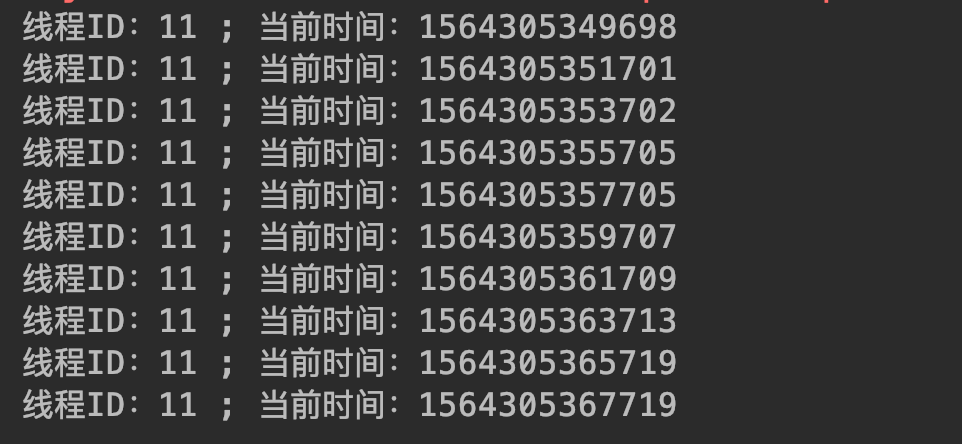

这里我们依然还是提交10个任务，不过每个任务之间隔两秒发送给线程池，因为一个任务执行只需要差不多1秒左右，所以再下一个任务过来的时候上一个任务已经执行完成了，之前的线程也就处于空闲模式，等下一个任务过来的时候就可以复用这个线程了。

但是我们思考一个问题，如果我们确实是同时发送很多任务呢？假设我们发送100个、1000个甚至更多呢？那么这种动态的线程池线程数量其实是会无限增长的，其后果会导致系统资源消耗，具有危险性。

#### 3.2.3.4 <span id="head56">周期性、定时性执行任务的线程池</span>

`public static ScheduledExecutorService newSingleThreadScheduledExecutor()`

创建一个可以在指定延时时间执行，或者间断执行——每隔多长时间执行一次的线程池。

示例：创建一个指定延时时间后执行的线程池

```java
package com.skylaker.pool;

import java.util.concurrent.Executors;
import java.util.concurrent.ScheduledExecutorService;
import java.util.concurrent.TimeUnit;

/**
 * 单个大小、定时性的线程池
 *
 * @author skylaker2019@163.com
 * @version V1.0 2019/7/28 4:11 PM
 */
public class SingleScheduledThreadPool {
    public static void main(String[] args){
        // 创建一个大小为1、可周期性或某个延时过后执行的的线程池
        ScheduledExecutorService executorService = Executors.newSingleThreadScheduledExecutor();
        // 定义线程任务
        Thread task = new Thread(new MyThread());
        // 提交任务到线程池
        System.out.println("提交任务时间：" + System.currentTimeMillis());
        executorService.schedule(task, 5, TimeUnit.SECONDS);
    }

    static class MyThread implements Runnable {
        public void run() {
            System.out.println("线程ID：" + Thread.currentThread().getId()
                    + " ; 当前时间：" + System.currentTimeMillis());

            try {
                Thread.sleep(1000);
            } catch (InterruptedException e) {
                e.printStackTrace();
            }
        }
    }
}
```


在这里我们创建了一个延时5秒执行的线程池，可以通过执行结果看到我们在提交了任务后5秒才执行了任务。

该定时、周期性线程池可以创建多种形式的定时策略，主要通过返回的对象ScheduledExecutorService实现的，主要方式有：

a.

```java
public ScheduledFuture<?> schedule(Runnable command,
                                       long delay, TimeUnit unit)
```

指定延时时间之后执行任务。

b.


```java
public ScheduledFuture<?> scheduleAtFixedRate(Runnable command,
                                                  long initialDelay,
                                                  long period,
                                                  TimeUnit unit);
```
scheduleAtFixedRate以固定频率进行任务调度，其以每一个任务开始时间为调度标准，即上一个任务开始时间之后经过period长时间进行下一个任务。


代码示例：

```java
package com.skylaker.pool;

import java.util.concurrent.Executors;
import java.util.concurrent.ScheduledExecutorService;
import java.util.concurrent.TimeUnit;

/**
 * 单个大小、定时性的线程池
 *
 * @author skylaker2019@163.com
 * @version V1.0 2019/7/28 4:11 PM
 */
public class SingleScheduledThreadPool {
    public static void main(String[] args){
        // 创建一个大小为1、可周期性或某个延时过后执行的的线程池
        ScheduledExecutorService executorService = Executors.newSingleThreadScheduledExecutor();
        // 定义线程任务
        Thread task = new Thread(new MyThread());
        // 提交任务到线程池
        System.out.println("提交任务时间：" + System.currentTimeMillis());
        executorService.scheduleAtFixedRate(task, 1, 2, TimeUnit.SECONDS);
    }

    static class MyThread implements Runnable {
        public void run() {
            System.out.println("线程ID：" + Thread.currentThread().getId()
                    + " ; 当前时间：" + System.currentTimeMillis());

            try {
                Thread.sleep(1000);
            } catch (InterruptedException e) {
                e.printStackTrace();
            }
        }
    }
}
```
执行结果：


可以看到线程在提交任务后指定延时1秒后执行任务调度，然后每两秒执行一次任务，因为设置的间隔时间为2秒。但是我们考虑一种情况，这里每个任务的执行耗时是短于任务调度周期的，所以下一个任务开始时候距离上一个任务开始时候正好2秒，但是如果任务执行耗时大于调度周期呢？我们稍微修改下任务执行耗时：

```java
public void run() {
            System.out.println("线程ID：" + Thread.currentThread().getId()
                    + " ; 当前时间：" + System.currentTimeMillis());

            try {
                Thread.sleep(3000);
            } catch (InterruptedException e) {
                e.printStackTrace();
            }
        }
```

执行结果：


发现现在的调度周期是任务执行的耗时，即如果任务执行耗时超过下一个任务应该执行的间隔耗时，那么下一个任务直接以上一个任务的结束时间作为开始时间，即上一个任务结束下一个任务继续。

c.

```java
public ScheduledFuture<?> scheduleWithFixedDelay(Runnable command,
                                                     long initialDelay,
                                                     long delay,
                                                     TimeUnit unit);
```

scheduleWithFixedDelay方法也是固定频率执行任务调度，但是和上一个scheduleAtFixedRate不同的是，它是以上一个任务结束时间作为调度标准，即上一个任务执行完了之后再经过delay长时间执行下一个任务。


```java
package com.skylaker.pool;

import java.util.concurrent.Executors;
import java.util.concurrent.ScheduledExecutorService;
import java.util.concurrent.TimeUnit;

/**
 * 单个大小、定时性的线程池
 *
 * @author skylaker2019@163.com
 * @version V1.0 2019/7/28 4:11 PM
 */
public class SingleScheduledThreadPool {
    public static void main(String[] args){
        // 创建一个大小为1、可周期性或某个延时过后执行的的线程池
        ScheduledExecutorService executorService = Executors.newSingleThreadScheduledExecutor();
        // 定义线程任务
        Thread task = new Thread(new MyThread());
        // 提交任务到线程池
        System.out.println("提交任务时间：" + System.currentTimeMillis());
        executorService.scheduleWithFixedDelay(task, 1, 2, TimeUnit.SECONDS);
    }

    static class MyThread implements Runnable {
        public void run() {
            System.out.println("线程ID：" + Thread.currentThread().getId()
                    + " ; 当前时间：" + System.currentTimeMillis());

            try {
                Thread.sleep(1000);
            } catch (InterruptedException e) {
                e.printStackTrace();
            }
        }
    }
}
```

执行结果：

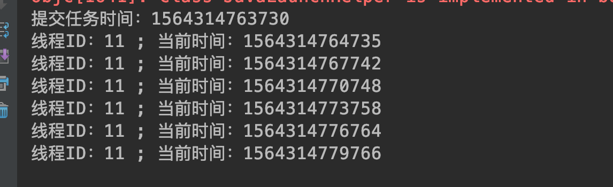

可以看到任务执行周期3秒，因为单个任务耗时1秒，再加上下个任务等待耗时2秒。

### 3.2.4 <span id="head57">线程池内部实现</span>

上面我们创建了几种不同形式的线程池，其实如果通过查看源码，我们会发现这几种线程池只不过都是ThreadPoolExecutor的封装，通过设置不停参数，创建不同特点的线程池，例如单个数量线程池，其实就是设置线程数量为1——核心线程数、最大线程数都是1的线程池：


#### 3.2.4.1 <span id="head58">相关参数</span>

我们看下ThreadPoolExecutor具体构造：

```java
public ThreadPoolExecutor(int corePoolSize,
                              int maximumPoolSize,
                              long keepAliveTime,
                              TimeUnit unit,
                              BlockingQueue<Runnable> workQueue,
                              ThreadFactory threadFactory,
                              RejectedExecutionHandler handler)
```

* corePoolSize：指定线程池核心线程数量，一般情况下线程池需要维持该数量的线程，以使线程得以复用；

* maximumPoolSize：指定最大线程数量，有些情况下，如果任务数量很多，核心线程数量已经无法满足任务执行，并且等待队列也已经满了，就会额外创建线程，但是最大线程数量不能超过该参数最大值。

* keepAliveTime：空闲线程存活时间，即在核心线程数量之外多余创建的线程在执行完任务后，就  变成空闲状态，那么需要回收，该参数就是定义空闲时间多长之后回收；

* unit ：keepAliveTime的单位，可以设置时分秒等；

* workQueue：等待队列，任务数量超过核心线程调度，暂时无法执行，那么任务就需要放入等待队列中进行等待。这个好比去吃饭但是人满了，就需要坐外面等一等。

* threadFactory：线程工厂，用于创建线程池中线程；

* handler ：任务拒绝策略，当任务超出核心线程调度能力，会将任务放入等待队列，如果队列也已经满了，那么就临时创建新的线程执行任务，如果整体线程数量达到最大线程数量，那么就不能接收新的任务了，就需要拒绝任务，而拒绝任务有不同的策略，该参数即设置拒绝策略。

#### 3.2.4.2 <span id="head59">核心参数</span>

##### 3.2.4.2.1 <span id="head60">workQueue: 等待队列</span>

等待队列存放已经提交但是尚未被执行需要等待的任务，队列实现BlockingQueue接口，例如单线程线程池：


线程池等待队列一共有几种不同的类型，分别是：

###### 3.2.4.2.1.1 <span id="head61">SynchronousQueue 直接提交任务的队列</span>

动态大小的线程池用的就是这种队列，SynchronousQueue队列没有容量，即提交的任务不会真正保存在队列中，提交的任务直接发送给线程池执行，如果没有空闲线程，那么直接新建新的线程执行任务，如果总的线程数量达到设置的最大线程数量则执行拒绝策略。这个队列和我们表面上看到的cachedThreadPool特点符合，线程池中线程数量随着任务数急速增长，如果不设置最大线程数量，很容易资源消耗，但是设置的小了，又很容易执行拒绝策略，因为该队列没有容纳任务的能力。


###### 3.2.4.2.1.2 <span id="head62">ArrayBlockingQueue 有界任务队列</span>

从名字很容易看出是由数组实现的队列，数组我们可以直接指定容量，所以这里ArrayBlockingQueue我们也可以直接指定容量`public ArrayBlockingQueue(int capacity)`。当使用该队列时候，如果核心线程数量已满，则将任务放到该队列进行等待，如果队列也已经满了，那么将创建新的线程，但是总的线程数量不能大于最大线程数量值，如果大于最大线程数量设定值则进行拒绝策略。可见，使用该队列时候还是想努力维持线程池线程数量为核心线程数大小。

###### 3.2.4.2.1.3 <span id="head63">LinkedBlockingQueue 无界任务队列</span>

通过链表实现的任务队列，链表本身是不需要连续内存空间的，而且方便动态新增节点，所以可以无限扩增。使用该队列，如果核心线程数量已满，则将任务放到该队列进行等待，无限放入，并不会创建核心线程数量之外的线程处理任务，所以这个队列如果任务很多时候，容易消耗资源。单个数量线程池用的就是这种队列：


###### 3.2.4.2.1.4 <span id="head64">PriorityBlockingQueue 优先任务队列</span>

无界队列，可根据任务优先级安排任务执行。

##### 3.2.4.2.2 <span id="head65">拒绝策略</span>

如同我们去饭店吃放一样，店里人满了的话，我们可以在外面等待区进行等待，但是如果等待人实在太多了，店完全应付不过来，这个时候服务员可能就对等待的顾客说：不好意思小店人太多要不各位到其他家店体验体验？

同样我们线程池在执行任务的时候，如果任务太多，我们可以采取等待队列进行多余任务的缓存，但是等待等待队列在一定程度上是有一定负载极限的，例如有界等待队列，即使对于像LinkedBlockingQueue这样的无界队列，在实际使用过程中为了避免系统性能消耗一般都需要设置一定的极限容量。所以对于过多的任务，在达到系统负荷水平上时，即等待队列已满、线程池线程数量达到最大线程数量且无空闲，那么就会采取一定的拒绝策略，以拒绝多余的任务。

###### 3.2.4.2.2.1 <span id="head66">拒绝策略接口定义</span>

拒绝策略有几种，都是`RejectedExecutionHandler`接口的实现，该接口定义了线程池如何执行拒绝策略：`void rejectedExecution(Runnable r, ThreadPoolExecutor executor);`，一共两个参数，一个是当前新提交的任务，一个是当前线程池对象。

###### 3.2.4.2.2.2 <span id="head67">AbortPolicy 策略</span>

直接抛出异常的方式拒绝多余任务，同时系统不能正常工作

```java
public static void main(String[] args) {
        System.out.println("主线程ID：" + Thread.currentThread().getId());

        ExecutorService es = getMyThreadPool1();
        for(int i = 0; i < 20; i++){
            MyTask myTask = new MyTask(i);
            es.submit(myTask);
        }
    }
    
/**
     * 核心线程数量 2；
     * 最大线程数量：5；
     * 线程空闲等待时间：0s;
     * 等待队列：大小为5的链表队列；
     * 拒绝策略：直接拒绝
     */
    static ExecutorService getMyThreadPool1() {
        return new ThreadPoolExecutor(
                2,
                5,
                0L,
                TimeUnit.SECONDS,
                new LinkedBlockingQueue(5),
                new ThreadPoolExecutor.AbortPolicy());

    }
    
 static class MyTask implements Runnable {
        private int id;

        MyTask(int id){
            this.id = id;
        }

        public void run() {
            System.out.println("当前执行任务线程ID：" + Thread.currentThread().getId() + "  执行任务ID：" + id);

            try {
                Thread.sleep(2000);
            } catch (InterruptedException e) {
                e.printStackTrace();
            }
        }
    }
```

执行结果：


可以看到在超出线程池负荷能力后直接抛出异常，异常信息提示线程池拒绝任务，且显示当前线程池信息，例如线程池大小、活动线程、等待队列大小：


###### 3.2.4.2.2.3 <span id="head68">CallerRunsPolicy 调用者执行拒绝的任务</span>

例如当前主线程将任务提交给线程池执行，但是线程池拒绝了，那么这种拒绝模式的话会让主线程去执行拒绝的任务

```java
/**
     * 核心线程数量 2；
     * 最大线程数量：5；
     * 线程空闲等待时间：0s;
     * 等待队列：大小为5的链表队列；
     * 拒绝策略：调用者运行丢弃的任务
     */
    static ExecutorService getMyThreadPool2() {
        return new ThreadPoolExecutor(
                2,
                5,
                0L,
                TimeUnit.SECONDS,
                new LinkedBlockingQueue(5),
                new ThreadPoolExecutor.CallerRunsPolicy());

    }
```

执行结果：


可以看到我们主线程参与了任务的执行

###### 3.2.4.2.2.4 <span id="head69">DiscardOldestPolicy 删除最老的任务，然后执行当前新提交的任务</span>

对于这种策略，因为某些情况下对于队列中等待时间最长的任务（即队列头节点任务）来说，它阻塞的时间最长，那么可能已经没有执行的必要了，所以直接舍弃来执行最新的任务，当然这个最新的任务也不是能立刻执行的，其实是将新提交的任务放入队列中，直白点说就是老任务让个坑给新任务，这个我们可以从源码看下：

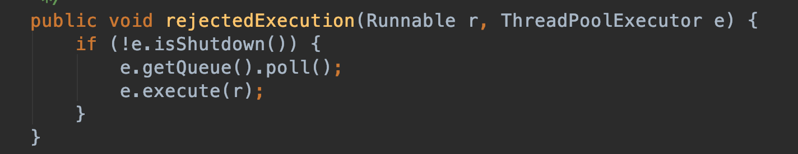

可以看到先判断线程池是否关闭，如果正常，则将等待队列的头节点移除，即丢弃等待时间最久的任务，然后向线程池提交新的任务

继承该策略看下实际执行过程：

```java
public static void main(String[] args) {
        System.out.println("主线程ID：" + Thread.currentThread().getId());

        ExecutorService es = getMyThreadPool3();
        for(int i = 0; i < 20; i++){
            MyTask myTask = new MyTask(i);
            es.execute(myTask);
        }
    }
    
 /**
     * 核心线程数量 2；
     * 最大线程数量：5；
     * 线程空闲等待时间：0s;
     * 等待队列：大小为5的链表队列；
     * 拒绝策略：丢弃队列中最旧的任务以执行当前新提交的任务
     */
    static ExecutorService getMyThreadPool3() {
        return new ThreadPoolExecutor(
                2,
                5,
                0L,
                TimeUnit.SECONDS,
                new LinkedBlockingQueue(5),
                new ThreadPoolExecutor.DiscardOldestPolicy(){
                    @Override
                    public void rejectedExecution(Runnable r, ThreadPoolExecutor e) {
                        BlockingQueue queue = e.getQueue();
                        StringBuffer buffer = new StringBuffer(10);
                        for(Object task : queue){
                            buffer.append(((MyTask)task).getId()).append(",");
                        }

                        System.out.println("将要执行的任务ID：" + ((MyTask)r).getId() + "；当前队列：" + buffer.toString() +
                                "；将被丢弃的任务ID：" + ((MyTask)e.getQueue().peek()).getId());
                        super.rejectedExecution(r, e);
                    }
                }
        );
    }
    

    static class MyTask implements Runnable {
        private int id;

        MyTask(int id){
            this.id = id;
        }

        public int getId(){
            return id;
        }

        public void run() {
            System.out.println("当前执行任务线程ID：" + Thread.currentThread().getId() + "  执行任务ID：" + id);

            try {
                Thread.sleep(2000);
            } catch (InterruptedException e) {
                e.printStackTrace();
            }
        }
    }
```

打印结果：


在这里我们通过重写DiscardOldestPolicy拒绝策略，打印在拒绝的时候相关队列信息，观察该策略的方式，可以看到：一开始发送两个任务到线程池，核心线程数量设置 的2，所以有两个线程在执行任务，这个时候新来的任务2、3、4、5、6被放入了等待队列，这个时候又有新的任务过来，因为设置的最大线程数量为5，所以可以创建新的线程来执行任务7、8、9；这个时候又有新任务10过来，但是线程池已经达到负荷了，这个时候根据拒绝策略就要把等到队列中的最老任务清除掉，即队列头部的任务2，所以可以看到等待队列变成了3、4、5、6、10，后面11、12等任务来的时候同样执行相同的操作；直到没有新的任务过来，即任务19发送过后，等待对了中缓存的任务为15、16、17、18、19，这个时候线程空闲开始处理等待队列中的任务。

注意这里我们提交任务的方式是execute，而不是submit，两者区别后面学了再说，哈哈~~~ 反正这里用submit执行会报错，因为submit方式提交的FutureTask无法转为我们定义的MyTask，而execute直接提交我们的MyTask，所以可以方便转换获取设置的任务ID信息。

这里我们看下线程空闲后优先从队列取任务，我们设置任务执行时间很少，来观察现象：

```java
static class MyTask implements Runnable {
        private int id;

        MyTask(int id){
            this.id = id;
        }

        public int getId(){
            return id;
        }

        public void run() {
            System.out.println("当前执行任务线程ID：" + Thread.currentThread().getId() + "  执行任务ID：" + id);

            try {
                Thread.sleep(1);
            } catch (InterruptedException e) {
                e.printStackTrace();
            }
        }
    }
```

打印结果：


同样任务0、1发送到线程池执行，然后2、3、4、5、6进入等待队列，再然后任务7、8、9启动新线程执行，我们观察到“将被丢弃的任务ID：2”，但是上面的显示信息是线程执行了任务2（这里忽略前后打印顺序，因为线程间打印也是竞态抢占资源的，和实际执行顺序可能不同），这是因为我们要进行拒绝策略的时候，正在遍历等待队列，但是因为单个任务执行很快，所以已经空闲的线程又立即从等待队列中获取队列首的任务进行执行，也就是任务2，其实从这里就看出线程优先从队列中取任务，因为没有去优先执行新来的任务10。可能会有一个疑问，任务5为啥没任何输出，这个我们这里用打印的方式去监测线程执行，其实是有延时的，本来队列是任务2、3、4、5、6，这个时候线程又拿走了2、3、4任务执行，任务5要被舍弃，正准备遍历队列要打印出来“将被丢弃的任务ID：5”，但是这个时候新来的任务唰唰来了，抢占了队列，这个时候遍历队列就是新的任务队列6、10、11、12、13了。

###### 3.2.4.2.2.5 <span id="head70">DiscardPolicy 静默拒绝</span>

从源代码可以看出这中策略拒绝其实不做任何事情，只是默默的将任务拒绝


###### 3.2.4.2.2.6 <span id="head71">自定义拒绝策略</span>

我们同样可以实现 `RejectedExecutionHandler` 接口实现自己的拒绝策略

```java
 /**
     * 核心线程数量 2；
     * 最大线程数量：5；
     * 线程空闲等待时间：0s;
     * 等待队列：大小为5的链表队列；
     * 拒绝策略：自定义拒绝策略，打印拒绝的任务信息
     */
    static ExecutorService getMyThreadPool5() {
        return new ThreadPoolExecutor(
                2,
                5,
                0L,
                TimeUnit.SECONDS,
                new LinkedBlockingQueue(5),
                new RejectedExecutionHandler() {
                    public void rejectedExecution(Runnable r, ThreadPoolExecutor executor) {
                        System.out.println("被拒绝的任务：" + r.toString());
                    }
                }
        );
    }
```

执行结果：

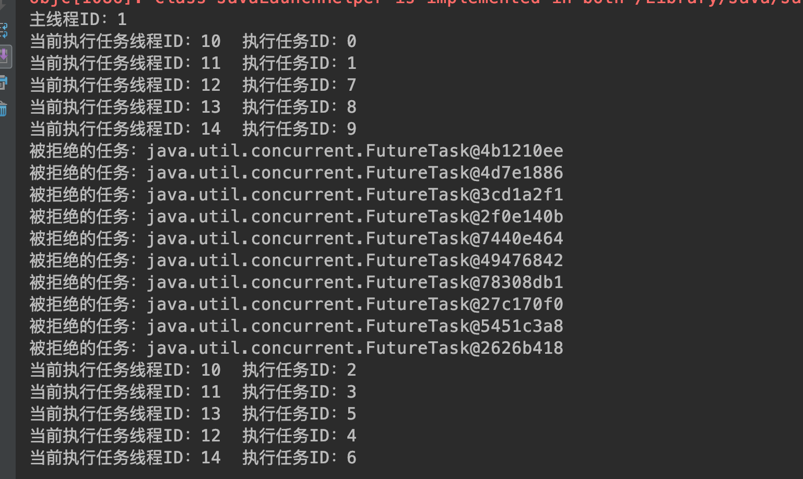

可以看到10个任务被执行，而10个任务被拒绝，因为线程池最大负载能力就是10 （最大线程数量 5 + 等待队列大小 5）

##### 3.2.4.2.3 <span id="head72">线程创建工厂</span>

###### 3.2.4.2.3.1 <span id="head73">线程工厂默认实现</span>

我们需要线程池执行任务的时候直接把Runnable接口定义的任务提交给线程池就行，在之前我们没用线程池的时候要运行任务需要自己启动线程去运行我们的任务，那么线程池中的线程哪来的呢？其实肯定也是创建来的，线程池内部通过ThreadFactory线程工厂来创建线程池，。在上一节中我们没有显式的指定ThreadFactory参数，其实线程池内容定义了其实例，我们可以看下：


可以看到调用了其它重载构造器，只不过加入默认线程工厂的实现：Executors.defaultThreadFactory()，通过线程工具类实现的默认ThreadFactory，我们进去看下具体实现：


继续跟踪：


在这里我们可以默认线程池定义线程工厂及如何创建线程逻辑：定义了线程池数量、线程组、线程数量、线程名称前缀等变量；在构造器中获取线程组（先获取系统级的SecurityManager对应的线程组，如果没有则用当前创建线程池对象所在线程的线程组，例如如果我们在主线程中定义了线程池，那么这里就会用主线程的线程组）；定义线程名称前缀 ”pool-" +线程池数量 + “-thread-“；然后在新建线程的时候，通过new Thread方法创建线程，并设置线程为非守护线程（意味着线程池在执行完任务后线程池不会退出），设置线程优先级为正常的优先级。

对于刚才提到的线程组问题，我们可以测试下：

```java
public static void main(String[] args) {
        MyTask task = new MyTask();
        System.out.println("主线程组：" + Thread.currentThread().getThreadGroup().getName());

        ExecutorService es = getThreadPool2();
        for(int i = 0; i < 10; i++){
            es.submit(task);
        }
    }
    
static ExecutorService getThreadPool2(){
        return new ThreadPoolExecutor(
                // 核心大小：1 ；
                1,
                // 最大大小 2；
                2,
                // 空闲时间：0s
                0, TimeUnit.SECONDS,
                // 有界队列
                new ArrayBlockingQueue<Runnable>(2),
                // 静默拒绝策略
                new ThreadPoolExecutor.DiscardPolicy()
        );
    }

    static class MyTask implements Runnable {
        public void run() {
            System.out.println("当前执行任务线程ID：" + Thread.currentThread().getId());
            System.out.println("当前执行任务线程组：" + Thread.currentThread().getThreadGroup().getName());

            try {
                Thread.sleep(2000);
            } catch (InterruptedException e) {
                e.printStackTrace();
            }
        }
    }
```

执行结果：


可以看到打印出的线程池中的线程所在线程组和当前主线程所在线程组是同一个：main

###### 3.2.4.2.3.2 <span id="head74">自定义线程工厂</span>

```java
static ExecutorService getThreadPool1(){
        return new ThreadPoolExecutor(
                // 核心大小：1 ；
                1,
                // 最大大小 2；
                2,
                // 空闲时间：0s
                0, TimeUnit.SECONDS,
                // 有界队列
                new ArrayBlockingQueue<Runnable>(2),
                // 自定义线程创建工厂
                new ThreadFactory() {
                    public Thread newThread(Runnable r) {
                        Thread thread = new Thread(r);
                        System.out.println("创建线程对象：" + thread);
                        return thread;
                    }
                },
                // 静默拒绝策略
                new ThreadPoolExecutor.DiscardPolicy()
        );
    }
```

执行结果：


可以看到线程池执行任务时按照设置打印出了线程对象信息，同时发现线程池线程组也是main，这是因为我们定义的线程池就是在主线程中定义的啊，所以默认和主线程一致了。

###### 3.2.4.2.3.3 <span id="head75">线程执行任务跟踪</span>

我们在创建线程池的时候如果不指定线程创建工厂，即线程创建由线程池自身负责，而创建的线程在执行任务的时候我们并不知道线程本身执行任务的时机（当然可以从任务角度捕获），如果想知道线程自身在执行任务前后相关内容呢？线程池提供了相应的触发方法供我们调用（包括线程池关闭事件）：

`线程执行之前调用： protected void beforeExecute(Thread t, Runnable r)`

`线程执行之后调用： protected void afterExecute(Runnable r, Throwable t)`

`线程池关闭时调用： protected void terminated()`

从源代码看线程池自身在相关方法里面并未做任何事情：


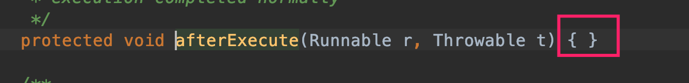


我们直接重写相关方法：

```java
package com.skylaker.pool.worker;

import java.util.concurrent.*;

/**
 * 线程池执行线程状态监控
 * @author skylaker2019@163.com
 * @version V1.0 2019/8/3 9:02 AM
 */
public class ThreadExecute {
    public static void main(String[] args) {
        ExecutorService es = new ThreadPoolExecutor(
                2,
                3,
                0, TimeUnit.SECONDS,
                new ArrayBlockingQueue(5),
                Executors.defaultThreadFactory(),
                new ThreadPoolExecutor.DiscardPolicy()
        ){
            // 线程执行之前调用
            @Override
            protected void beforeExecute(Thread t, Runnable r) {
                System.out.println("准备执行任务：" + ((MyTask)r).getId());
            }

            // 线程执行之后调用
            @Override
            protected void afterExecute(Runnable r, Throwable t) {
                System.out.println("已执行完任务：" + ((MyTask)r).getId());
            }

            // 线程池关闭时调用
            @Override
            protected void terminated() {
                System.out.println("线程池退出");
            }
        };

        for(int i = 0; i < 10; i++){
            MyTask task = new MyTask(i);
//            es.submit(task);
            es.execute(task);
        }

        es.shutdown();
    }

    static class MyTask implements Runnable {
        private int id;

        MyTask(int id){
            this.id = id;
        }

        public int getId(){
            return id;
        }

        public void run() {
            System.out.println("当前执行任务线程ID：" + Thread.currentThread().getId() + "  执行任务ID：" + id);

            try {
                Thread.sleep(1);
            } catch (InterruptedException e) {
                e.printStackTrace();
            }
        }
    }
}

```

执行结果：


从打印结果来看每次线程执行任务前后都对输出相应的动作信息，同时线程池在关闭后也会回调相关方法。

这里我们仍然采用execute的方式提交，如果采用submit提交会报错：


这是为什么呢？我们跟踪下源代码，如果采用submit的方法：

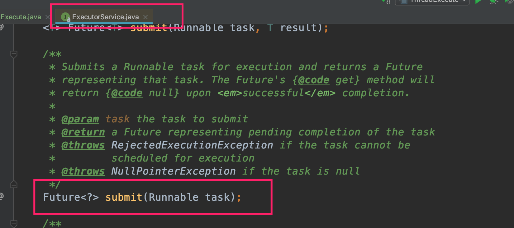

其实调用的是ExecuteService定义的submit方法，这是一种有返回值形式的提交，但是这里是接口定义，我们继续往下看实现定义，但是有几种实现：


根据最开始线程继承结构，我们的ThreadPoolExecutor是实现了AbstractExecutorService接口的，所以我们直接到AbstractExecutorService里面看下：


这里有调用了newTaskFor方法：


可以看到用FutureTask封装生成了新的一个对象，而返回的FutureTask对象正好发送给了线程池执行，也就是说用submit方法提交的任务线程池其实执行FutureTask方法的，我们在线程触发事件beforeExecute中用了强转((MyTask)r).getId()，而我们的MyTask和FutureTask除了都实现了Runnable接口之外并无任何继承关系，那么也就无法强转，所以就出现强转异常了。

那么为什么execute方法就可以了呢？我们点击进入execute方法，直接就是顶层接口Executor的execute方法：


我们再一路跟踪到ThreadPoolExecutor执行任务的地方：


可以看到线程在执行任务的前后确实调用了beforeExecute和afterExecute方法，同时执行的任务还是Runnable实例，即未被封装或转换的MyTask对象，那么我们在触发方法里面使用强转自然也就没有任何问题了。

## 3.3 <span id="head76">Fork/Join</span>

### 3.3.1 <span id="head77">概述</span>

在某些场景下需要处理大量的数据，如果直接采用串行依次计算方式那么可能需要很长的时间，我们可以利用线程框架提供的ForkJoinPool来分配处理任务，即将一个大的任务发送给Fork/Join线程池，如果这个任务过大，那么可以将任务拆分成若干个小的任务，如果拆分出来的小的任务还大，那么还可以进一步分解，类似图(图片来自网络)：


### 3.3.2 <span id="head78">原理方法</span>

其实在框架内执行任务的就是一个个对应的线程，而一个线程可能被分配多个任务，每个线程有个队列缓存要计算的任务，同时线程如果执行完自己的任务进入空闲状态的话，可以从别的线程任务队列中拿任务执行，即工作窃取：


如果线程去区别的线程任务队列取任务的话是从对了尾端取，而线程从自己的任务队列取任务是从队列头，这样就有效避免任务获取冲突，当然如果只剩一个任务了就存在竞争了。

ForkJoinPool线程池核心方法：
`public <T> ForkJoinTask<T> submit(ForkJoinTask<T> task)`

即提交ForkJoin形式的任务，而ForkJoinTask是是一个支持Fork即任务分解、Join即可等待任务执行结束获取结果的任务，其核心三个方法：fork、join、compute（执行具体计算任务）。ForkJoinTask主要的两个子类：RecursiveAction（没有返回值任务）和RecursiveTask（有返回值任务）


### 3.3.3 <span id="head79">使用示例</span>

```java
package com.skylaker.pool.forkjoin;

import java.util.ArrayList;
import java.util.concurrent.ExecutionException;
import java.util.concurrent.ForkJoinPool;
import java.util.concurrent.ForkJoinTask;
import java.util.concurrent.RecursiveTask;

/**
 * 分而治之 fork/join框架
 *
 * @author skylaker2019@163.com
 * @version V1.0 2019/8/3 12:10 PM
 */
public class ThreadForkJoinPool {
    public static void main(String[] args) {
        ForkJoinPool forkJoinPool = new ForkJoinPool();

        // 场景：计算数列和
        MyTask task = new MyTask(1, 99);
        ForkJoinTask<Integer> forkJoinTask = forkJoinPool.submit(task);

        try {
            if(forkJoinTask.isCompletedAbnormally()){
                // 内部任务非正常执行
                System.out.println(forkJoinTask.getException());
            } else {
                // 任务正常执行
                // 等待获取最终的计算结果
                int res = forkJoinTask.get();
                System.out.println("计算结果：" + res);
            }
        } catch (InterruptedException e) {
            e.printStackTrace();
        } catch (ExecutionException e) {
            e.printStackTrace();
        }
    }

    /**
     * 计算指定区间数列和
     */
    static class MyTask extends RecursiveTask {
        // 设置每个子任务能够计算的数的数量
        private static final int THRESHOLD = 20;
        // 单个任务计算的开始数
        private int start;
        // 单个任务计算的结束数
        private int end;

        MyTask(int start, int end){
            System.out.println("当前计算范围：" + start + " --" + end);
            this.start = start;
            this.end = end;
        }

        // 执行计算任务（定义了一个大任务，内部可以分解成多个小任务）
        @Override
        protected Object compute() {
            int sum = 0;
            // 判断当前任务要计算的数的数量是否在设置的阈值范围内
            boolean isInThreshold = end - start + 1 <= THRESHOLD;

            if(isInThreshold){
                // 如果没有超出则直接计算，例如传进来15个数
                for(; start <= end; start++){
                    sum += start;
                }
            } else {
                // 如果超出了则需要将任务分解成小的任务
                // 那么如何分解呢？完全取决于程序设定，因为我们不知道需要计算的数的总数量
                // 所以直接每次将所有的数分成10个部分，其中数量在阈值内的直接计算
                // 在阈值外的则再进行分解

                // 计算每个子任务承担的数量
                int subTaskNumCount = ((end - start + 1) / 10) + 1;
                // 缓存分解的子任务
                ArrayList<MyTask> subTaskList = new ArrayList<>(10);

                for(int i = 0; i < 10; i++){
                    // 计算每个子任务计算起始数
                    int subTaskStart = start + subTaskNumCount * i;
                    // 每个子任务计算的结束数
                    int subTaskEnd = subTaskStart + subTaskNumCount - 1;
                    if(subTaskEnd > end){
                        subTaskEnd = end;
                    }

                    MyTask subTask = new MyTask(subTaskStart, subTaskEnd);
                    subTaskList.add(subTask);
                    // 子任务执行计算（有可能内部又分解）
                    subTask.fork();
                }

                // 计算子任务计算结果和
                for(MyTask t : subTaskList){
                    sum += (int)t.join();
                }
            }
            return sum;
        }
    }

}

```

执行结果：


## 3.4 <span id="head80">Future</span>

# 4. <span id="head81">线程协作</span>

# 5. <span id="head82">JMM内存模型</span>

# 6. <span id="head83">互斥处理</span>
## 6.1 <span id="head84">概述</span>
多线程在对临界区数据同时涉及状态变更的操作的时候就会出现数据安全问题，为了保证数据访问操作结果的正确性，Java提供显式的互斥操作，即通过锁来实现线程并发同步互斥（其实说互斥也是一种协作机制，互斥不是目的，最终共同完成目标任务才是目的，只不过过程中出现需要协调一致的方式）。

## 6.2 <span id="head85">synchronized</span>
* 作用

实现线程间同步，即对同步代码块加锁，使得同一时刻只能只能有一个线程进程进入同步代码块，换句话说实现同步代码块线程访问串行化。
* 特点

//TODO

* 方式

作用于实例方法

```java
package com.skylaker.sync;

import org.junit.jupiter.api.Test;

/**
 * synchronized 修饰实例方法
 * @author skylaker2019@163.com
 * @version V1.0 2019/8/7 10:21 PM
 */
public class SynchronizedService {
    private int sum = 0;

    @Test
    public void test() throws InterruptedException {
        MyTask myTask = new MyTask(10000);

        Thread thread1 = new Thread(myTask);
        Thread thread2 = new Thread(myTask);
        thread1.start();
        thread2.start();

        thread1.join();
        thread2.join();

        System.out.println("计算结果：" + sum);
    }

    class MyTask implements Runnable {
        private int num = 0;

        MyTask(int num){
            this.num = num;
        }

        public void run() {
            for(int i = 0; i < num; i++){
                add();
                Thread.yield();
            }
        }

        // 修饰实例方法
        private synchronized void add(){
            sum++;
        }
    }
}
```

作用于代码块

```java
package com.skylaker.sync;

import org.junit.jupiter.api.Test;

/**
 * synchronized 修饰代码块
 * @author skylaker2019@163.com
 * @version V1.0 2019/8/7 10:21 PM
 */
public class SynchronizedService2 {
    private  int sum = 0;
    private Object lock = new Object();

    @Test
    public void test() throws InterruptedException {
        MyTask myTask = new MyTask(10000);

        Thread thread1 = new Thread(myTask);
        Thread thread2 = new Thread(myTask);
        thread1.start();
        thread2.start();

        thread1.join();
        thread2.join();

        System.out.println("计算结果：" + sum);
    }

    class MyTask implements Runnable {
        private int num = 0;

        MyTask(int num){
            this.num = num;
        }

        public void run() {
            for(int i = 0; i < num; i++){
                add3();
                Thread.yield();
            }
        }

        // 修饰代码块：指定实例对象锁
        private void add2(){
            synchronized (lock){
                sum++;
            }
        }

        // 修饰代码块：指定类字节码对象锁
        private void add3(){
            synchronized (MyTask.class){
                sum++;
            }
        }
    }
}
```

作用于静态方法

```java
package com.skylaker.sync;

import org.junit.jupiter.api.Test;

/**
 * synchronized 修饰静态方法
 * @author skylaker2019@163.com
 * @version V1.0 2019/8/7 10:21 PM
 */
public class SynchronizedService3 {
    private static int sum = 0;

    @Test
    public void test() throws InterruptedException {
        MyTask myTask = new MyTask(10000);

        Thread thread1 = new Thread(myTask);
        Thread thread2 = new Thread(myTask);
        thread1.start();
        thread2.start();

        thread1.join();
        thread2.join();

        System.out.println("计算结果：" + sum);
    }

    static class MyTask implements Runnable {
        private int num = 0;

        MyTask(int num){
            this.num = num;
        }

        public void run() {
            for(int i = 0; i < num; i++){
                add3();
                Thread.yield();
            }
        }

        // 修饰静态方法
        private synchronized static void add3(){
            sum++;
        }
    }
}
```

* 注意点
其实不管何种方式，对于不同线程操作同一个临界区，保证用的是同一把锁即可。

------

****

**文件内容过多，剩余内容已分割到其它文件目录 ! **

------

------

