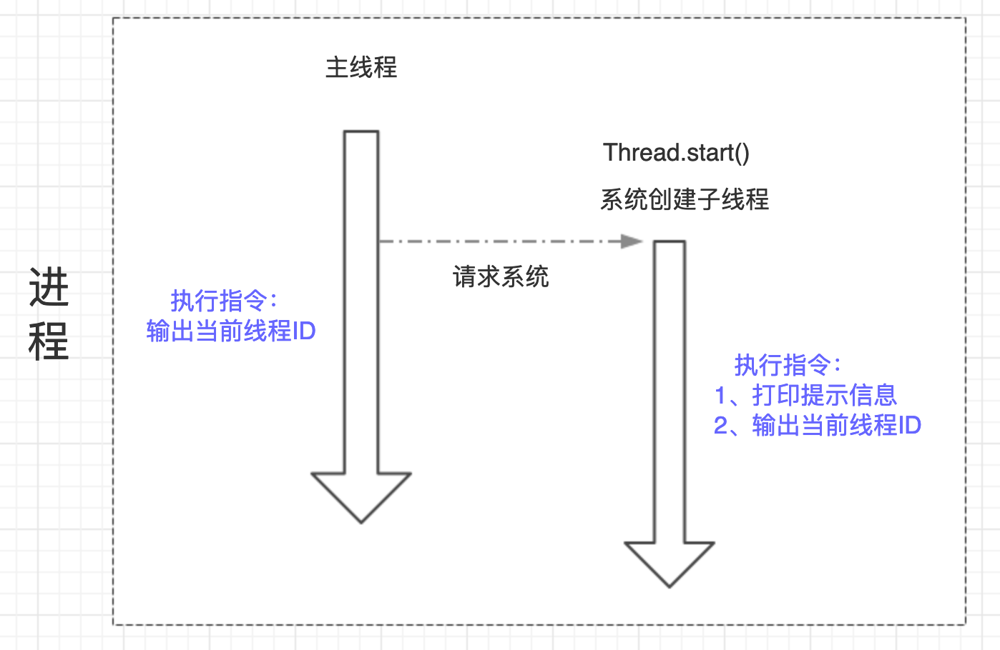

##  <span id="head12">新建线程</span>

### 1 <span id="head13">方式一：继承Thread实现</span>

```java
public class ThreadNew {

    public static void main(String[] args){
        // 方式一: 通过继承Thread
        Thread01 thread01 = new Thread01();
        thread01.start();

        /// 打印当前主线程ID
        System.out.println("主线程ID：" + Thread.currentThread().getId());
    }
    
    /**
     * 方式一: 通过继承Thread
     */
    static class Thread01 extends Thread {
        @Override
        public void run() {
            System.out.println("Hello, I'm a Thread by extends !");
            System.out.println("子线程ID：" + Thread.currentThread().getId());
        }
    }
```

 执行结果：

 

在这里，我们通过继承Java线程对象Thread创建了一个线程（我们确实创建了线程本身吗？），然后通过start方法来启动运行，同时我们还在main方法输出所谓的主线程ID，最后执行结果输出了三行内容，我们看到第一行 Hello... 这个内容，这个正是我们在线程run方法中定义的，第二、三行分别输出了子线程、主线程ID。

我们的main方法作为入口方法，负责执行的对象被称为主线程，而通过定义一个Thread，执行start方法，就是创建了一个子线程。从上述结果我们可以验证确实启动了一个新的子线程执行了执行代码指令。主线程和子线程的关系可以表示如下：



主线程、子系统是两个不同的个体对象，他们单独执行自己的程序指令，可以在主线程中启动子线程。

### 2 <span id="head14">方式二：通过实现Runnable接口</span>

```java
public class ThreadNew {

    public static void main(String[] args){
        // 方式二：通过实现Runnable接口
//        Thread02 thread02 = new Thread02();
//        thread02.start(); 没有该方法，更不可能执行，因为这是Thread02实例，不是线程Thread实例
        Thread thread02 = new Thread(new Thread02());
        thread02.start();

        /// 打印当前主线程ID
        System.out.println("主线程ID：" + Thread.currentThread().getId());
    }
    
        /**
     * 方式二：通过实现Runnable接口
     */
    static class Thread02 implements Runnable {
        public void run() {
            System.out.println("Hi, I'm a Thread by implements !");
            System.out.println("子线程ID：" + Thread.currentThread().getId());
        }
    }
}
```

执行结果：


可以看到和方式一类似的结果，不过这里我们发现主线程的信息先打印出来了，如果多次执行其实可以发现有时子线程先打印信息，有时主线程先打印，这个正是因为主线程、子系统是两个相互独立的个体，主线程启动了子线程，相当于系统中有两个线程同时在运行，那么具体谁先执行完成是无法确定的，所以也就是谁先打印信息也就无法确定了。

### 3 <span id="head15">我们创建了线程吗</span>

上面两种方式是创建线程的基本方式，但是其实说到底也是一种方式，因为Thread对象默认实现了Runnable接口：


即创建线程都需要实现Runable接口，不过如果我们直接通过继承Thread来实现的话，因为Java单继承特性我们无法再继承其他对象，所以最好通过实现接口的方式。

我们现在来思考一个问题，我们这些操作确实是创建了线程吗？即我们是否创建了线程本身？其实我们定义的线程其实真实的理解应该是我们定义了线程需要执行的任务内容，即run方法内的程序指令，只不过需要执行这段指令的方式是让JVM去创建一个线程去执行，而非当前主线程；new Thread 然后 start 就是通知JVM去创建线程执行指令，只不过不同线程执行的指令可以是同一个代码片段定义的。
    

```java
    @Test
    public void testThread(){
        Thread02 thread02 = new Thread02();

        Thread t1 = new Thread(thread02);
        Thread t2 = new Thread(thread02);
        Thread t3 = new Thread(thread02);
        t1.start();
        t2.start();
        t3.start();
    }
```

执行结果：


我们定义了个Thread02实例，理论上如果我们实现Runnable接口的对象实例就是线程本身，那么这里三个线程执行就应该是同一个线程，应该输出同样的线程ID，但是结果显示并非如此，而是输出了三个线程ID，也就是通过 new Thread 方法才真正定义了线程，但其实也不完全是，更准确的说法是Thread执行start方法后主线程通知JVM去创建三个不同的线程，然后执行我们在Thread02的run方法中定义的代码内容。只不过很多时候因为我们用这样的方式启动的就是线程，所以就直接称Thread为线程了。

其实执行start方法后，JVM创建了线程，线程并非直接获取到CPU调度，而是出于就绪状态，会和其他线程抢占资源，当被CPU调度后，就会出于运行状态，执行对应的run方法中的内容。

线程本身是操作系统中的一个资源处理对象，我们的代码是程序指令，线程可以接收CPU调度，执行我们指定的程序指令。我们去吃饭可以让服务员倒杯水，服务员接收我们的请求来做倒水的事情，但是不能说我们请服务器倒水这个请求是服务员，我们更没有自带或者创建了服务员~~

### 4 <span id="head16">直接Run方法怎样</span>

我们启动线程的时候是通过Thread的start方法，但是run方法里面才是我们要线程执行的内容啊，为啥不直接执行Run方法呢？

```java
    @Test
    public void testRunStart(){
        Thread t1 = new Thread01();
        t1.run();

        Thread t2 = new Thread(new Thread02());
        t2.run();

        System.out.println("主线程ID：" + Thread.currentThread().getId());
    }
```

运行结果：


我们利用两种方式创建的线程，直接运行run方法，同时输出主线程ID，如果run方法启动的是线程执行，那么理论上他们对应的线程ID应该和主线程不同，但是很意外，输出的结果显示两个子线程和主线程的ID是一致的，说明通过run方法根本没有新建子线程，就是主线程在运行。

其实启动线程必须通过Thread的start方法，如果直接运行run方法也是可以的，只不过是运行普通的java方法，还是主线程在执行。Thread的start方法执行过后，通知JVM创建子线程，子线程运行其中run方法定义的指令。

### 5 <span id="head17">多次调用start方法</span>

如果多次调用start方法会怎么样呢？

```java
    @Test
    public void testStart(){
        Thread t1 = new Thread(new Thread02());
        t1.start();
        t1.start();
    }
```

执行结果：


前面两行创建了线程，执行了代码指令，但是再次执行start方法就报错了，因为已经启动了线程，正在执行指令，无法再次发送任务了，直白点人家线程已经启动了你还要去启动不是多余么~~ 而抛出的异常也阐明了这一点，IllegalThreadStateException，非法线程状态，线程已经处于就绪状态不能又直接就绪。