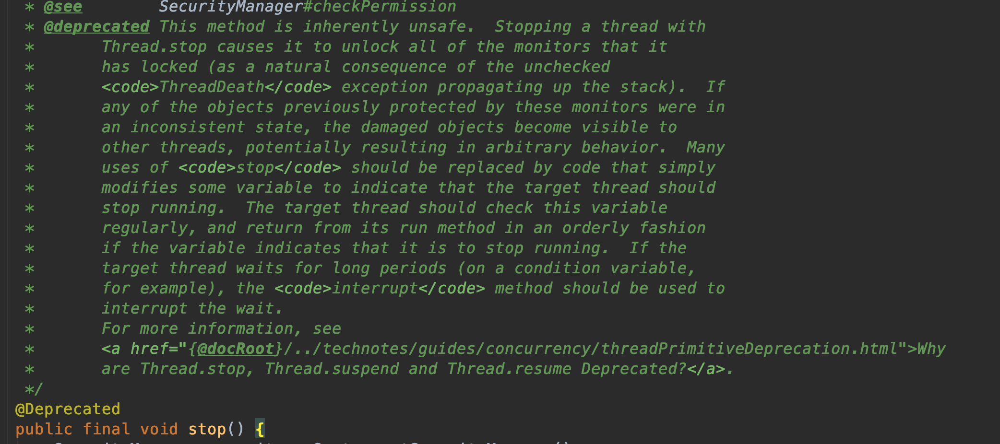

## <span id="head18">终止线程</span>

### 1 <span id="head19">如何停止线程</span>

我们已经有了新建线程的方法，那么如何停止一个线程呢，停止不就stop嘛，我们试试，你别说还真有stop方法，还开心，赶紧试试：

```java
public class ThreadStop {
    @Test
    public void testStopThread(){
        Thread thread = new Thread(new Runnable() {
            public void run() {
                try {
                    System.out.println("Hello, Thread !");
                    Thread.sleep(2000);
                } catch (InterruptedException e) {
                    e.printStackTrace();
                }
            }
        });

        // 启动线程
        thread.start();
        // 终止线程
        thread.stop();
    }
}
```

输出结果：


可以看到输出了期望的值~~ 

### 2  <span id="head20">方法分析</span>

但是我们发现一个问题，stop方法被标识为横线了，这表明这是一个过时的方法，一个废弃的方法必然有其被废弃的原因，一般都会导致一些问题或者有了更好的方法。我们看下官方注释：



里面说明了弃用该方法的原因，大致意思就是如果使用stop方法去终止一个线程，那么该线程所持有的监视器（一般来说锁对象）都会直接释放掉，而这些监视器是保证线程之间同步的措施，如果突然释放掉，那么其他线程就会获的访问临界区资源的资格，进而操作临界区资源，可能导致临界区资源破坏。

仔细想想，我们线程之间同时去操作临界区资源，为了保证临界区资源安全性需要对访问该临界区的线程进行同步，常常通过锁的方式，线程获取到了锁，进行临界区资源操作，操作完成释放掉锁，其他线程抢占CPU获取调用得到了锁，进入临界区进行操作，大家先后依次有序进行，保证了共享资源的安全性。现在某个线程获取到了锁，正在操作临界区资源，突然接收到stop方法，被迫中止，释放掉锁了，这个时候其他正在阻塞等待的线程就有机会了，获取到了锁进行临界区资源操作，但是问题来了，前一个突然被中止的线程操作数据刚到一半，现在又被其他线程操作，那么数据就被破坏了，比如原本要 a=1 进行加5操作，依次加1操作，才加到3就突然退出了，后续的线程应该在前一个加了5的基础上操作，现在在加了3的基础上操作，明显最终的数据结果就会出问题，这正是stop方法非安全性被舍弃的原因。我们可以通过程序模拟下相关的场景：

```java
package com.skylaker.stop;

/**
 * 线程直接stop产生问题场景模拟
 *
 * @author skylaker2019@163.com
 * @version V1.0 2019/7/20 9:53 PM
 */
public class ThreadStop2 {
    private static User user  = new User();

    public static void main(String[] args){
        // 开启读线程不停的读
        new ReadThread().start();

        // 开启写线程不停的写
        while(true){
            WriteThread writeThread = new WriteThread();
            writeThread.start();

            try {
                Thread.sleep(150);
            } catch (InterruptedException e) {
                e.printStackTrace();
            }
            writeThread.stop();
        }
    }

    /**
     * 读线程：读取User对象的age和name，当不一致的时候输出
     */
    static class ReadThread extends Thread {
        @Override
        public void run() {
            while (true){
                synchronized (user){
                    if(user.getAge() != Integer.parseInt(user.getName())){
                        System.out.println("当前User的age和name不一致，age："
                                + user.getAge()
                                + ", name: "
                                + user.getName());
                    }
                }

                // 临时让出资源避免读线程一直持有锁对象，
                // 写线程无法操作，观察不出现象
                Thread.yield();
            }
        }
    }

    /**
     * 写线程：不停的设置User的 age、name值，且值一致（忽略类型）
     */
    static class WriteThread extends Thread {
        @Override
        public void run() {
            while (true){
                synchronized (user){
                    int value = (int) (System.currentTimeMillis() / 1000);
                    user.setAge(value);

                    try {
                        Thread.sleep(100);
                    } catch (InterruptedException e) {
                        e.printStackTrace();
                    }

                    user.setName(String.valueOf(value));
                }

                Thread.yield();
            }
        }
    }

    static class User {
        private int age;

        private String name;

        User() {
            // 初始化设值，避免读线程刚启动疯狂读取没有值报错
            age = 1;
            name = "1";
        }

        public int getAge() {
            return age;
        }

        public void setAge(int age) {
            this.age = age;
        }

        public String getName() {
            return name;
        }

        public void setName(String name) {
            this.name = name;
        }

        @Override
        public String toString() {
            return "User{" +
                    "age=" + age +
                    ", name='" + name + '\'' +
                    '}';
        }
    }
}
```

执行结果：


可以看到测试代码输出了意外场景的数据，仔细观察发现，发生意外时候name的值（对应的int值）总是比age的值小1，这是为什么呢？因为我们的写线程中是先设置age的值得，但是在到设置name的值中间有个短暂的间隔，但正是因为这个间隔就产生了问题，因为在此期间，写线程突然被stop终止了，那么就会导致写线程只设置了age的值却没来得及设置name的值，这样我们以时间戳值设置变量的话，就会发现name值比age小1。

上述验证代码正验证了stop代码的危害，也是官方描述的内容，会突然导致线程终止，释放锁资源，导致同步失效，最终导致数据损坏。

所以，我们程序中禁止stop方法！

那么我们程序就是想要线程停止运行呢，该咋办？可以有两种方式，一个是自行实现程序自动退出的逻辑，例如定义一个标识位，当满足条件时即退出程序运行；另外可以通过线程间中断实现。