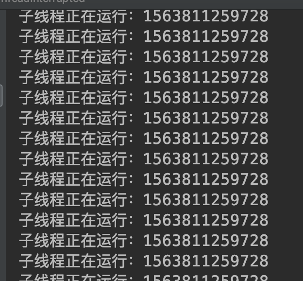
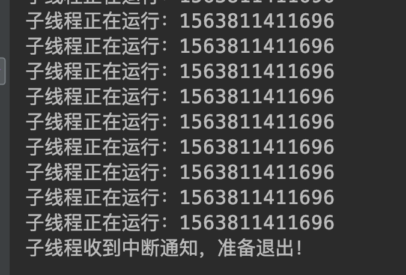
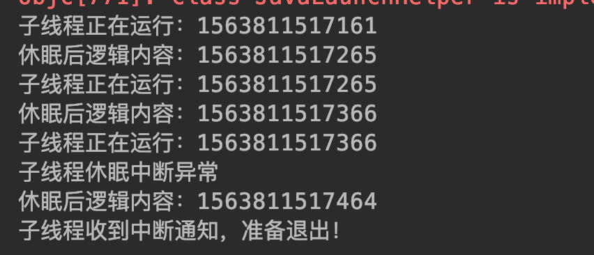

## <span id="head21">线程中断</span>

### 1 <span id="head22">中断概述</span>

回忆上一节stop方法内容，如果仔细思考，发现它不安全的根本原因就在于突然停止线程，好比如你在吃饭突然被人把碗筷扔了，你突然不能继续吃饭了，你不得发飙；但是如果换个方式，有人来告诉你说食堂因为有事要打扫卫生啥的，让你赶紧吃完，这个肯定要温柔点了。在线程中也有类似的方式，就是线程中断，通过中断通知线程停止运行，不过和你被通知不要吃饭但是你可以选择继续吃一会就不吃了还是立即就不吃了一样，线程在接收到中断请求后，也可以继续运行完当前程序指令内容后再停止，或者已经几乎执行完了可以直接停止。

总计起来就是，中断可以请求线程结束运行，但是线程收到中断请求何时真正停止可以自行处理决定。

中断是线程间的协作方式。因为中断时需要别的线程发起请求的，类似人之间通信交流。

### 2 <span id="head23">线程方法</span>

A. **public void Thread.interrupt()**

中断线程：通知目标线程中断，设置中断标志位。这个中断标志位是干嘛的呢？其实就直接当做一个flag看待了，我们通知目标线程中断，但是目标线程具体停不停止、如何处理中断完全由目标线程决定，那么目标线程如何判断呢？就相当于if(true == flag)了，即通过判断中断标志位。

B. **public boolean Thread.isInterrupted()**

判断线程是否被中断：目标线程被通知中断后，可以通过该方法判断是否被中断

C. **public static boolean Thread.interrupted()**

判断是否被中断，并清除当前中断标志

### 3 <span id="head24">方法实例</span>

#### 3.1 <span id="head25">只通知线程中断，但是线程不显式处理</span>

```java
public static void main(String[] args) throws InterruptedException {
        testInterrupt();
    }

    /**
     * 如果子线程不对中断通知进行处理，那么将不会退出处理逻辑
     * @throws InterruptedException
     */
    public static void testInterrupt() throws InterruptedException {
        Thread thread = new Thread(){
            @Override
            public void run() {
                while (true) {
                    System.out.println("子线程正在运行：" + System.currentTimeMillis());
                    Thread.yield();
                }
            }
        };

        thread.start();
        Thread.sleep(2000);
        // 通知子线程中断
        thread.interrupt();
    }
```

执行结果：



通知线程中断，但是线程并没有对中断进行处理，因此不会结束程序。

#### 3.2 <span id="head26">对中断进行判断处理</span>

```java
/**
     * 子线程对中断通知进行响应
     * @throws InterruptedException
     */
    public static void testReolveInterrupt() throws InterruptedException {
        Thread thread = new Thread(){
            @Override
            public void run() {
                while (true) {
                    if(Thread.currentThread().isInterrupted()){
                        System.out.println("子线程收到中断通知，准备退出！");
                        break;
                    }

                    System.out.println("子线程正在运行：" + System.currentTimeMillis());
                    Thread.yield();
                }
            }
        };

        thread.start();
        Thread.sleep(200);
        // 通知子线程中断
        thread.interrupt();
    }
```

执行结果:



子线程对中断标志位进行判断，如果产生了中断则结束。

#### 3.3 <span id="head27">休眠中断处理</span>

```java
/**
     * 休眠过程中中断
     * @throws InterruptedException
     */
    public static void testSleepInterrupt() throws InterruptedException {
        Thread thread = new Thread(){
            @Override
            public void run(){
                while (true) {
                    if (Thread.currentThread().isInterrupted()){
                        System.out.println("子线程收到中断通知，准备退出！");
                        break;
                    }

                    System.out.println("子线程正在运行：" + System.currentTimeMillis());

                    try {
                        Thread.sleep(100);
                    } catch (InterruptedException e) {
                        System.out.println("子线程休眠中断异常");
                        // 异常中断标志位被清除，需要重新设置，让子线程处理退出，避免直接退出导致后续代码无法执行
                        Thread.currentThread().interrupt();
                    }

                    System.out.println("休眠后逻辑内容：" + System.currentTimeMillis());
                    Thread.yield();
                }
            }
        };

        thread.start();
        Thread.sleep(300);
        // 通知子线程中断
        thread.interrupt();
    }
```

执行结果：



子线程处理逻辑中存在sleep方法，线程在休眠期间如果被中断则会产生中断异常，且会清除中断标志位。但是产生中断异常后我们不应该直接退出线程，因为后续可能还会有其他处理逻辑，可以通过重新设置中断标志位，进行判断后处理。