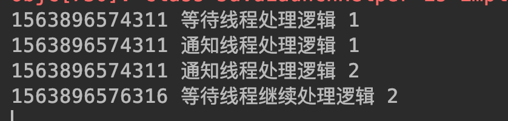

## <span id="head28">线程等待、唤醒</span>

### 1 <span id="head29">场景概述</span>

线程之间在某些情况下会需要相互协作，A线程处理某个逻辑时可能需要等待B线程处理完成后才能继续进行。举个生活的场景，例如你去海底捞吃火锅，但是人已经满了，这个时候你就需要等待，服务员通知你人满了，你便到等待区域吃点小吃慢慢等着；等有空桌时，服务员又通知你可以如坐点餐吃火锅了。这个过程中你相当于一个线程，而其他吃饭的顾客是其他线程。线程之间的通信采用 wait 和 notify 方法完成。

### 2 <span id="head30">协作方法</span>

A. public final void wait() throws InterruptedException

该方法为object方法，即所有对象都具有该方法。当线程中的对象调用wait方法后当前所在线程便暂停当前程序处理逻辑，然后释放当前线程所持有的锁，进入调用wait方法对象的等待队列，这个等待队列其实是一个虚拟的概念，当期对象上面等待的线程都在这个队列中，这个过程可以用如下图示表达：


B. public final native void notify()

该方法也是object定义的方法，同样意味所有的对象都拥有这个方法。当对象调用notify方法时候，当前所在线程会在执行完程序逻辑后释放掉当前的持有的锁，然后去当前对象的等待队列中随机唤醒一个线程，获取到锁的线程会继续在原来暂停的地方继续运行。

不过还有个 notifyAll 方法，唤醒所有等待的线程。


### 3 <span id="head31">代码实例</span>

```java
package com.skylaker.thread.wait;

/**
 * 多线程协作：wait notify
 * @author skylaker2019@163.com
 * @version V1.0 2019/7/23 10:31 PM
 */
public class ThreadWaitNotify {
    final static Object object = new Object();

    public static void main(String[] args){
        WaitThread waitThread = new WaitThread();
        NotifyThread notifyThread = new NotifyThread();
        waitThread.start();
        notifyThread.start();
    }

    // 阻塞等待 wait
    static class WaitThread extends Thread {
        @Override
        public void run() {
            synchronized (object) {
                System.out.println(System.currentTimeMillis() + " 等待线程处理逻辑 1 ");

                try {
                    // 当前锁对象锁住的线程进入阻塞等待，并释放锁
                    object.wait();
                } catch (InterruptedException e) {
                    e.printStackTrace();
                }

                System.out.println(System.currentTimeMillis() + " 等待线程继续处理逻辑 2");
            }
        }
    }

    // 通知唤醒 notify
    static class NotifyThread extends Thread {
        @Override
        public void run() {
            synchronized (object) {
                System.out.println(System.currentTimeMillis() + " 通知线程处理逻辑 1");

                // 当前锁对象锁住的线程通知当前锁对象等待队列中的某个线程唤醒
                object.notify();

                System.out.println(System.currentTimeMillis() + " 通知线程处理逻辑 2");
                try {
                    Thread.sleep(2000);
                } catch (InterruptedException e) {
                    e.printStackTrace();
                }
            }
        }
    }
}
```

执行结果：



在这里我们模拟了两个线程，在等待线程中，通过锁对象通知线程进行等待，然后在通知线程中锁对象进行唤醒等待队列中的阻塞线程。我们可以看待输出结果第四行显示的是等待线程之前执行wait方法后的逻辑内容，说明进行wait的线程被唤醒后会继续在原来等待的地方继续运行。而第四行比第三行延时2秒，这个因为我们在通知线程中notify之后，又故意等待了两秒，这个恰恰说明通知线程在notify之后并没有立即释放掉当前持有的锁资源，而是执行完自己的剩余逻辑才释放掉锁资源，这个也是一种保证逻辑正确、数据正确的方式，不然就和stop类似了。

### 4 <span id="head32">必须是同一个对象吗</span>

```java
public class ThreadWaitNotify {
    final static Object object = new Object();
    final static Object object2 = new Object();

    public static void main(String[] args){
        WaitThread waitThread = new WaitThread();
        NotifyThread notifyThread = new NotifyThread();
        waitThread.start();
        notifyThread.start();
    }

    // 阻塞等待 wait
    static class WaitThread extends Thread {
        @Override
        public void run() {
            synchronized (object) {
                System.out.println(System.currentTimeMillis() + " 等待线程处理逻辑 1 ");

                try {
                    // 当前锁对象锁住的线程进入阻塞等待，并释放锁
                    object.wait();
                } catch (InterruptedException e) {
                    e.printStackTrace();
                }

                System.out.println(System.currentTimeMillis() + " 等待线程继续处理逻辑 2");
            }
        }
    }

    // 通知唤醒 notify
    static class NotifyThread extends Thread {
        @Override
        public void run() {
            synchronized (object2) {
                System.out.println(System.currentTimeMillis() + " 通知线程处理逻辑 1");

                // 当前锁对象锁住的线程通知当前锁对象等待队列中的某个线程唤醒
                object2.notify();

                System.out.println(System.currentTimeMillis() + " 通知线程处理逻辑 2");
                try {
                    Thread.sleep(2000);
                } catch (InterruptedException e) {
                    e.printStackTrace();
                }
            }
        }
    }
}
```

执行结果：


这里可以看到等待线程在等待后就一直没有下文了，即一直处于等待阻塞状态，因为在它的锁对象object上面没有其他线程来唤醒他，所以就一直处于阻塞状态了。而通知线程它是通知锁对象object2上面等待队列中的等待线程，那么肯定通知不到object上等待的线程了。好比上面你去吃火锅，还在等待呢，结果旁边麻辣烫店的服务员把你薅过去了，你是不是一脸懵逼，答应么（我们正常来说哈）？

### 5 <span id="head33">必须是锁对象吗</span>

那么必须要用锁对象进行 wait 和 nitify 吗？

```java
public class ThreadWaitNotify {
    final static Object object = new Object();
    final static Object object2 = new Object();

    public static void main(String[] args){
        WaitThread waitThread = new WaitThread();
        NotifyThread notifyThread = new NotifyThread();
        waitThread.start();
        notifyThread.start();
    }

    // 阻塞等待 wait
    static class WaitThread extends Thread {
        @Override
        public void run() {
            synchronized (object) {
                System.out.println(System.currentTimeMillis() + " 等待线程处理逻辑 1 ");

                try {
                    // 当前锁对象锁住的线程进入阻塞等待，并释放锁
                    object2.wait();
                } catch (InterruptedException e) {
                    e.printStackTrace();
                }

                System.out.println(System.currentTimeMillis() + " 等待线程继续处理逻辑 2");
            }
        }
    }

    // 通知唤醒 notify
    static class NotifyThread extends Thread {
        @Override
        public void run() {
            synchronized (object) {
                System.out.println(System.currentTimeMillis() + " 通知线程处理逻辑 1");

                // 当前锁对象锁住的线程通知当前锁对象等待队列中的某个线程唤醒
                object2.notify();

                System.out.println(System.currentTimeMillis() + " 通知线程处理逻辑 2");
                try {
                    Thread.sleep(2000);
                } catch (InterruptedException e) {
                    e.printStackTrace();
                }
            }
        }
    }
}
```

执行结果：


可以看到两个线程在执行 wait 和 notify 时都报错了，这个说明要想执行 wait 和 notify 必须是同一个锁对象！其实仔细想想，如果不是用锁对象，那么也就无法控制线程之间同步，导致临界区资源问题。好比如上面你去吃火锅，没有服务员控制下顾客，大家随意抢桌子，估计就乱了~~~

### 6 <span id="head34">wait和sleep的区别</span>

sleep可以让当前线程休眠一段时间，wait可以让当前锁线程阻塞等待一段时间，但是两者还是有区别的，一是wait可以被唤醒，但是sleep只能等休眠时间结束，如果休眠过程中发生中断，那么会导致中断异常；二是sleep休眠期间并不是释放当前锁资源，导致其它在当前锁对象上阻塞的线程一直在阻塞，而wait方法会导致当前锁上的线程暂停，释放掉持有的锁对象，进入等待队列，其他在阻塞的线程则抢占锁资源，抢占到锁的线程进入处理相关指令。