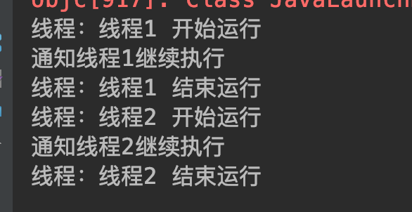

## <span id="head35">线程挂起和继续执行</span>

### 1 <span id="head36">方法概述</span>

A. public final void suspend()

线程挂起方法，让当前线程挂起，但是不释放锁资源，那么就会导致其他在当前锁上等待的线程一直阻塞。

B. public final void resume() 

通知线程继续执行，suspend挂起的线程必须等到resume才能继续运行。

### 2 <span id="head37">方法问题</span>

我们在实际调用这两个方法的时候，发现其实已经被标注为舍弃方法，为啥呢？其实我们借鉴前面一些例子，就会发现挂起方法的一个大问题，就是在挂起期间不会释放当前锁对象，而suspend的线程必须被resume唤醒，试想如果出现差错，那么就会一直处于挂起状态，就一直持有锁对象，则导致其他等待的所有线程都得不到执行，严重影响系统功能。我们可以通过例子来测试下：

```java
package com.skylaker.suspend;

/**
 * 线程挂起suspend和继续执行resume
 *
 * @author skylaker2019@163.com
 * @version V1.0 2019/7/24 11:27 PM
 */
public class ThreadSuspendResume {
    private static Object object = new Object();

    public static void main(String[] args) throws InterruptedException {
        MyThread myThread1 = new MyThread("线程1");
        MyThread myThread2 = new MyThread("线程2");

        myThread1.start();
        myThread2.start();

        // 线程1继续执行
        System.out.println("通知线程1继续执行");
        myThread1.resume();
        // 线程2继续执行
        System.out.println("通知线程2继续执行");
        myThread2.resume();

        myThread1.join();
        myThread2.join();
    }

    static class MyThread extends Thread {
        private String threadName;

        MyThread(String threadName){
            this.threadName = threadName;
        }

        @Override
        public void run() {
            synchronized (object){
                System.out.println("线程：" + threadName + " 开始运行");
                // 线程挂起
                Thread.currentThread().suspend();
                System.out.println("线程：" + threadName + " 结束运行");

            }
        }
    }
}
```

运行正常结果：



非正常运行结果：


上面显示了两种不同的执行结果，一种正常的，两个线程都能正常结束运行，而另外一种则是非正常情况，线程2一直在挂起中，不能结束，这是因为线程2的通知唤醒resume唤醒时机在挂起suspend之前，这样线程2在挂起之后就一直等不到唤醒，那么也就一直等待了，造成结束不了。

其实这里挂起和唤醒继续运行和上一篇的wait、notify类似，但是wait、nofity会释放当前锁对象，一定程度上保证了整体程序的正常执行性，所以我们可以用wait、notify方法实现suspend、resume功能。