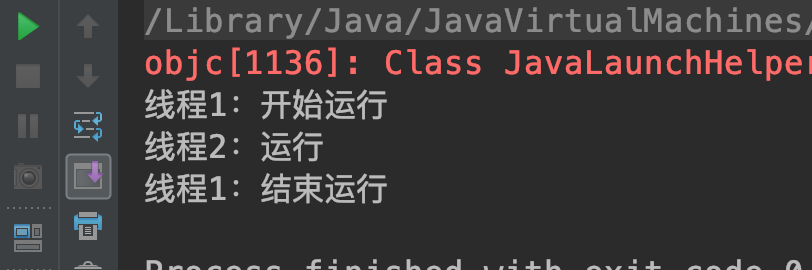

## <span id="head38">等待线程结束和和谦让</span>

### 1 <span id="head39">等待线程运行结束：join方法</span>

和实际生活中一样，线程之间也存在着各种各样的协作，人在协作某些事情的时候，例如测试人员要等开发人员开发完成相关功能之后才能进行测试，而线程也有类似方法：join

public final void join() throws InterruptedException

调用join方法后，调用端线程会等到被调用线程执行结束，例如测试代码：

``` java
package com.skylaker.thread.join;

/**
 * 等待线程结束运行 join
 *
 * @author skylaker2019@163.com
 * @version V1.0 2019/7/25 12:42 AM
 */
public class ThreadJoin {
    private static volatile int sum = 0;

    public static void main(String[] args){
        MyThread myThread = new MyThread();
        myThread.start();

        System.out.println("计算和为：" + sum);
    }

    static class MyThread extends Thread {
        @Override
        public void run() {
            for (int i = 0; i < 100; i++){
                sum += i;
            }
        }
    }
}
```

执行结果：


当然如果子线程运行足够快，有时会得到正确的最终结果 4950，不过很多情况下是小于4950的，就是因为主线程并未等到子线程执行完就直接打印结果了，但是如果主线程主动等到子线程执行完成就能始终得到最终的值。

```java
package com.skylaker.thread.join;

/**
 * 等待线程结束运行 join
 *
 * @author skylaker2019@163.com
 * @version V1.0 2019/7/25 12:42 AM
 */
public class ThreadJoin {
    private static volatile int sum = 0;

    public static void main(String[] args){
        MyThread myThread = new MyThread();
        myThread.start();

        try {
            myThread.join();
        } catch (InterruptedException e) {
            e.printStackTrace();
        }
        System.out.println("计算和为：" + sum);

    }

    static class MyThread extends Thread {
        @Override
        public void run() {
            for (int i = 0; i < 100; i++){
                sum += i;
            }
        }
    }
}
```

执行结果：


### 2 <span id="head40">线程谦让：yield</span>

调用的线程会让出占用的CPU资源，让其他线程先执行，但是当前线程让出之后并不是阻塞等待，而是又直接加入资源竞争，所以让出资源后可能还是当前线程继续运行。需要注意线程谦让并不会释放当前锁资源。

```java
package com.skylaker.thread.yield;

/**
 * 线程谦让 yield
 *
 * @author skylaker2019@163.com
 * @version V1.0 2019/7/25 12:56 AM
 */
public class ThreadYield {
    public static void main(String[] args) throws InterruptedException {
        MyThread1 myThread1 = new MyThread1();
        MyThread2 myThread2 = new MyThread2();
        myThread1.setPriority(Thread.MIN_PRIORITY);
        myThread2.setPriority(Thread.MAX_PRIORITY);

        myThread1.start();
        myThread2.start();
    }

    static class MyThread1 extends Thread {
        @Override
        public void run() {
            System.out.println("线程1：开始运行");
            Thread.currentThread().yield();
            System.out.println("线程1：结束运行");
        }
    }

    static class MyThread2 extends Thread {
        @Override
        public void run() {
            System.out.println("线程2：运行");
        }
    }
}
```

运行结果：



可以看到线程1让出后线程2优先运行。