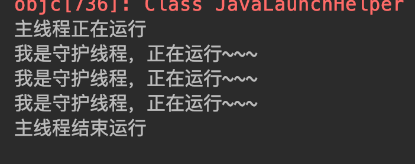

## <span id="head42">守护线程</span>

* 有时候程序在运行时候需要有些后台默默运行的线程处理一些事情，例如JVM中的垃圾收集器负责垃圾回收。我们可以通过`public final void setDaemon(boolean on)`设置某个线程为守护线程：

```java
package com.skylaker.thread.daemon;

/**
 * 守护线程
 *
 * @author skylaker2019@163.com
 * @version V1.0 2019/7/26 10:14 PM
 */
public class ThreadDaemon {
    public static void main(String[] args) throws InterruptedException {
        MyThread myThread = new MyThread();
        // 设置线程为守护线程
        myThread.setDaemon(true);

        // 主线程开始
        System.out.println("主线程正在运行");
        myThread.start();

        Thread.sleep(5000);
        // 主线程结束
        System.out.println("主线程结束运行");
    }

    static class MyThread extends Thread {
        @Override
        public void run() {
            while (true) {
                System.out.println("我是守护线程，正在运行~~~");
                try {
                    Thread.sleep(2000);
                } catch (InterruptedException e) {
                    e.printStackTrace();
                }
            }
        }
    }
}
```

运行结果：



需要注意 setDaemon 方法需要在线程启动前设置，不然无法将线程设置为守护线程。另外从代码执行结果来看，主线程执行结束后守护线程也结束了，这是为啥？所谓皮之不存毛将焉附，守护线程是为了其他主线程存在的，如果主要的线程对象代码执行完了，那么意味着程序结束，那么自然守护线程也就没有存在的必要了，所以也就随着其他非守护线程的都执行完毕而消失。