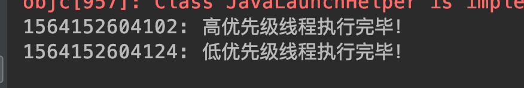

## <span id="head43">线程优先级</span>

### 1 <span id="head44">优先级概述</span>

同现实世界一样，不同的线程有着不同的等级，高层阶级的人拥有着更多的社会资源，做事更容易成功，线程同样可以设置不同的优先级，在资源抢占方面有着不同的表现，例如抢占CPU、获取锁，高优先级的线程趋向于更容易获取到资源，而低优先级的获取资源能力弱，极端严重程度下都可能发生一值得不到运行即饥饿情况。

### 2 <span id="head45">不设置优先级的情况表现</span>

```java
package com.skylaker.priority;

/**
 * 线程优先级
 *
 * @author skylaker2019@163.com
 * @version V1.0 2019/7/26 10:33 PM
 */
public class ThreadPriority {

    public static void main(String[] args) throws InterruptedException {
        HighThread highThread = new HighThread();
        LowerThread lowerThread = new LowerThread();
        highThread.start();
        lowerThread.start();
    }

    static class HighThread extends Thread {
        private int count = 0;

        @Override
        public void run() {
            while (true) {
                count++;

                if(count > 100000){
                    System.out.println(System.currentTimeMillis() + ": 高优先级线程执行完毕！");
                    break;
                }
            }
        }
    }

    static class LowerThread extends Thread {
        private int count = 0;

        @Override
        public void run() {
            while (true) {
                count++;

                if(count > 100000){
                    System.out.println(System.currentTimeMillis() + ": 低优先级线程执行完毕！");
                    break;
                }
            }
        }
    }
}
```

执行结果：


两个线程几乎都是完成计算任务。

### 3 <span id="head46">设置线程优先级</span>

```java
package com.skylaker.priority;

import org.omg.PortableServer.THREAD_POLICY_ID;

/**
 * 线程优先级
 *
 * @author skylaker2019@163.com
 * @version V1.0 2019/7/26 10:33 PM
 */
public class ThreadPriority {

    public static void main(String[] args) throws InterruptedException {
        HighThread highThread = new HighThread();
        LowerThread lowerThread = new LowerThread();

        highThread.setPriority(Thread.MAX_PRIORITY);
        lowerThread.setPriority(Thread.MIN_PRIORITY);
        
        highThread.start();
        lowerThread.start();
    }

    static class HighThread extends Thread {
        private int count = 0;

        @Override
        public void run() {
            while (true) {
                count++;

                if(count > 100000){
                    System.out.println(System.currentTimeMillis() + ": 高优先级线程执行完毕！");
                    break;
                }
            }
        }
    }

    static class LowerThread extends Thread {
        private int count = 0;

        @Override
        public void run() {
            while (true) {
                count++;

                if(count > 100000){
                    System.out.println(System.currentTimeMillis() + ": 低优先级线程执行完毕！");
                    break;
                }
            }
        }
    }
}
```

执行结果：


好像也几乎是同时完成的，这不是设置线程优先级了吗？其实这个线程设置了优先级并不意味着低优先级的线程执行效率就一定慢，可能在当前环境某个时刻低优先级的线程就是突然更能抢占CPU。另外主要因为我们这里并没有设置线程间资源抢占，即你做你的事，我用我的资源，互不冲突，(另外计算的数也小)我们可以设置资源抢占来看具体情况：

```java
package com.skylaker.priority;

/**
 * 线程优先级
 *
 * @author skylaker2019@163.com
 * @version V1.0 2019/7/26 10:33 PM
 */
public class ThreadPriority2 {

    public static void main(String[] args) throws InterruptedException {
        HighThread highThread = new HighThread();
        LowerThread lowerThread = new LowerThread();

        highThread.setPriority(Thread.MAX_PRIORITY);
        lowerThread.setPriority(Thread.MIN_PRIORITY);

        highThread.start();
        lowerThread.start();
    }

    static class HighThread extends Thread {
        private int count = 0;

        @Override
        public void run() {
            while (true) {
                synchronized (ThreadPriority2.class){
                    count++;

                    if(count > 100000000){
                        System.out.println(System.currentTimeMillis() + ": 高优先级线程执行完毕！");
                        break;
                    }
                }
            }
        }
    }

    static class LowerThread extends Thread {
        private int count = 0;

        @Override
        public void run() {
            while (true) {
                synchronized (ThreadPriority2.class) {
                    count++;

                    if (count > 100000000) {
                        System.out.println(System.currentTimeMillis() + ": 低优先级线程执行完毕！");
                        break;
                    }
                }
            }
        }
    }
}
```

执行结果：



这里我们设置高低优先级线程抢占同一个锁资源，多次执行会发现常常高优先级线程先运行完。

线程设置优先级方法：`public final void setPriority(int newPriority)`

有几种优先级：

```java
/**
     * The minimum priority that a thread can have.
     */
    public final static int MIN_PRIORITY = 1;

   /**
     * The default priority that is assigned to a thread.
     */
    public final static int NORM_PRIORITY = 5;

    /**
     * The maximum priority that a thread can have.
     */
    public final static int MAX_PRIORITY = 10;
```

# 