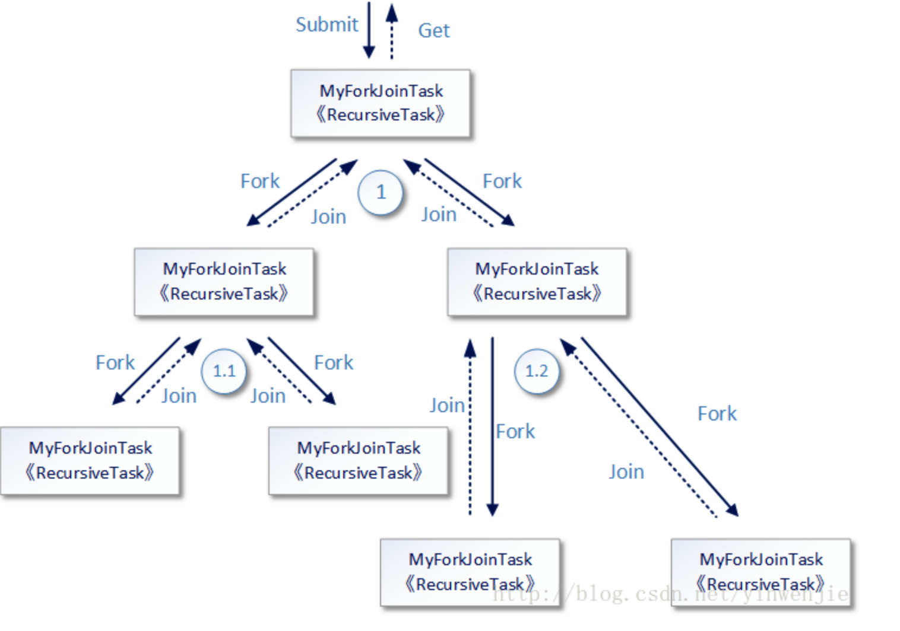
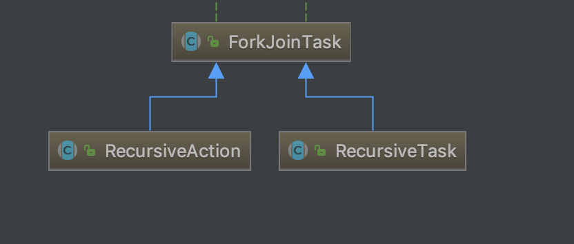
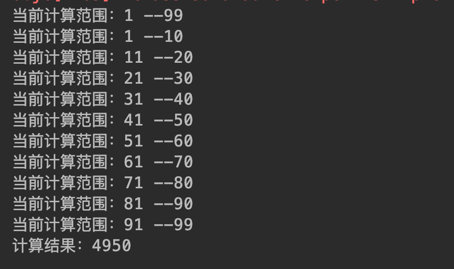

# <span id="head47">分工协作</span>

## 1 <span id="head76">Fork/Join</span>

### 1.1 <span id="head77">概述</span>

在某些场景下需要处理大量的数据，如果直接采用串行依次计算方式那么可能需要很长的时间，我们可以利用线程框架提供的ForkJoinPool来分配处理任务，即将一个大的任务发送给Fork/Join线程池，如果这个任务过大，那么可以将任务拆分成若干个小的任务，如果拆分出来的小的任务还大，那么还可以进一步分解，类似图(图片来自网络)：



### 1.2 <span id="head78">原理方法</span>

其实在框架内执行任务的就是一个个对应的线程，而一个线程可能被分配多个任务，每个线程有个队列缓存要计算的任务，同时线程如果执行完自己的任务进入空闲状态的话，可以从别的线程任务队列中拿任务执行，即工作窃取：


如果线程去区别的线程任务队列取任务的话是从对了尾端取，而线程从自己的任务队列取任务是从队列头，这样就有效避免任务获取冲突，当然如果只剩一个任务了就存在竞争了。

ForkJoinPool线程池核心方法：
`public <T> ForkJoinTask<T> submit(ForkJoinTask<T> task)`

即提交ForkJoin形式的任务，而ForkJoinTask是是一个支持Fork即任务分解、Join即可等待任务执行结束获取结果的任务，其核心三个方法：fork、join、compute（执行具体计算任务）。ForkJoinTask主要的两个子类：RecursiveAction（没有返回值任务）和RecursiveTask（有返回值任务）



### 1.3 <span id="head79">使用示例</span>

```java
package com.skylaker.pool.forkjoin;

import java.util.ArrayList;
import java.util.concurrent.ExecutionException;
import java.util.concurrent.ForkJoinPool;
import java.util.concurrent.ForkJoinTask;
import java.util.concurrent.RecursiveTask;

/**
 * 分而治之 fork/join框架
 *
 * @author skylaker2019@163.com
 * @version V1.0 2019/8/3 12:10 PM
 */
public class ThreadForkJoinPool {
    public static void main(String[] args) {
        ForkJoinPool forkJoinPool = new ForkJoinPool();

        // 场景：计算数列和
        MyTask task = new MyTask(1, 99);
        ForkJoinTask<Integer> forkJoinTask = forkJoinPool.submit(task);

        try {
            if(forkJoinTask.isCompletedAbnormally()){
                // 内部任务非正常执行
                System.out.println(forkJoinTask.getException());
            } else {
                // 任务正常执行
                // 等待获取最终的计算结果
                int res = forkJoinTask.get();
                System.out.println("计算结果：" + res);
            }
        } catch (InterruptedException e) {
            e.printStackTrace();
        } catch (ExecutionException e) {
            e.printStackTrace();
        }
    }

    /**
     * 计算指定区间数列和
     */
    static class MyTask extends RecursiveTask {
        // 设置每个子任务能够计算的数的数量
        private static final int THRESHOLD = 20;
        // 单个任务计算的开始数
        private int start;
        // 单个任务计算的结束数
        private int end;

        MyTask(int start, int end){
            System.out.println("当前计算范围：" + start + " --" + end);
            this.start = start;
            this.end = end;
        }

        // 执行计算任务（定义了一个大任务，内部可以分解成多个小任务）
        @Override
        protected Object compute() {
            int sum = 0;
            // 判断当前任务要计算的数的数量是否在设置的阈值范围内
            boolean isInThreshold = end - start + 1 <= THRESHOLD;

            if(isInThreshold){
                // 如果没有超出则直接计算，例如传进来15个数
                for(; start <= end; start++){
                    sum += start;
                }
            } else {
                // 如果超出了则需要将任务分解成小的任务
                // 那么如何分解呢？完全取决于程序设定，因为我们不知道需要计算的数的总数量
                // 所以直接每次将所有的数分成10个部分，其中数量在阈值内的直接计算
                // 在阈值外的则再进行分解

                // 计算每个子任务承担的数量
                int subTaskNumCount = ((end - start + 1) / 10) + 1;
                // 缓存分解的子任务
                ArrayList<MyTask> subTaskList = new ArrayList<>(10);

                for(int i = 0; i < 10; i++){
                    // 计算每个子任务计算起始数
                    int subTaskStart = start + subTaskNumCount * i;
                    // 每个子任务计算的结束数
                    int subTaskEnd = subTaskStart + subTaskNumCount - 1;
                    if(subTaskEnd > end){
                        subTaskEnd = end;
                    }

                    MyTask subTask = new MyTask(subTaskStart, subTaskEnd);
                    subTaskList.add(subTask);
                    // 子任务执行计算（有可能内部又分解）
                    subTask.fork();
                }

                // 计算子任务计算结果和
                for(MyTask t : subTaskList){
                    sum += (int)t.join();
                }
            }
            return sum;
        }
    }

}

```

执行结果：




## 2 <span id="head80">Future</span>

