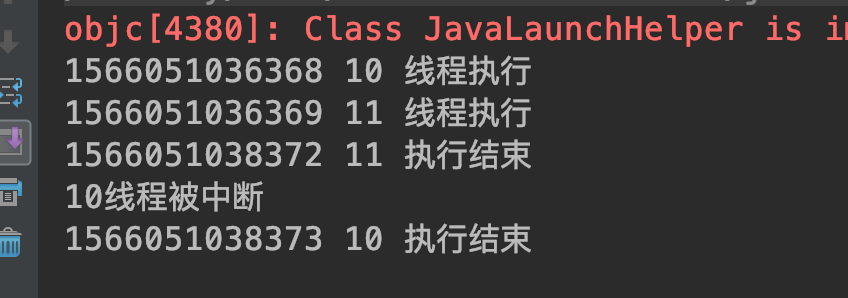

##### 6.9 线程阻塞工具类 LockSupport
###### 6.9.1 基本概念
可以使线程在任意位置阻塞等待；

类似Thread.suspend()、Object.wait()方法，但是和两者不同，相比suspend可以避免由于唤醒resume和挂起suspend顺序导致线程一直阻塞无法执行的问题；不必像wait方法需要先获取对象锁，虽然支持响应中断，但是不显式抛出中断异常InterruptedException；

原理：使用类似信号量机制，每个线程一个许可，park使许可不可用；unpark使许可可用，如果许可可用那么park方法会立即返回。所以即使unpark方法在park之前park方法也能结束，而不像resume在suspend之前就无法结束。

如果在同步锁中，lock会阻塞锁占用，导致其它线程等待。

###### 6.9.2 相关方法
使当前所在线程阻塞等待：
`LockSupport.park()`

指定线程结束阻塞：
`LockSupport.unpark(Thread thread)`

###### 6.9.3 代码示例
```
package com.skylaker.park;

import java.util.concurrent.locks.LockSupport;

/**
 * 线程阻塞工具 LockSupportPark
 * @author skylaker2019@163.com
 * @version V1.0 2019/8/17 7:01 PM
 */
public class ParkService {
    public static void main(String[] args) throws InterruptedException {
        MyTask myTask = new MyTask();
        Thread thread1 = new Thread(myTask);
        Thread thread2 = new Thread(myTask);
        thread1.start();
        thread2.start();

        Thread.sleep(2000);

        // 结束线程阻塞等待
        LockSupport.unpark(thread1);
        LockSupport.unpark(thread2);
    }

    static class MyTask implements Runnable {
        public void run() {
            System.out.println(System.currentTimeMillis() + " " + Thread.currentThread().getId() + " 线程执行");
            // 线程阻塞等待
            LockSupport.park();
            System.out.println(System.currentTimeMillis() + " " + Thread.currentThread().getId() + " 执行结束");
        }
    }
}
```


两个线程一开始都阻塞，后来主线程通过unpark结束两个线程等待，执行完毕。

通过中断结束线程阻塞：
```
public static void main(String[] args) throws InterruptedException {
        MyTask myTask = new MyTask();
        Thread thread1 = new Thread(myTask);
        Thread thread2 = new Thread(myTask);
        thread1.start();
        thread2.start();

        Thread.sleep(2000);

        // 结束线程阻塞等待
        thread1.interrupt();
        LockSupport.unpark(thread2);
    }

    static class MyTask implements Runnable {
        public void run() {
            System.out.println(System.currentTimeMillis() + " " + Thread.currentThread().getId() + " 线程执行");

            // 线程阻塞等待
            LockSupport.park();
             // park被中断不主动抛出异常，但是可以通过线程状态监测
            if(Thread.interrupted()){
                System.out.println(Thread.currentThread().getId() + " 线程被中断");
            }

            System.out.println(System.currentTimeMillis() + " " + Thread.currentThread().getId() + " 执行结束");
        }
    }
```


