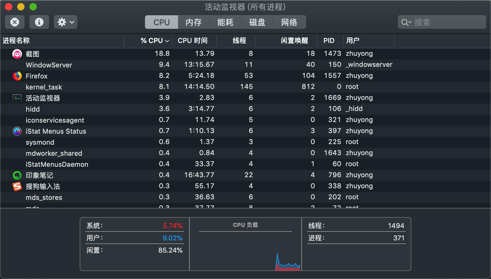

# 基础概念

## 1. 开篇废话

本学习内容主要以《实战JAVA高并发程序设计》一书为参考资料，先知其然，再知其所以然~~

## 2.  高并发与多线程

说到线程，可能比较令人难以理解，毕竟是作为抽象的存在，我们面对的是一个高度封装的计算机硬件设施以及很神奇的软件系统，线程具体在里面的存在形式、运行方式等等，都是无法直观感知的，具体的内容需要学习相关的计算机原理、操作系统原理等知识的。我们这里谈高并发、谈线程可以先不必刨根问底其底层原理，可以先外部感知，知道如何使用。

我们先说说高并发，啥叫高并发呢？整天听人说高并发，一言不合分布式啥的，听着老高大上了。其实我们编程不要仅仅拘泥于程序开发本身，很多东西都是融会贯通，有着现实场景类似的。比如我们去饭店吃饭，就一个人去，饭店空荡荡的，这种情况下服务员肯定不会着急，从容应对，来给你点菜、上菜啥的，服务周到，美滋滋~ 但是如果去饭店吃饭的人多了，那如果还是这一个服务员的话，肯定要忙成狗了，你这边刚点完菜，那边桌的客人就喊着去点菜，点完又忙着来回上菜，就是一时干这一时干那 如果老板不想雇佣其他服务员，我估计一个顾客来这的体验肯定不会好，要等好久才能轮到服务自己；而服务员肯定也不爽，太累了，拍屁股走人~~ 那么为了应对大量客户的情况，正常的老板肯定会雇佣多个服务员，来满足这种忙碌的场景。其实这个一堆人来吃饭就是高并发的现实场景，那这个在计算机世界、在互联网环境下呢？就是同时存在大量计算、调度场景；存在大量网络请求处理的场景，例如双11亿万同胞集体狂欢，一起买买买导致大量的请求奔向各大电商网站的情景。

那么怎么应对高并发场景、解决高并发的导致的一系列问题呢？首先我们明确一个概念，多线程是高并发么？这个问题其实是伪命题，我们需要区分高并发与多线程的概念，高并发是一种场景，而多线程是一种技术手段、是应对解决高并发的一种方式。我们不能说多个服务员就是忙碌的场景，概念完全不对，是因为面对顾客多忙碌的场景我们采用多个服务员来应对。应对高并发有着各种各样的方式，例如我们常听说的微服务架构、分布式架构、集群模式、分库分表、缓存系统等等，而具体到实际处理对象上来说，我们可以开启多个线程来处理实际的问题，例如开启多个线程分别负责多个客户端请求连接（当然这个方式合不合理值得商榷）~~ 这个需要具体学习不同的高并发场景解决技术了~~

我们再来说说线程，具体什么是线程？我们打开电脑，如果是windows平台我们可以打开资源管理器、mac平台打开活动监视器查看当前哪些应用在运行，例如
    
这里我们可以看到很多应用，各个应用占用的CPU、内存等资源也在不停的变化，我们看到第一列显示进程名称，其实我们的一个应用在操作系统中就是被当做进程管理的，而每一个应用详细信息列中会显示线程数量：
    
看到这里我们大致就能知道线程其实是进程内部的资源对象。即进程是应用级别的调度对象，就是一个个的应用程序占用CPU、内存等系统资源的逻辑对象；线程就是进程内部、会公用进程资源的调度对象。回到上面的例子，进程就相当于一个个不同的饭店，每个饭店中不同的服务员就相当于线程。而常常开启多个线程就是为了提升系统运行效率，毕竟饭店只有一个服务员的话顾客一多肯定是忙不过来的，但是非要就一个的话，来回服务倒是可以，一边服务员忙成狗，一边客人不愿意等待还没点菜就跑了，回到计算机中就是一堆任务迟迟得不到解决、一堆用户买买买请求得不到处理，自然就会导致系统过载，或系统崩溃、或大量请求失效~~ 

面对高并发我们可以采用多线程方式处理，那是不是开启更多的线程就更能应对、更好的解决问题呢？并不是，就好比如饭店顾客多，总不能有多少顾客就雇佣多少服务员吧，真这样的话饭店老板就哭了，得付多少薪水啊、还咋挣钱？同样系统开启更多的线程，那么所产生的系统资源消耗和上下文切换等带来的负担也逐渐增大，所以需要综合考量开启合适数量的线程。

## 3. 同步和异步

* 同步（Synchronous）：需要依次执行，调用端需要等待调用完成才能继续执行，例如吃饭上菜，不给你同时上菜，吃完一个菜再上下一个菜；
* 异步(Asynchronous)：不需要等待，在等待某个事情执行时可以做别的事情，例如去吃饭一直在等待菜上来，在等待过程中可以玩玩手机、聊聊天，等菜上来了就正式吃饭。

## 4. 并发和并行

* 并行(Parallslism)：同时运行，例如在吃饭的同时边看电视；
* 并发(Concurrency)：侧重于多个任务交替执行，例如吃一会饭，又去玩玩手机，但是不能同时进行。
* 很多时候二者会当成同一个概念，其实是有差别的。对计算机来说，如果只有一个CPU，那么其实是做不到真正的并行的，只能并发，因为CPU某个时刻智能执行一条指令，采用多线程操作方式其实CPU是来回切换执行的，只不过速度很快，让人的感觉是同时完成的。不过现代计算机大多多核，也就能做到真正的并行了，即可以同时执行多个任务。

## 5. 临界区

* 共享的资源或者公共资源，对于多个线程共享临界区来说，某个时刻只允许一个线程访问（其实多个访问我们也可以称作临界区），其他线程要想访问必须等待。
* 对于多线程访问临界区，大部分情况下需要进行同步控制，避免多个线程同时操作临界区资源以导致资源破坏。

## 6. 阻塞和非阻塞

* 阻塞(Blocking)：是一种事物之间相互影响的描述，一个事物的状态导致另一个一直在等待。例如堵车，前面的车不动了，而且这条路单行道，那么后面的车就动弹不得，只能处于等待状态，这就是阻塞。对于线程来说，一个线程操作临界区资源，同时线程间进行同步控制，那么其他线程就需要等待当前线程执行完毕，等待过程就是一种阻塞状态。
* 非阻塞(Non-Blocking)：即不需要等待，这路很宽，不管你这辆车停不停，其他车照样畅通无阻。对于线程来说，就是一个线程不用等待其他线程执行完毕，可以畅通执行。

## 7. 死锁、饥饿和活锁

* 死锁（Deadlock）：指多线程之间因为相互持有多方的所需要的锁，但是又都释放不了，导致相互等待无法继续运行的状态。
* 饥饿（Starvation）：指线程因为因为种种原因一直得不到所需要的资源，一直无法执行。多线程执行需要抢占系统资源，例如CPU，如果有些线程因为优先级低导致常常抢占不到CPU调度，就会一直在阻塞状态导致饥饿。
* 活锁（LiveLock）：死锁是互相占用对方需要的资源就不释放，而活锁是双方都在释放资源给对方使用，导致双方都获取不到资源，无法继续运行，好比如你走路遇到某个人，你给他让路，他也给你让路，但是你往左，他往右，没办法，你又往右，他又往左...这样你和对方都无法继续往前走了，都在礼让。

## 8. 并发级别

* 阻塞：线程之间利用synchronized或者重入锁进行同步，其中一个获取到锁可以访问临界区资源，那么其他的线程就需要处在等待阻塞状态，等获取锁的线程释放资源后自己抢占到锁后才能继续运行。
* 无饥饿（Starvation-Free）：线程调度是相对公平的，所有的线程都能得到执行，例如采用公平锁，不会因为线程优先级低而得不到执行。
* 无锁（Lock-Free）：不直接采用锁机制同步，利用CAS等方式保证线程之间同步访问临界区资源。
* 无等待（Wait-Free）：无锁要求所有线程必须在有限步骤内完成。例如采用读写锁进行线程同步，读控制不加处理，写操作需要加锁操作。

## 9. JMM

* 高并发场景下采用多线程处理相关逻辑，一大核心难点在于线程间的同步，即对临界区资源的访问控制，不加控制有可能导致数据操作出错，例如两个线程都对临界区资源变量 a = 1 进行加1操作，两个线程同时读取到当前值，线程1操作 a=1+1, 回写a值，线程2也 a=1+1，也回写a值，那么最终a的值就变成了2，而非期望的3，这就是线程未同步导致的一大问题。
* JMM，Java Memory Model ，Java内存模型机制，保证线程间操作有效、正确的协同，有以下三个特性：
  1）原子性（Atomicity）：指一个操作是不可中断的；
  2）可见性（Visibility）：一个线程修改了共享变量值，其他的线程能否立即知道这个修改。
  3）有序性（Ordering）：计算机在执行程序指令时会进行相关的优化，会有指令重排序，多线程并发场景下有些指令重排会导致问题。有序性即要求相关指令间不允许重排序，依赖Happen-Before原则。