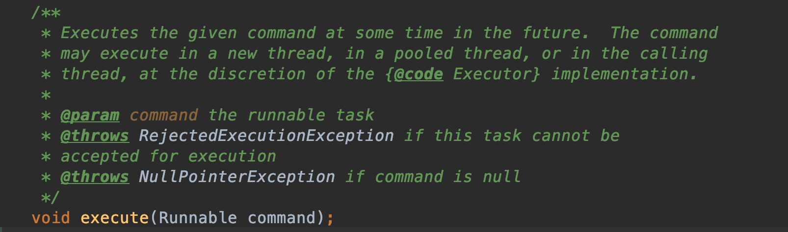
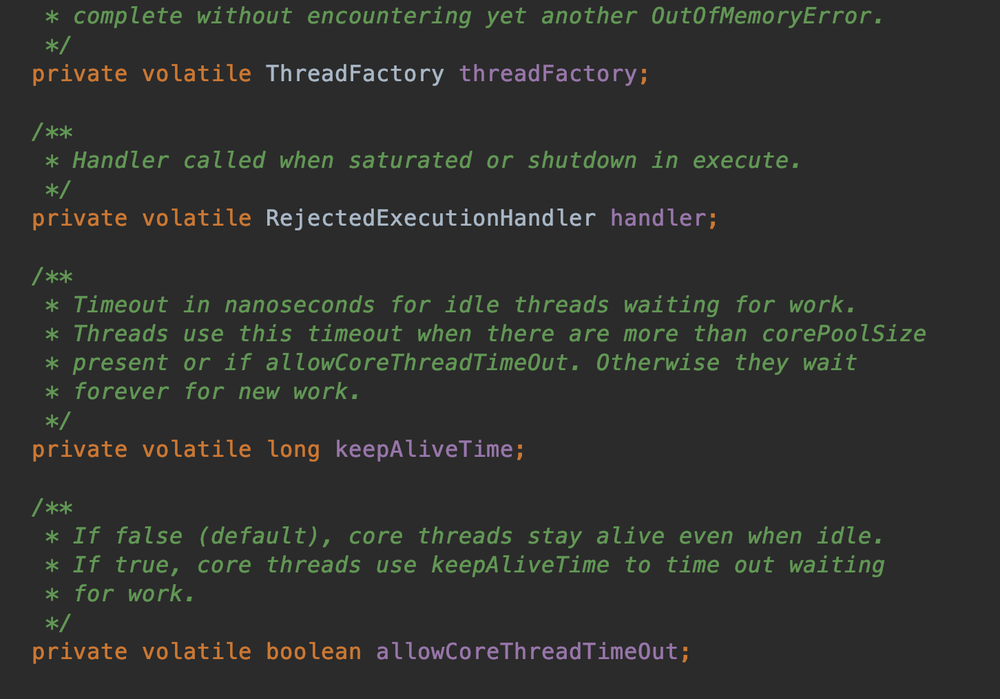
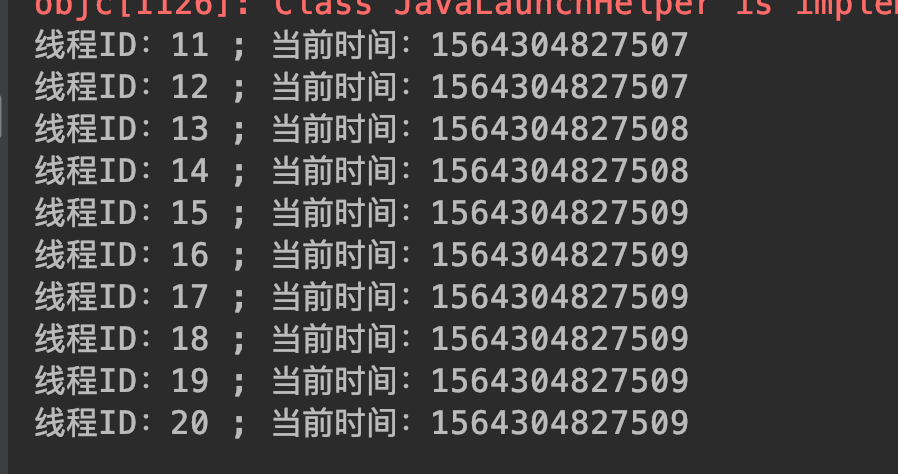
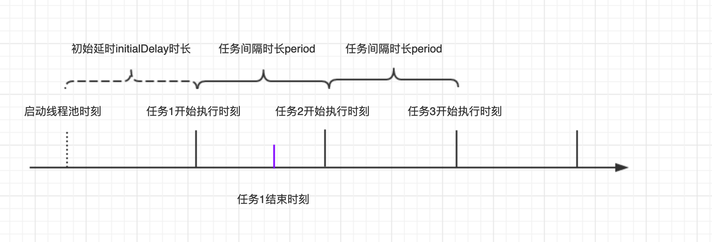
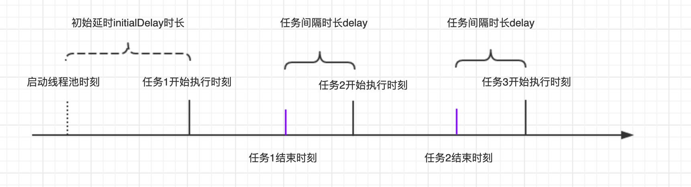
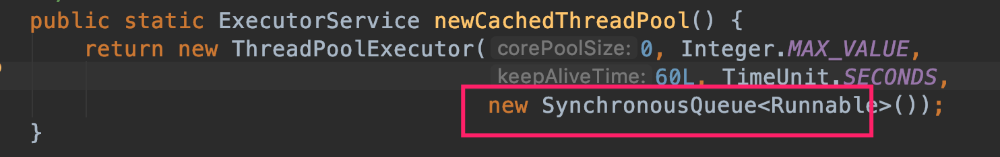
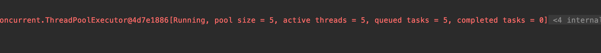
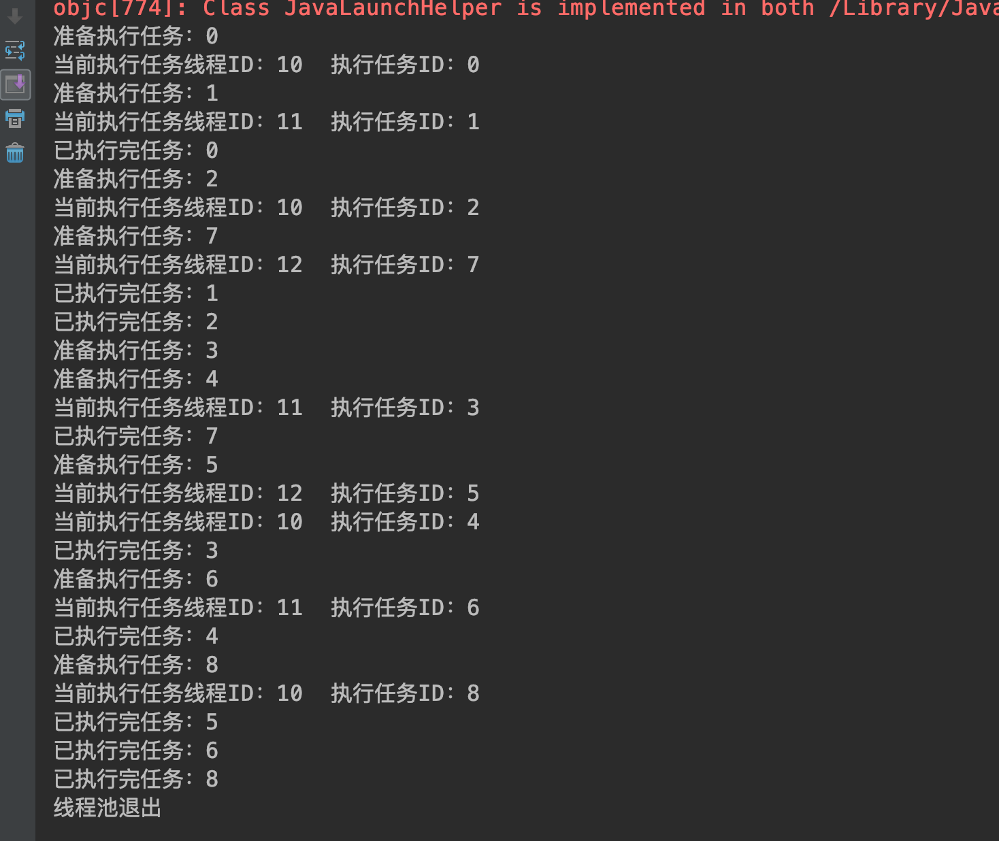
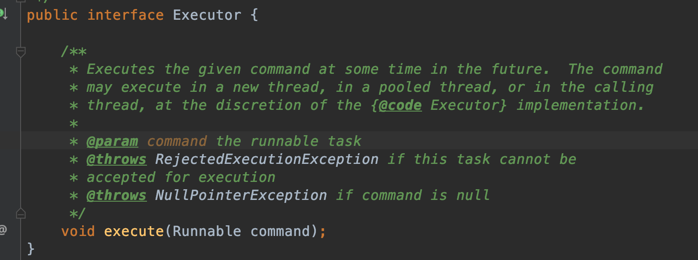

# <span id="head49">线程池</span>

### 1 <span id="head50">线程池概述</span>

在现实世界中，很多事情都是很多人一起协作完成的，例如我们每天上班整个项目组在做一个软件项目，每个人承担着不同的任务。线程之间同样也存在着这样的场景，例如要完成很多任务的时候可以开启多个线程去完成相应的功能，提高任务执行效率、缩短执行时间，这也恰恰是我们多线程的存在的核心价值。

当我们需要多线程处理程序任务时，我们可以通过基本的new Thread方法创建多个线程，然后启动运行分配任务处理，处理完成关闭线程。但是这样的方式存在着一个问题，线程的创建与销毁需要系统调度处理，另外线程本身也是需要占用一定的系统资源的，在实际环境中我们可能需要频繁且大量的生成线程，那么这种方式就会严重消耗系统资源，拖垮系统，所以我们就需要一种方式去解决这种问题。

好比如一个商店需要服务员服务顾客，不能来一个顾客就雇佣一个服务员，然后顾客走了辞退，而是雇佣一定数量的服务员，有顾客来了对其帮助，如果顾客很多的话，那么有些顾客就需要进行一定的等待；如果没有顾客的话那么服务员就可以休息休息。

这其实就是要用池化技术。同样的道理我们在做其他场景编程时同样遇到，例如数据库连接池，为了避免频繁创建关闭数据库连接而创建一些固定的连接放到一个连接池中，这样当有连接需要时从中选取一个，没用的话池中连接保持存活，处于空闲状态。

线程处理同样用池化技术来解决这种多线程需求。

### 2 <span id="head51">Java线程池结构</span>

我们先来看下Java线程池相关组件基本结构关系：


线程池通过Executor及其相关实现类定义，Executor作为顶层接口定义了线程池基本行为，即执行分配的任务：接收Runnable接口实现对象，完成其中指定的任务指令。



ExecutorService定义了一些线程池基本的行为方法，例如关闭线程池、提交任务等。


核心组件是ThreadPoolExecutor，由该组件创建实际的线程池，例如定义线程池大小、线程创建工厂、任务拒绝策略等。




Executors是一个线程工具类，它可以创建不同类型的线程池，但是本质上其实都是通过ThreadPoolExecutor实现的。

### 3 <span id="head52">线程池种类</span>

通过Exexutors我们可以直接定义几种不同类型的线程池：

#### 3.1 <span id="head53">固定大小的线程池</span>

`public static ExecutorService newFixedThreadPool(int nThreads)`

创建固定大小的线程池，线程池中的线程数量固定不变，当有新任务来的时候，若有空闲线程，则执行；若没有空闲线程，则任务放到线程池等待队列中，等有空闲线程时候再处理。

代码示例：

```java
package com.skylaker.pool;

import java.util.concurrent.ExecutorService;
import java.util.concurrent.Executors;

/**
 * 固定大小的线程池
 *
 * @author skylaker2019@163.com
 * @version V1.0 2019/7/28 4:11 PM
 */
public class FixedThreadPool {
    public static void main(String[] args){
        // 创建一个大小为5的线程池
        ExecutorService executorService = Executors.newFixedThreadPool(5);
        // 定义线程任务
        Thread task = new Thread(new MyThread());
        // 提交任务到线程池
        for(int i = 0; i < 10; i++){
            executorService.submit(task);
        }
        // 关闭线程池
        executorService.shutdown();
    }

    static class MyThread implements Runnable {
        public void run() {
            System.out.println("线程ID：" + Thread.currentThread().getId()
                    + " ; 当前时间：" + System.currentTimeMillis());

            try {
                Thread.sleep(1000);
            } catch (InterruptedException e) {
                e.printStackTrace();
            }
        }
    }
}
```

运行结果：


这个我们定义了一个数量为5的线程池，即池中有5个线程，我们发送了10个任务，每个任务执行完都会休眠一秒，如果我们将10个任务给一个线程执行，那么就是顺序执行，最起码要10秒钟，但是发送给线程池只需要两秒钟左右。根据打印的线程ID，我们可以看到执行任务的确实有5个线程，他们几乎同时执行分配的任务，然后过了一秒钟处理剩下的等待的5个任务。

#### 3.2 <span id="head54">创建单个数量线程的线程池</span>

`public static ExecutorService newSingleThreadExecutor()`

创建一个线程数量只有1的线程池，也就是线程池中只有一个线程在进行任务处理，如果有多余任务则进入到等待队列进行等待，等线程处理完任务，再依次按照任务先后顺序执行。这种线程池执行任务就是单个线程串行执行，所以效率低。

```java
package com.skylaker.pool;

import java.util.concurrent.ExecutorService;
import java.util.concurrent.Executors;

/**
 * 单个大小的线程池
 *
 * @author skylaker2019@163.com
 * @version V1.0 2019/7/28 4:11 PM
 */
public class SingleThreadPool {
    public static void main(String[] args){
        // 创建一个大小为1的固定线程池
        ExecutorService executorService = Executors.newSingleThreadExecutor();
        // 定义线程任务
        Thread task = new Thread(new MyThread());
        // 提交任务到线程池
        for(int i = 0; i < 10; i++){
            executorService.submit(task);
        }
        // 关闭线程池
        executorService.shutdown();
    }

    static class MyThread implements Runnable {
        public void run() {
            System.out.println("线程ID：" + Thread.currentThread().getId()
                    + " ; 当前时间：" + System.currentTimeMillis());

            try {
                Thread.sleep(1000);
            } catch (InterruptedException e) {
                e.printStackTrace();
            }
        }
    }
}
```

执行结果：


可以看到只有一个线程在执行任务，而且按照任务的特点，每隔一秒执行一次。

#### 3.3 <span id="head55">动态大小的线程池</span>

`public static ExecutorService newCachedThreadPool()`

这种线程池的大小是随着任务量多少而动态调整的，线程数量不固定。当有新任务则优先复用现有空闲线程，若没有则创建新的线程处理，处理完成线程返回线程池进行复用。

```java
package com.skylaker.pool;

import java.util.concurrent.ExecutorService;
import java.util.concurrent.Executors;

/**
 * 动态大小的线程池
 *
 * @author skylaker2019@163.com
 * @version V1.0 2019/7/28 4:11 PM
 */
public class CachedThreadPool {
    public static void main(String[] args){
        // 创建一个大小可动态调整的线程池
        ExecutorService executorService = Executors.newCachedThreadPool();
        // 定义线程任务
        Thread task = new Thread(new MyThread());
        // 提交任务到线程池
        for(int i = 0; i < 10; i++){
            executorService.submit(task);
        }
        // 关闭线程池
        executorService.shutdown();
    }

    static class MyThread implements Runnable {
        public void run() {
            System.out.println("线程ID：" + Thread.currentThread().getId()
                    + " ; 当前时间：" + System.currentTimeMillis());

            try {
                Thread.sleep(1000);
            } catch (InterruptedException e) {
                e.printStackTrace();
            }
        }
    }
}
```

执行结果：



这里我们可以看到我们同时发送了10个任务，线程池就创建了10个线程进行处理，因为我们的任务是同时发送给线程池执行的，线程池在收到任务后发现没有空闲线程处理则创建新线程进行处理。如果我们的任务前后存在间隔呢？

```java
public static void main(String[] args) throws InterruptedException {
        // 创建一个大小可动态调整的线程池
        ExecutorService executorService = Executors.newCachedThreadPool();
        // 定义线程任务
        Thread task = new Thread(new MyThread());
        // 提交任务到线程池
        for(int i = 0; i < 10; i++){
            executorService.submit(task);
            // 每隔两秒提交一个任务
            Thread.sleep(2000);
        }
        // 关闭线程池
        executorService.shutdown();
    }
```


这里我们依然还是提交10个任务，不过每个任务之间隔两秒发送给线程池，因为一个任务执行只需要差不多1秒左右，所以再下一个任务过来的时候上一个任务已经执行完成了，之前的线程也就处于空闲模式，等下一个任务过来的时候就可以复用这个线程了。

但是我们思考一个问题，如果我们确实是同时发送很多任务呢？假设我们发送100个、1000个甚至更多呢？那么这种动态的线程池线程数量其实是会无限增长的，其后果会导致系统资源消耗，具有危险性。

#### 3.4 <span id="head56">周期性、定时性执行任务的线程池</span>

`public static ScheduledExecutorService newSingleThreadScheduledExecutor()`

创建一个可以在指定延时时间执行，或者间断执行——每隔多长时间执行一次的线程池。

示例：创建一个指定延时时间后执行的线程池

```java
package com.skylaker.pool;

import java.util.concurrent.Executors;
import java.util.concurrent.ScheduledExecutorService;
import java.util.concurrent.TimeUnit;

/**
 * 单个大小、定时性的线程池
 *
 * @author skylaker2019@163.com
 * @version V1.0 2019/7/28 4:11 PM
 */
public class SingleScheduledThreadPool {
    public static void main(String[] args){
        // 创建一个大小为1、可周期性或某个延时过后执行的的线程池
        ScheduledExecutorService executorService = Executors.newSingleThreadScheduledExecutor();
        // 定义线程任务
        Thread task = new Thread(new MyThread());
        // 提交任务到线程池
        System.out.println("提交任务时间：" + System.currentTimeMillis());
        executorService.schedule(task, 5, TimeUnit.SECONDS);
    }

    static class MyThread implements Runnable {
        public void run() {
            System.out.println("线程ID：" + Thread.currentThread().getId()
                    + " ; 当前时间：" + System.currentTimeMillis());

            try {
                Thread.sleep(1000);
            } catch (InterruptedException e) {
                e.printStackTrace();
            }
        }
    }
}
```


在这里我们创建了一个延时5秒执行的线程池，可以通过执行结果看到我们在提交了任务后5秒才执行了任务。

该定时、周期性线程池可以创建多种形式的定时策略，主要通过返回的对象ScheduledExecutorService实现的，主要方式有：

a.

```java
public ScheduledFuture<?> schedule(Runnable command,
                                       long delay, TimeUnit unit)
```

指定延时时间之后执行任务。

b.


```java
public ScheduledFuture<?> scheduleAtFixedRate(Runnable command,
                                                  long initialDelay,
                                                  long period,
                                                  TimeUnit unit);
```

scheduleAtFixedRate以固定频率进行任务调度，其以每一个任务开始时间为调度标准，即上一个任务开始时间之后经过period长时间进行下一个任务。



代码示例：

```java
package com.skylaker.pool;

import java.util.concurrent.Executors;
import java.util.concurrent.ScheduledExecutorService;
import java.util.concurrent.TimeUnit;

/**
 * 单个大小、定时性的线程池
 *
 * @author skylaker2019@163.com
 * @version V1.0 2019/7/28 4:11 PM
 */
public class SingleScheduledThreadPool {
    public static void main(String[] args){
        // 创建一个大小为1、可周期性或某个延时过后执行的的线程池
        ScheduledExecutorService executorService = Executors.newSingleThreadScheduledExecutor();
        // 定义线程任务
        Thread task = new Thread(new MyThread());
        // 提交任务到线程池
        System.out.println("提交任务时间：" + System.currentTimeMillis());
        executorService.scheduleAtFixedRate(task, 1, 2, TimeUnit.SECONDS);
    }

    static class MyThread implements Runnable {
        public void run() {
            System.out.println("线程ID：" + Thread.currentThread().getId()
                    + " ; 当前时间：" + System.currentTimeMillis());

            try {
                Thread.sleep(1000);
            } catch (InterruptedException e) {
                e.printStackTrace();
            }
        }
    }
}
```

执行结果：


可以看到线程在提交任务后指定延时1秒后执行任务调度，然后每两秒执行一次任务，因为设置的间隔时间为2秒。但是我们考虑一种情况，这里每个任务的执行耗时是短于任务调度周期的，所以下一个任务开始时候距离上一个任务开始时候正好2秒，但是如果任务执行耗时大于调度周期呢？我们稍微修改下任务执行耗时：

```java
public void run() {
            System.out.println("线程ID：" + Thread.currentThread().getId()
                    + " ; 当前时间：" + System.currentTimeMillis());

            try {
                Thread.sleep(3000);
            } catch (InterruptedException e) {
                e.printStackTrace();
            }
        }
```

执行结果：


发现现在的调度周期是任务执行的耗时，即如果任务执行耗时超过下一个任务应该执行的间隔耗时，那么下一个任务直接以上一个任务的结束时间作为开始时间，即上一个任务结束下一个任务继续。

c.

```java
public ScheduledFuture<?> scheduleWithFixedDelay(Runnable command,
                                                     long initialDelay,
                                                     long delay,
                                                     TimeUnit unit);
```

scheduleWithFixedDelay方法也是固定频率执行任务调度，但是和上一个scheduleAtFixedRate不同的是，它是以上一个任务结束时间作为调度标准，即上一个任务执行完了之后再经过delay长时间执行下一个任务。



```java
package com.skylaker.pool;

import java.util.concurrent.Executors;
import java.util.concurrent.ScheduledExecutorService;
import java.util.concurrent.TimeUnit;

/**
 * 单个大小、定时性的线程池
 *
 * @author skylaker2019@163.com
 * @version V1.0 2019/7/28 4:11 PM
 */
public class SingleScheduledThreadPool {
    public static void main(String[] args){
        // 创建一个大小为1、可周期性或某个延时过后执行的的线程池
        ScheduledExecutorService executorService = Executors.newSingleThreadScheduledExecutor();
        // 定义线程任务
        Thread task = new Thread(new MyThread());
        // 提交任务到线程池
        System.out.println("提交任务时间：" + System.currentTimeMillis());
        executorService.scheduleWithFixedDelay(task, 1, 2, TimeUnit.SECONDS);
    }

    static class MyThread implements Runnable {
        public void run() {
            System.out.println("线程ID：" + Thread.currentThread().getId()
                    + " ; 当前时间：" + System.currentTimeMillis());

            try {
                Thread.sleep(1000);
            } catch (InterruptedException e) {
                e.printStackTrace();
            }
        }
    }
}
```

执行结果：


可以看到任务执行周期3秒，因为单个任务耗时1秒，再加上下个任务等待耗时2秒。

### 4 <span id="head57">线程池内部实现</span>

上面我们创建了几种不同形式的线程池，其实如果通过查看源码，我们会发现这几种线程池只不过都是ThreadPoolExecutor的封装，通过设置不停参数，创建不同特点的线程池，例如单个数量线程池，其实就是设置线程数量为1——核心线程数、最大线程数都是1的线程池：


#### 4.1 <span id="head58">相关参数</span>

我们看下ThreadPoolExecutor具体构造：

```java
public ThreadPoolExecutor(int corePoolSize,
                              int maximumPoolSize,
                              long keepAliveTime,
                              TimeUnit unit,
                              BlockingQueue<Runnable> workQueue,
                              ThreadFactory threadFactory,
                              RejectedExecutionHandler handler)
```

* corePoolSize：指定线程池核心线程数量，一般情况下线程池需要维持该数量的线程，以使线程得以复用；

* maximumPoolSize：指定最大线程数量，有些情况下，如果任务数量很多，核心线程数量已经无法满足任务执行，并且等待队列也已经满了，就会额外创建线程，但是最大线程数量不能超过该参数最大值。

* keepAliveTime：空闲线程存活时间，即在核心线程数量之外多余创建的线程在执行完任务后，就  变成空闲状态，那么需要回收，该参数就是定义空闲时间多长之后回收；

* unit ：keepAliveTime的单位，可以设置时分秒等；

* workQueue：等待队列，任务数量超过核心线程调度，暂时无法执行，那么任务就需要放入等待队列中进行等待。这个好比去吃饭但是人满了，就需要坐外面等一等。

* threadFactory：线程工厂，用于创建线程池中线程；

* handler ：任务拒绝策略，当任务超出核心线程调度能力，会将任务放入等待队列，如果队列也已经满了，那么就临时创建新的线程执行任务，如果整体线程数量达到最大线程数量，那么就不能接收新的任务了，就需要拒绝任务，而拒绝任务有不同的策略，该参数即设置拒绝策略。

#### 4.2 <span id="head59">核心参数</span>

##### 4.2.1 <span id="head60">workQueue: 等待队列</span>

等待队列存放已经提交但是尚未被执行需要等待的任务，队列实现BlockingQueue接口，例如单线程线程池：


线程池等待队列一共有几种不同的类型，分别是：

###### 4.2.1.1 <span id="head61">SynchronousQueue 直接提交任务的队列</span>

动态大小的线程池用的就是这种队列，SynchronousQueue队列没有容量，即提交的任务不会真正保存在队列中，提交的任务直接发送给线程池执行，如果没有空闲线程，那么直接新建新的线程执行任务，如果总的线程数量达到设置的最大线程数量则执行拒绝策略。这个队列和我们表面上看到的cachedThreadPool特点符合，线程池中线程数量随着任务数急速增长，如果不设置最大线程数量，很容易资源消耗，但是设置的小了，又很容易执行拒绝策略，因为该队列没有容纳任务的能力。



###### 4.2.1.2 <span id="head62">ArrayBlockingQueue 有界任务队列</span>

从名字很容易看出是由数组实现的队列，数组我们可以直接指定容量，所以这里ArrayBlockingQueue我们也可以直接指定容量`public ArrayBlockingQueue(int capacity)`。当使用该队列时候，如果核心线程数量已满，则将任务放到该队列进行等待，如果队列也已经满了，那么将创建新的线程，但是总的线程数量不能大于最大线程数量值，如果大于最大线程数量设定值则进行拒绝策略。可见，使用该队列时候还是想努力维持线程池线程数量为核心线程数大小。

###### 4.2.1.3 <span id="head63">LinkedBlockingQueue 无界任务队列</span>

通过链表实现的任务队列，链表本身是不需要连续内存空间的，而且方便动态新增节点，所以可以无限扩增。使用该队列，如果核心线程数量已满，则将任务放到该队列进行等待，无限放入，并不会创建核心线程数量之外的线程处理任务，所以这个队列如果任务很多时候，容易消耗资源。单个数量线程池用的就是这种队列：


###### 4.2.1.4 <span id="head64">PriorityBlockingQueue 优先任务队列</span>

无界队列，可根据任务优先级安排任务执行。

##### 4.2.2 <span id="head65">拒绝策略</span>

如同我们去饭店吃放一样，店里人满了的话，我们可以在外面等待区进行等待，但是如果等待人实在太多了，店完全应付不过来，这个时候服务员可能就对等待的顾客说：不好意思小店人太多要不各位到其他家店体验体验？

同样我们线程池在执行任务的时候，如果任务太多，我们可以采取等待队列进行多余任务的缓存，但是等待等待队列在一定程度上是有一定负载极限的，例如有界等待队列，即使对于像LinkedBlockingQueue这样的无界队列，在实际使用过程中为了避免系统性能消耗一般都需要设置一定的极限容量。所以对于过多的任务，在达到系统负荷水平上时，即等待队列已满、线程池线程数量达到最大线程数量且无空闲，那么就会采取一定的拒绝策略，以拒绝多余的任务。

###### 4.2.2.1 <span id="head66">拒绝策略接口定义</span>

拒绝策略有几种，都是`RejectedExecutionHandler`接口的实现，该接口定义了线程池如何执行拒绝策略：`void rejectedExecution(Runnable r, ThreadPoolExecutor executor);`，一共两个参数，一个是当前新提交的任务，一个是当前线程池对象。

###### 4.2.2.2 <span id="head67">AbortPolicy 策略</span>

直接抛出异常的方式拒绝多余任务，同时系统不能正常工作

```java
public static void main(String[] args) {
        System.out.println("主线程ID：" + Thread.currentThread().getId());

        ExecutorService es = getMyThreadPool1();
        for(int i = 0; i < 20; i++){
            MyTask myTask = new MyTask(i);
            es.submit(myTask);
        }
    }
    
/**
     * 核心线程数量 2；
     * 最大线程数量：5；
     * 线程空闲等待时间：0s;
     * 等待队列：大小为5的链表队列；
     * 拒绝策略：直接拒绝
     */
    static ExecutorService getMyThreadPool1() {
        return new ThreadPoolExecutor(
                2,
                5,
                0L,
                TimeUnit.SECONDS,
                new LinkedBlockingQueue(5),
                new ThreadPoolExecutor.AbortPolicy());

    }
    
 static class MyTask implements Runnable {
        private int id;

        MyTask(int id){
            this.id = id;
        }

        public void run() {
            System.out.println("当前执行任务线程ID：" + Thread.currentThread().getId() + "  执行任务ID：" + id);

            try {
                Thread.sleep(2000);
            } catch (InterruptedException e) {
                e.printStackTrace();
            }
        }
    }
```

执行结果：


可以看到在超出线程池负荷能力后直接抛出异常，异常信息提示线程池拒绝任务，且显示当前线程池信息，例如线程池大小、活动线程、等待队列大小：



###### 4.2.2.3 <span id="head68">CallerRunsPolicy 调用者执行拒绝的任务</span>

例如当前主线程将任务提交给线程池执行，但是线程池拒绝了，那么这种拒绝模式的话会让主线程去执行拒绝的任务

```java
/**
     * 核心线程数量 2；
     * 最大线程数量：5；
     * 线程空闲等待时间：0s;
     * 等待队列：大小为5的链表队列；
     * 拒绝策略：调用者运行丢弃的任务
     */
    static ExecutorService getMyThreadPool2() {
        return new ThreadPoolExecutor(
                2,
                5,
                0L,
                TimeUnit.SECONDS,
                new LinkedBlockingQueue(5),
                new ThreadPoolExecutor.CallerRunsPolicy());

    }
```

执行结果：


可以看到我们主线程参与了任务的执行

###### 4.2.2.4 <span id="head69">DiscardOldestPolicy 删除最老的任务，然后执行当前新提交的任务</span>

对于这种策略，因为某些情况下对于队列中等待时间最长的任务（即队列头节点任务）来说，它阻塞的时间最长，那么可能已经没有执行的必要了，所以直接舍弃来执行最新的任务，当然这个最新的任务也不是能立刻执行的，其实是将新提交的任务放入队列中，直白点说就是老任务让个坑给新任务，这个我们可以从源码看下：


可以看到先判断线程池是否关闭，如果正常，则将等待队列的头节点移除，即丢弃等待时间最久的任务，然后向线程池提交新的任务

继承该策略看下实际执行过程：

```java
public static void main(String[] args) {
        System.out.println("主线程ID：" + Thread.currentThread().getId());

        ExecutorService es = getMyThreadPool3();
        for(int i = 0; i < 20; i++){
            MyTask myTask = new MyTask(i);
            es.execute(myTask);
        }
    }
    
 /**
     * 核心线程数量 2；
     * 最大线程数量：5；
     * 线程空闲等待时间：0s;
     * 等待队列：大小为5的链表队列；
     * 拒绝策略：丢弃队列中最旧的任务以执行当前新提交的任务
     */
    static ExecutorService getMyThreadPool3() {
        return new ThreadPoolExecutor(
                2,
                5,
                0L,
                TimeUnit.SECONDS,
                new LinkedBlockingQueue(5),
                new ThreadPoolExecutor.DiscardOldestPolicy(){
                    @Override
                    public void rejectedExecution(Runnable r, ThreadPoolExecutor e) {
                        BlockingQueue queue = e.getQueue();
                        StringBuffer buffer = new StringBuffer(10);
                        for(Object task : queue){
                            buffer.append(((MyTask)task).getId()).append(",");
                        }

                        System.out.println("将要执行的任务ID：" + ((MyTask)r).getId() + "；当前队列：" + buffer.toString() +
                                "；将被丢弃的任务ID：" + ((MyTask)e.getQueue().peek()).getId());
                        super.rejectedExecution(r, e);
                    }
                }
        );
    }
    

    static class MyTask implements Runnable {
        private int id;

        MyTask(int id){
            this.id = id;
        }

        public int getId(){
            return id;
        }

        public void run() {
            System.out.println("当前执行任务线程ID：" + Thread.currentThread().getId() + "  执行任务ID：" + id);

            try {
                Thread.sleep(2000);
            } catch (InterruptedException e) {
                e.printStackTrace();
            }
        }
    }
```

打印结果：


在这里我们通过重写DiscardOldestPolicy拒绝策略，打印在拒绝的时候相关队列信息，观察该策略的方式，可以看到：一开始发送两个任务到线程池，核心线程数量设置 的2，所以有两个线程在执行任务，这个时候新来的任务2、3、4、5、6被放入了等待队列，这个时候又有新的任务过来，因为设置的最大线程数量为5，所以可以创建新的线程来执行任务7、8、9；这个时候又有新任务10过来，但是线程池已经达到负荷了，这个时候根据拒绝策略就要把等到队列中的最老任务清除掉，即队列头部的任务2，所以可以看到等待队列变成了3、4、5、6、10，后面11、12等任务来的时候同样执行相同的操作；直到没有新的任务过来，即任务19发送过后，等待对了中缓存的任务为15、16、17、18、19，这个时候线程空闲开始处理等待队列中的任务。

注意这里我们提交任务的方式是execute，而不是submit，两者区别后面学了再说，哈哈~~~ 反正这里用submit执行会报错，因为submit方式提交的FutureTask无法转为我们定义的MyTask，而execute直接提交我们的MyTask，所以可以方便转换获取设置的任务ID信息。

这里我们看下线程空闲后优先从队列取任务，我们设置任务执行时间很少，来观察现象：

```java
static class MyTask implements Runnable {
        private int id;

        MyTask(int id){
            this.id = id;
        }

        public int getId(){
            return id;
        }

        public void run() {
            System.out.println("当前执行任务线程ID：" + Thread.currentThread().getId() + "  执行任务ID：" + id);

            try {
                Thread.sleep(1);
            } catch (InterruptedException e) {
                e.printStackTrace();
            }
        }
    }
```

打印结果：


同样任务0、1发送到线程池执行，然后2、3、4、5、6进入等待队列，再然后任务7、8、9启动新线程执行，我们观察到“将被丢弃的任务ID：2”，但是上面的显示信息是线程执行了任务2（这里忽略前后打印顺序，因为线程间打印也是竞态抢占资源的，和实际执行顺序可能不同），这是因为我们要进行拒绝策略的时候，正在遍历等待队列，但是因为单个任务执行很快，所以已经空闲的线程又立即从等待队列中获取队列首的任务进行执行，也就是任务2，其实从这里就看出线程优先从队列中取任务，因为没有去优先执行新来的任务10。可能会有一个疑问，任务5为啥没任何输出，这个我们这里用打印的方式去监测线程执行，其实是有延时的，本来队列是任务2、3、4、5、6，这个时候线程又拿走了2、3、4任务执行，任务5要被舍弃，正准备遍历队列要打印出来“将被丢弃的任务ID：5”，但是这个时候新来的任务唰唰来了，抢占了队列，这个时候遍历队列就是新的任务队列6、10、11、12、13了。

###### 4.2.2.5 <span id="head70">DiscardPolicy 静默拒绝</span>

从源代码可以看出这中策略拒绝其实不做任何事情，只是默默的将任务拒绝


###### 4.2.2.6 <span id="head71">自定义拒绝策略</span>

我们同样可以实现 `RejectedExecutionHandler` 接口实现自己的拒绝策略

```java
 /**
     * 核心线程数量 2；
     * 最大线程数量：5；
     * 线程空闲等待时间：0s;
     * 等待队列：大小为5的链表队列；
     * 拒绝策略：自定义拒绝策略，打印拒绝的任务信息
     */
    static ExecutorService getMyThreadPool5() {
        return new ThreadPoolExecutor(
                2,
                5,
                0L,
                TimeUnit.SECONDS,
                new LinkedBlockingQueue(5),
                new RejectedExecutionHandler() {
                    public void rejectedExecution(Runnable r, ThreadPoolExecutor executor) {
                        System.out.println("被拒绝的任务：" + r.toString());
                    }
                }
        );
    }
```

执行结果：


可以看到10个任务被执行，而10个任务被拒绝，因为线程池最大负载能力就是10 （最大线程数量 5 + 等待队列大小 5）

##### 4.2.3 <span id="head72">线程创建工厂</span>

###### 4.2.3.1 <span id="head73">线程工厂默认实现</span>

我们需要线程池执行任务的时候直接把Runnable接口定义的任务提交给线程池就行，在之前我们没用线程池的时候要运行任务需要自己启动线程去运行我们的任务，那么线程池中的线程哪来的呢？其实肯定也是创建来的，线程池内部通过ThreadFactory线程工厂来创建线程池，。在上一节中我们没有显式的指定ThreadFactory参数，其实线程池内容定义了其实例，我们可以看下：


可以看到调用了其它重载构造器，只不过加入默认线程工厂的实现：Executors.defaultThreadFactory()，通过线程工具类实现的默认ThreadFactory，我们进去看下具体实现：


继续跟踪：


在这里我们可以默认线程池定义线程工厂及如何创建线程逻辑：定义了线程池数量、线程组、线程数量、线程名称前缀等变量；在构造器中获取线程组（先获取系统级的SecurityManager对应的线程组，如果没有则用当前创建线程池对象所在线程的线程组，例如如果我们在主线程中定义了线程池，那么这里就会用主线程的线程组）；定义线程名称前缀 ”pool-" +线程池数量 + “-thread-“；然后在新建线程的时候，通过new Thread方法创建线程，并设置线程为非守护线程（意味着线程池在执行完任务后线程池不会退出），设置线程优先级为正常的优先级。

对于刚才提到的线程组问题，我们可以测试下：

```java
public static void main(String[] args) {
        MyTask task = new MyTask();
        System.out.println("主线程组：" + Thread.currentThread().getThreadGroup().getName());

        ExecutorService es = getThreadPool2();
        for(int i = 0; i < 10; i++){
            es.submit(task);
        }
    }
    
static ExecutorService getThreadPool2(){
        return new ThreadPoolExecutor(
                // 核心大小：1 ；
                1,
                // 最大大小 2；
                2,
                // 空闲时间：0s
                0, TimeUnit.SECONDS,
                // 有界队列
                new ArrayBlockingQueue<Runnable>(2),
                // 静默拒绝策略
                new ThreadPoolExecutor.DiscardPolicy()
        );
    }

    static class MyTask implements Runnable {
        public void run() {
            System.out.println("当前执行任务线程ID：" + Thread.currentThread().getId());
            System.out.println("当前执行任务线程组：" + Thread.currentThread().getThreadGroup().getName());

            try {
                Thread.sleep(2000);
            } catch (InterruptedException e) {
                e.printStackTrace();
            }
        }
    }
```

执行结果：


可以看到打印出的线程池中的线程所在线程组和当前主线程所在线程组是同一个：main

###### 4.2.3.2 <span id="head74">自定义线程工厂</span>

```java
static ExecutorService getThreadPool1(){
        return new ThreadPoolExecutor(
                // 核心大小：1 ；
                1,
                // 最大大小 2；
                2,
                // 空闲时间：0s
                0, TimeUnit.SECONDS,
                // 有界队列
                new ArrayBlockingQueue<Runnable>(2),
                // 自定义线程创建工厂
                new ThreadFactory() {
                    public Thread newThread(Runnable r) {
                        Thread thread = new Thread(r);
                        System.out.println("创建线程对象：" + thread);
                        return thread;
                    }
                },
                // 静默拒绝策略
                new ThreadPoolExecutor.DiscardPolicy()
        );
    }
```

执行结果：


可以看到线程池执行任务时按照设置打印出了线程对象信息，同时发现线程池线程组也是main，这是因为我们定义的线程池就是在主线程中定义的啊，所以默认和主线程一致了。

###### 4.2.3.3 <span id="head75">线程执行任务跟踪</span>

我们在创建线程池的时候如果不指定线程创建工厂，即线程创建由线程池自身负责，而创建的线程在执行任务的时候我们并不知道线程本身执行任务的时机（当然可以从任务角度捕获），如果想知道线程自身在执行任务前后相关内容呢？线程池提供了相应的触发方法供我们调用（包括线程池关闭事件）：

`线程执行之前调用： protected void beforeExecute(Thread t, Runnable r)`

`线程执行之后调用： protected void afterExecute(Runnable r, Throwable t)`

`线程池关闭时调用： protected void terminated()`

从源代码看线程池自身在相关方法里面并未做任何事情：


我们直接重写相关方法：

```java
package com.skylaker.threadpool.worker;

import java.util.concurrent.*;

/**
 * 线程池执行线程状态监控
 * @author skylaker2019@163.com
 * @version V1.0 2019/8/3 9:02 AM
 */
public class ThreadExecute {
    public static void main(String[] args) {
        ExecutorService es = new ThreadPoolExecutor(
                2,
                3,
                0, TimeUnit.SECONDS,
                new ArrayBlockingQueue(5),
                Executors.defaultThreadFactory(),
                new ThreadPoolExecutor.DiscardPolicy()
        ){
            // 线程执行之前调用
            @Override
            protected void beforeExecute(Thread t, Runnable r) {
                System.out.println("准备执行任务：" + ((MyTask)r).getId());
            }

            // 线程执行之后调用
            @Override
            protected void afterExecute(Runnable r, Throwable t) {
                System.out.println("已执行完任务：" + ((MyTask)r).getId());
            }

            // 线程池关闭时调用
            @Override
            protected void terminated() {
                System.out.println("线程池退出");
            }
        };

        for(int i = 0; i < 10; i++){
            MyTask task = new MyTask(i);
//            es.submit(task);
            es.execute(task);
        }

        es.shutdown();
    }

    static class MyTask implements Runnable {
        private int id;

        MyTask(int id){
            this.id = id;
        }

        public int getId(){
            return id;
        }

        public void run() {
            System.out.println("当前执行任务线程ID：" + Thread.currentThread().getId() + "  执行任务ID：" + id);

            try {
                Thread.sleep(1);
            } catch (InterruptedException e) {
                e.printStackTrace();
            }
        }
    }
}

```

执行结果：



从打印结果来看每次线程执行任务前后都对输出相应的动作信息，同时线程池在关闭后也会回调相关方法。

这里我们仍然采用execute的方式提交，如果采用submit提交会报错：


这是为什么呢？我们跟踪下源代码，如果采用submit的方法：


其实调用的是ExecuteService定义的submit方法，这是一种有返回值形式的提交，但是这里是接口定义，我们继续往下看实现定义，但是有几种实现：


根据最开始线程继承结构，我们的ThreadPoolExecutor是实现了AbstractExecutorService接口的，所以我们直接到AbstractExecutorService里面看下：


这里有调用了newTaskFor方法：


可以看到用FutureTask封装生成了新的一个对象，而返回的FutureTask对象正好发送给了线程池执行，也就是说用submit方法提交的任务线程池其实执行FutureTask方法的，我们在线程触发事件beforeExecute中用了强转((MyTask)r).getId()，而我们的MyTask和FutureTask除了都实现了Runnable接口之外并无任何继承关系，那么也就无法强转，所以就出现强转异常了。

那么为什么execute方法就可以了呢？我们点击进入execute方法，直接就是顶层接口Executor的execute方法：



我们再一路跟踪到ThreadPoolExecutor执行任务的地方：


可以看到线程在执行任务的前后确实调用了beforeExecute和afterExecute方法，同时执行的任务还是Runnable实例，即未被封装或转换的MyTask对象，那么我们在触发方法里面使用强转自然也就没有任何问题了。