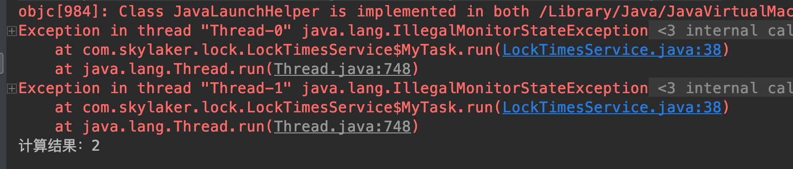
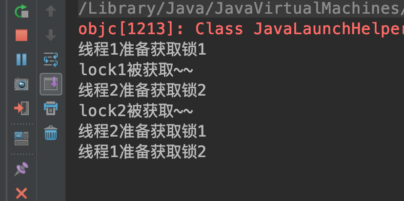
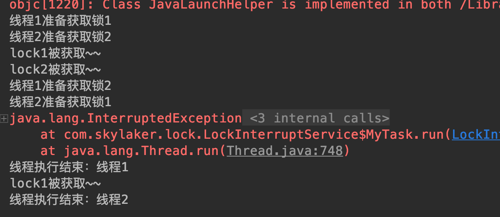
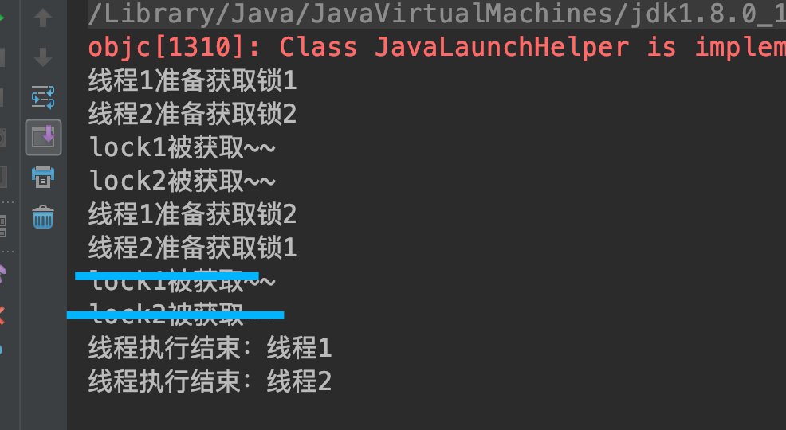
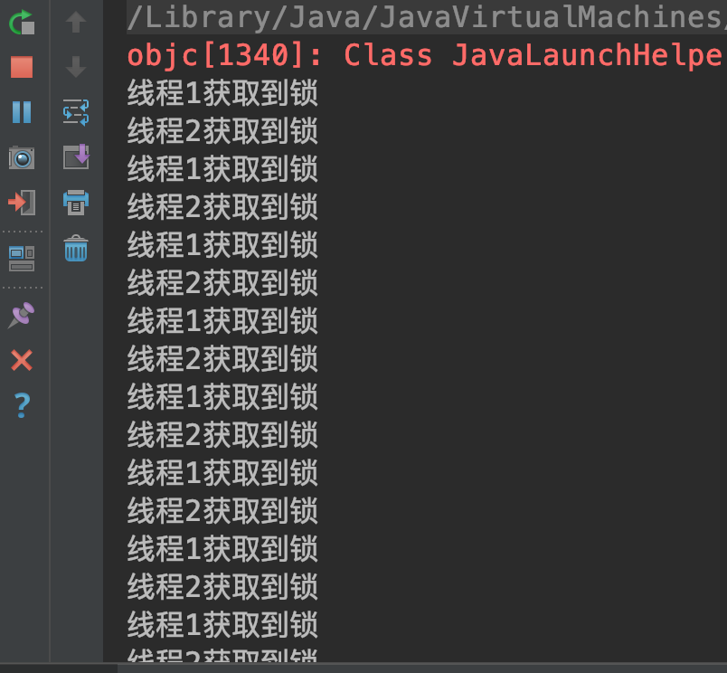

##### 6.3 可冲入锁 Lock
###### 6.3.1 基本概念

* 重入锁：ReentrantLock

* 可重入：同一个线程可以多次获取同一把锁。如果不可重入，那么同一个线程在获取到锁后再次尝试获取该锁时候因为锁已经被占用将阻塞一直等待导致死锁。

* 特点：手动控制加锁、释放锁，比较灵活；可响应中断；可设置公平锁；

###### 6.3.2 基本方法

* 加锁、解锁

```
package com.skylaker.concurrent.lock;

import java.util.concurrent.locks.ReentrantLock;

/**
 * 可重入锁 Lock
 * @author skylaker2019@163.com
 * @version V1.0 2019/8/13 8:09 PM
 */
public class LockService {
    // 定义锁
    private static ReentrantLock lock = new ReentrantLock();
    private static int i = 0;

    public static void main(String[] args) throws InterruptedException {
        MyTask task = new MyTask();
        Thread thread1 = new Thread(task);
        Thread thread2 = new Thread(task);
        thread1.start();
        thread2.start();
        thread1.join();
        thread2.join();

        System.out.println("计算结果：" + i);
    }

    static class MyTask implements Runnable {
        public void run() {
            for(int j = 0; j < 10000; j++){
                // 加锁
                lock.lock();
                try{
                    i++;
                } finally {
                    // 释放锁
                    lock.unlock();
                }

                // 线程谦让，为了测试CPU抢占调度导致共享变量计算冲突
                Thread.yield();
            }
        }
    }
}

```

执行结果：


结果与期望一致，ReentrantLock需要手动显式的加锁：lock.lock，以及退出临界区时释放锁资源：lock.unlock，如果不释放锁那么其他线程就会一直获取不到锁造成饥饿；这里释放锁在try finally块中就是为了避免因为代码非正常退出导致没有释放锁。

* 多次获取锁

```
// 加锁
lock.lock();
lock.lock();
try{
    i++;
} finally {
    // 释放锁
    lock.unlock();
    lock.unlock();
}
```

可重入，加锁与加锁次数应该保持一致，如果多释放（例如加锁一次、释放锁两次）则报错`java.lang.IllegalMonitorStateException`：



可以看到程序提前终止；如果少释放，即加锁次数大于释放锁次数，相当于线程一直持有锁，其它线程则等待阻塞。

* 中断响应

等待锁过程中可以响应中断取消对锁的申请等待（synchronized是要么获取到锁执行要么一直等待锁），可以有效避免死锁

先来看下不采用中断造成死锁的情况：

```
package com.skylaker.concurrent.lock;

import java.util.concurrent.locks.ReentrantLock;

/**
 * 可重入锁 Lock : 死锁
 * @author skylaker2019@163.com
 * @version V1.0 2019/8/13 8:09 PM
 */
public class LockInterruptService {
    // 锁1
    private static ReentrantLock lock1 = new ReentrantLock();
    // 锁2
    private static ReentrantLock lock2 = new ReentrantLock();

    public static void main(String[] args) throws InterruptedException {
        Thread thread1 = new Thread(new MyTask(1));
        Thread thread2 = new Thread(new MyTask(2));
        thread1.setName("线程1");
        thread2.setName("线程2");
        thread1.start();
        thread2.start();

        Thread.sleep(1000);
        thread1.interrupt();
    }

    static class MyTask implements Runnable {
        private int i ;

        MyTask(int i){
            this.i = i;
        }

        public void run() {
            try{
                if(1 == i){
                    // 先获取锁1
                    System.out.println(Thread.currentThread().getName() + "准备获取锁1");
                    lock1.lock();
                    if(lock1.isLocked()){
                        System.out.println("lock1被获取~~");
                    }

                    try {
                        Thread.sleep(500);
                    } catch (InterruptedException e) {
                        e.printStackTrace();
                    }

                    // 再获取锁2
                    System.out.println(Thread.currentThread().getName() + "准备获取锁2");
                    lock2.lock();
                    if(lock2.isLocked()){
                        System.out.println("lock2被获取~~");
                    }
                } else {
                    // 先获取锁2
                    System.out.println(Thread.currentThread().getName() + "准备获取锁2");
                    lock2.lock();
                    if(lock2.isLocked()){
                        System.out.println("lock2被获取~~");
                    }

                    try {
                        Thread.sleep(500);
                    } catch (InterruptedException e) {
                        e.printStackTrace();
                    }

                    // 再获取锁1
                    System.out.println(Thread.currentThread().getName() + "准备获取锁1");
                    lock1.lock();
                    if(lock1.isLocked()){
                        System.out.println("lock1被获取~~");
                    }
                }
            } catch (Exception e){
                e.printStackTrace();
            } finally {
                if(lock1.isHeldByCurrentThread()){
                    lock1.unlock();
                }
                if(lock2.isHeldByCurrentThread()){
                    lock2.unlock();
                }

                System.out.println("线程执行结束：" + Thread.currentThread().getName());
            }
        }
    }
}
```

结果：



线程1在获取锁1后准备获取锁2，线程2在获取锁2后准备获取锁1，但是因为双方互相持有锁都不释放就导致一直阻塞等待造成死锁。即使主线程中对线程1进行中断，但是默认的lock方法并不支持中断响应，所以需要采用支持中断响应的方法：`public void lockInterruptibly() throws InterruptedException`

```
public void run() {
            try{
                if(1 == i){
                    // 先获取锁1
                    System.out.println(Thread.currentThread().getName() + "准备获取锁1");
                    lock1.lockInterruptibly();
                    if(lock1.isLocked()){
                        System.out.println("lock1被获取~~");
                    }

                    try {
                        Thread.sleep(500);
                    } catch (InterruptedException e) {
                        e.printStackTrace();
                    }

                    // 再获取锁2
                    System.out.println(Thread.currentThread().getName() + "准备获取锁2");
                    lock2.lockInterruptibly();
                    if(lock2.isLocked()){
                        System.out.println("lock2被获取~~");
                    }
                } else {
                    // 先获取锁2
                    System.out.println(Thread.currentThread().getName() + "准备获取锁2");
                    lock2.lockInterruptibly();
                    if(lock2.isLocked()){
                        System.out.println("lock2被获取~~");
                    }

                    try {
                        Thread.sleep(500);
                    } catch (InterruptedException e) {
                        e.printStackTrace();
                    }

                    // 再获取锁1
                    System.out.println(Thread.currentThread().getName() + "准备获取锁1");
                    lock1.lockInterruptibly();
                    if(lock1.isLocked()){
                        System.out.println("lock1被获取~~");
                    }
                }
            } catch (Exception e){
                e.printStackTrace();
            } finally {
                if(lock1.isHeldByCurrentThread()){
                    lock1.unlock();
                }
                if(lock2.isHeldByCurrentThread()){
                    lock2.unlock();
                }

                System.out.println("线程执行结束：" + Thread.currentThread().getName());
            }
        }
```

执行结果：



同样在线程1、2死锁，但是支持请求锁等待中断，主线程中断线程1，线程1对锁2放弃等待、中止退出并释放了锁1，这个时候线程2就能正常获取到锁1了从而正常执行结束。

* 锁申请限时

除了中断锁请求还可以通过锁请求超时来解决死锁，

一定时间内尝试获取锁，如果达到指定时间没有获取到则取消锁申请，可以从方法定义看出在等待期间可以响应异常：`public boolean tryLock(long timeout, TimeUnit unit) throws InterruptedException`

尝试获取锁，获取成功返回true,获取失败返回false：`public boolean tryLock()`

例如解决死锁：

```
public void run() {
            try{
                if(1 == i){
                    // 先获取锁1
                    System.out.println(Thread.currentThread().getName() + "准备获取锁1");
                    // 在一定时间内尝试获取锁，如果获取不到则放弃
                    lock1.tryLock(5, TimeUnit.SECONDS);
                    if(lock1.isLocked()){
                        System.out.println("lock1被获取~~");
                    }

                    try {
                        Thread.sleep(500);
                    } catch (InterruptedException e) {
                        e.printStackTrace();
                    }

                    // 再获取锁2
                    System.out.println(Thread.currentThread().getName() + "准备获取锁2");
                    lock2.tryLock(5, TimeUnit.SECONDS);
                    if(lock2.isLocked()){
                        System.out.println("lock2被获取~~");
                    }
                } else {
                    // 先获取锁2
                    System.out.println(Thread.currentThread().getName() + "准备获取锁2");
                    lock2.tryLock(5, TimeUnit.SECONDS);
                    if(lock2.isLocked()){
                        System.out.println("lock2被获取~~");
                    }

                    try {
                        Thread.sleep(500);
                    } catch (InterruptedException e) {
                        e.printStackTrace();
                    }

                    // 再获取锁1
                    System.out.println(Thread.currentThread().getName() + "准备获取锁1");
                    lock1.tryLock(5, TimeUnit.SECONDS);
                    if(lock1.isLocked()){
                        System.out.println("lock1被获取~~");
                    }
                }
            } catch (Exception e){
                e.printStackTrace();
            } finally {
                if(lock1.isHeldByCurrentThread()){
                    lock1.unlock();
                }
                if(lock2.isHeldByCurrentThread()){
                    lock2.unlock();
                }

                System.out.println("线程执行结束：" + Thread.currentThread().getName());
            }
        }
```



这里最后打印的 "lock1被获取"、“lock2被获取”容易迷惑，我线程放弃获取锁了，怎么又获取锁了？其实是因为代码书写问题，它打印的是第一轮被申请的情况。实质上是两个线程在相互等待锁过程中放弃然后各自结束任务执行。

* 公平锁

设置是否公平锁：`public ReentrantLock(boolean fair)` true 公平；false 非公平

```
// 设置公平锁
    private static ReentrantLock lock = new ReentrantLock(true);

    public static void main(String[] args) throws InterruptedException {
        MyTask task = new MyTask();
        Thread thread1 = new Thread(task, "线程1");
        Thread thread2 = new Thread(task, "线程2");
        thread1.start();
        thread2.start();
    }

    static class MyTask implements Runnable {
        public void run() {
            while (true) {
                try{
                    lock.lock();
                    Thread.sleep(1000);
                    System.out.println(Thread.currentThread().getName() + "获取到锁");
                } catch (InterruptedException e) {
                    e.printStackTrace();
                } finally {
                    lock.unlock();
                }
            }
        }
    }
```




