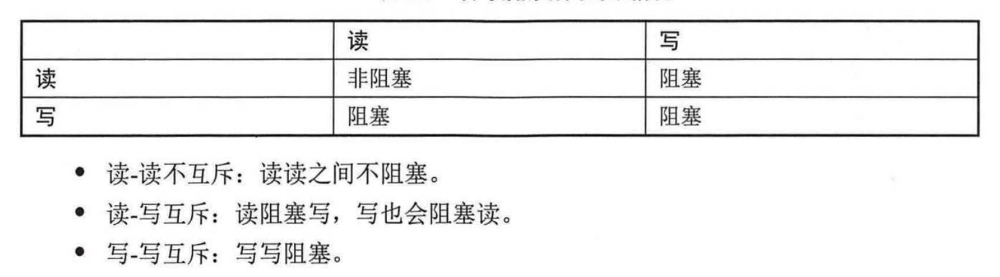
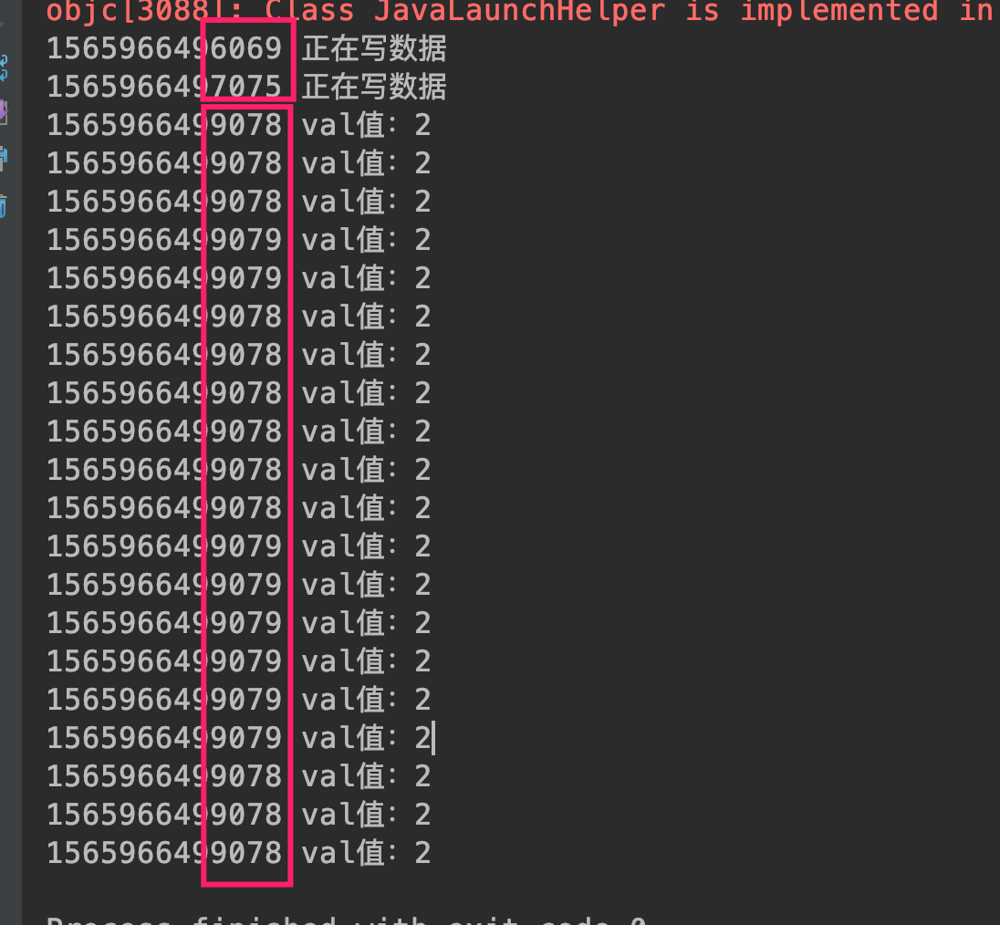
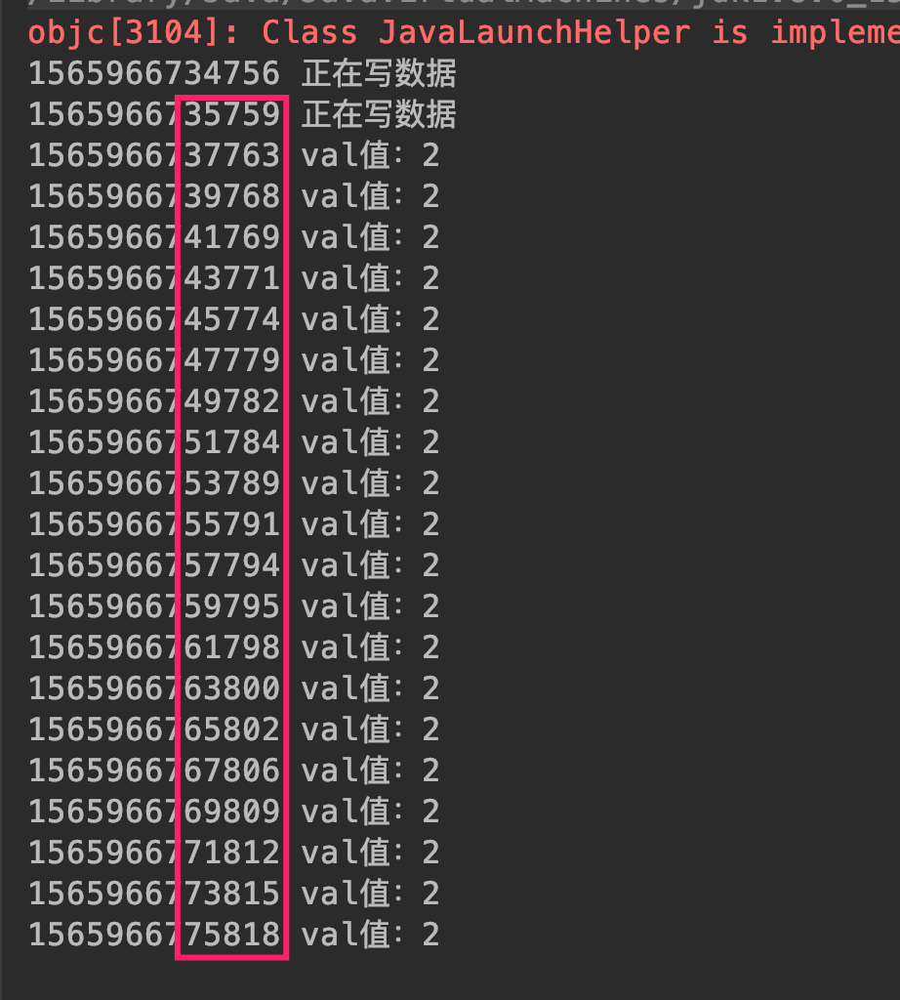

##### 6.6 读写锁 ReadWriteLock
###### 6.6.1 基本内容
多线程间进行互斥操作的本质原因在于对临界区的保护，避免多线程同时操作共享对象造成数据不安全问题，但是如果多线程根本不会修改共享数据的值即不造成数据安全问题，那么完全可以不用加锁。

读写锁实现读写分离，对不同场景加不同的锁，读场景用读锁，写场景采用写锁；具体互斥性：


总结起来就是涉及写线程操作的都要互斥阻塞。

###### 6.6.2 代码示例

```
package com.skylaker.concurrent.lock;

import com.sun.org.apache.regexp.internal.RE;

import java.util.concurrent.locks.Lock;
import java.util.concurrent.locks.ReentrantReadWriteLock;

/**
 * 读写锁
 * @author skylaker2019@163.com
 * @version V1.0 2019/8/16 10:14 PM
 */
public class ReadWriteLockService {
    private static int val = 0;

    // 读写锁对象
    private static ReentrantReadWriteLock readWriteLock = new ReentrantReadWriteLock();
    // 读锁
    private static Lock readLock = readWriteLock.readLock();
    // 写锁
    private static Lock writeLock = readWriteLock.writeLock();


    public static void main(String[] args) {
        ReadTask readTask = new ReadTask();
        WriteTask writeTask = new WriteTask();

        for(int i = 0; i < 2; i++){
            new Thread(writeTask).start();
        }

        for(int i = 0; i < 20; i++){
            new Thread(readTask).start();
        }
    }

    static class ReadTask implements Runnable {
        public void run() {
            try {
                readLock.lock();
                Thread.sleep(2000);
                System.out.println(System.currentTimeMillis() + " val值：" + val);
            } catch (InterruptedException e) {
                e.printStackTrace();
            } finally {
                readLock.unlock();
            }
        }
    }

    static class WriteTask implements Runnable {
        public void run() {
            try {
                writeLock.lock();
                Thread.sleep(1000);
                System.out.println(System.currentTimeMillis() + " 正在写数据");
                val++;
            } catch (InterruptedException e) {
                e.printStackTrace();
            } finally {
                writeLock.unlock();
            }
        }
    }
}
```



写线程在操作时其它写线程、读线程阻塞等待，但是读与读线程间没有阻塞，相当于并发执行。

我们直接用重入锁试下耗时：

```
public class Lock2Service {
    private static int val = 0;
    private static ReentrantLock lock = new ReentrantLock();

    public static void main(String[] args) {
        ReadTask readTask = new ReadTask();
        WriteTask writeTask = new WriteTask();

        for(int i = 0; i < 2; i++){
            new Thread(writeTask).start();
        }

        for(int i = 0; i < 20; i++){
            new Thread(readTask).start();
        }
    }

    static class ReadTask implements Runnable {
        public void run() {
            try {
                lock.lock();
                Thread.sleep(2000);
                System.out.println(System.currentTimeMillis() + " val值：" + val);
            } catch (InterruptedException e) {
                e.printStackTrace();
            } finally {
                lock.unlock();
            }
        }
    }

    static class WriteTask implements Runnable {
        public void run() {
            try {
                lock.lock();
                Thread.sleep(1000);
                System.out.println(System.currentTimeMillis() + " 正在写数据");
                val++;
            } catch (InterruptedException e) {
                e.printStackTrace();
            } finally {
                lock.unlock();
            }
        }
    }
}
```



可以看到读写线程间都是互斥等待。