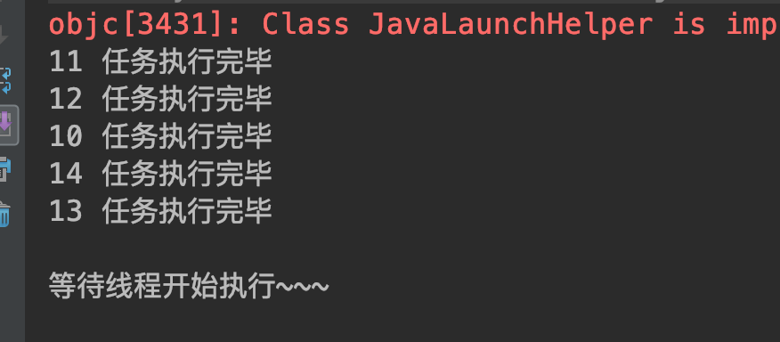

##### 6.7 倒计时器 CountDownLatch
###### 6.7.1 基本概念
多线程控制工具类，作用：可以让一个线程等待直到倒计时器计数结束，然后开始执行。

相当于一个倒计时钟，10、9、8、7 ... 到了0之后，在等待的线程就可以结束暂停继续运行了。

###### 6.7.2 基本方法

构造方法：指定计数个数
`public CountDownLatch(int count)`

等待计数结束，可响应中断：
`public void await() throws InterruptedException`

计数值减一：
`public void countDown()`

###### 6.7.3 代码示例

```
package com.skylaker.concurrent.latch;

import java.util.concurrent.CountDownLatch;
import java.util.concurrent.ExecutorService;
import java.util.concurrent.Executors;

/**
 * 倒计时器 CountDownLatch
 * @author skylaker2019@163.com
 * @version V1.0 2019/8/17 11:23 AM
 */
public class LatchService {
    static CountDownLatch countDownLatch = new CountDownLatch(5);

    public static void main(String[] args) {
        MyTask myTask = new MyTask();

        ExecutorService pool = Executors.newFixedThreadPool(5);
        for (int i = 0 ; i < 5; i++){
            pool.submit(myTask);
        }

        try {
            // 等待计时器计数结束
            countDownLatch.await();
            // 等待的线程开始执行（这里就是主线程）
            System.out.println("\n等待线程开始执行~~~");
        } catch (InterruptedException e) {
            e.printStackTrace();
        }

        pool.shutdown();
    }

    static class MyTask implements Runnable {
        public void run() {
            try {
                Thread.sleep(2000);
                System.out.println(Thread.currentThread().getId() + " 任务执行完毕");

                // 减少一个计数器值
                countDownLatch.countDown();
            } catch (InterruptedException e) {
                e.printStackTrace();
            }
        }
    }
}
```



我们设置了一个计数为5的计时器，启动5个线程，每个线程执行后计数减1，那么5个线程执行完毕计时器就计时结束，而一直在等待的线程就可以继续运行了。