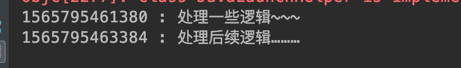
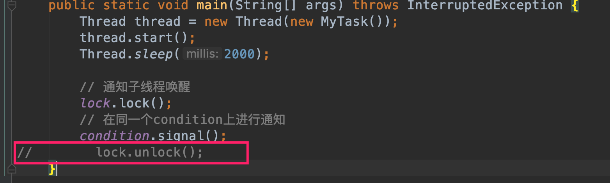
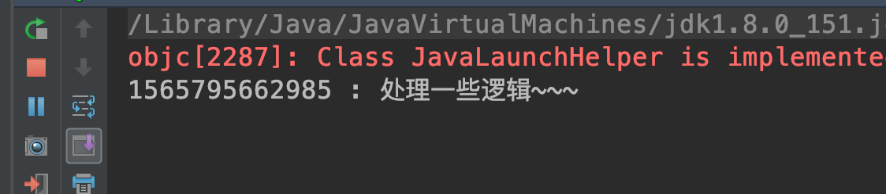

##### 6.4 重入锁等待通知 Condition
###### 6.4.1 基本内容

synchronized与wait()方法和notify()方法结合实现线程等待、通知唤醒；

可重入锁实现ReentrantLock实现等待、通知唤醒需要结合Condition使用；通过lock接口的 newCondition() 方法可以生成一个与当前重入锁绑定的 Condition实例；

###### 6.4.2 相关方法
* await()：使当前线程等待，并释放当前锁；当被其他线程signal()或signalAll()唤醒后竞争获取锁继续运行；可以响应中断结束等待；

* awaitUninterruptlbly()：与await()类似，但是不会响应中断；

* singal()：唤醒一个等待中的线程；

* singalAll()：唤醒所有等待线程

###### 6.4.3 代码示例

```
package com.skylaker.lock;

import java.util.concurrent.locks.Condition;
import java.util.concurrent.locks.ReentrantLock;

/**
 * 可重入锁 Lock 等待通知唤醒：Condition
 * @author skylaker2019@163.com
 * @version V1.0 2019/8/13 8:09 PM
 */
public class ConditionService {
    private static ReentrantLock lock = new ReentrantLock();
    private static Condition condition = lock.newCondition();

    public static void main(String[] args) throws InterruptedException {
        Thread thread = new Thread(new MyTask());
        thread.start();
        Thread.sleep(2000);

        // 通知子线程唤醒
        lock.lock();
        // 在同一个condition上进行通知
        condition.signal();
        lock.unlock();
    }

    static class MyTask implements Runnable {
        public void run() {
            try{
                lock.lock();
                System.out.println(System.currentTimeMillis() + " : 处理一些逻辑~~~");
                // 在当前锁对象的Condition上进行等待
                condition.await();
                System.out.println(System.currentTimeMillis() + " : 处理后续逻辑………");
            } catch (InterruptedException e) {
                e.printStackTrace();
            } finally {
                lock.unlock();
            }
        }
    }
}
```



前后间隔了两秒，即子线程等待的时间，后来主线程唤醒了子线程，子线程获取锁之后又继续执行；

如果主线程不释放锁，那么子线程即使被唤醒但是无法获取锁还是无法继续运行，则一直处于等到饥饿中：




